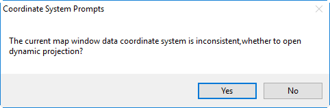
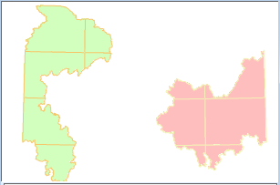
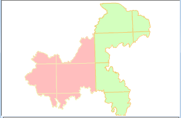

The Dynamic command in the Projection group allows you to specify whether to project different data in a map on the fly to make them display in the same projection.

The Dynamic Project on the Coordinate tab is used to control the layers in map to display in same projection through dynamic projection.

The data of a region are stored in two datasets in different projections. When added to the same map window, the region is torn apart because of the different projections.

  
Figure: The region  
  
If you don't check Dynamic Projection, When you add two different data to the same map window, the Coordinate System Reminder dialog box pops up, and you can click the Yes button in the dialog box to automatically turn on the dynamic projection.

  
Figure: Coordinate System Reminder dialog box  
  
If you check the Dynamic Projection box, the two data are displayed in the map window using a uniform projection, and the effect after the display is shown below.

 |   
---|---  
Before dynamically projecting | After dynamically projecting  
  
During starting Dynamic Projection, the settings of tranformation parameters
are supported. You can click "Transform Parameter" to open "Parameter
Settings" dialog box to set related parameters. For more description about
projection tranform parameters, please refer to [Transformation of
projection](../../DataProcessing/Projection/ConvertPrjCoordSysSingle.htm).

### Note

Web Map (including OGC, SuperMap Cloud Service and Google maps etc.), image maps and map cache type don't support dynamic projection.