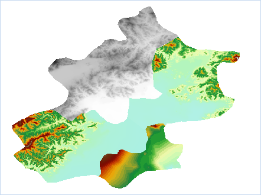
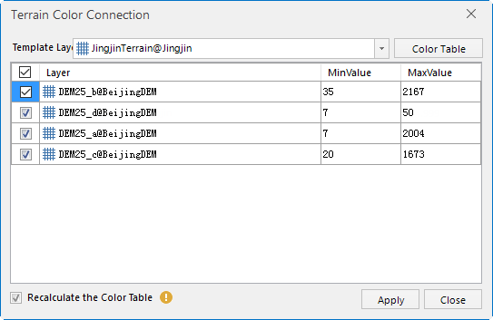
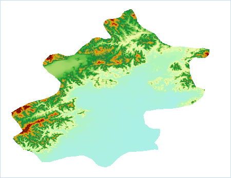

### Introduction

Since the color table and the range of its value for each data are different, it maybe display the uneven color or pixel color out of touch in the position of raster mosaic when multiple raster data are added to the same map. At the point, you can make the display for translation between the adjacent raster layers in the map are seamless.

The principle of the function: Setting the layer color tables are the same table, then the grid with the same pixel value will use the same color table to make the pixel display for mosaic position of adjacent data are coherence and uniform.

### Application Instance

Some DEM data of Beijing area are consisted of 4 adjacent datasets, the reason why the raster pixel color out of line is more obvious is that one color table of raster data are different with the other three, and also the terrain of one data is flat, its maximum elevation value compared to the other three are much smaller. As follows:

  
Figure: The adjacent grid color is not continuous  
  
You can make the map in the raster data color uniform through the function "Terrain Color Connection", the detailed steps are:

  1. Adds the adjacent raster data into the same map, Click Map > Mapping > "Terrain Color Connection" and pop up the following dialog box.  
  
  
Figure:Terrain Color Connection dialog box  

  2. Setting Template Layer: Click the Template Layer dropdown button, select a layer as the color table template, and apply the color table to the checked layers in layer list. If the color table of layer needs to be adjusted, you can click "Color Table" button and setting it in the pop-up "Color Table" dialog box. Please reference [Color Table Settings](../VisualSetting/ColorTableDia.htm) for specific steps.
  3. Selecting the raster data that needs to be color connection in the layer list of the dialog box, at the same time maximum and minimum pixel value of each layer will be displayed in the list, and users can reference the range of data pixel value when selecting a template layer.
  4. Recalculate the Color Table: If you don't check this checkbox, it represents the pixel that is smaller than the minimum value of template layer is indicated with the color of minimum pixel; Otherwise it means the union of the pixel value for the checked layers is used as the value range of color table, so that the pixel values and the corresponding colors in the color table are reassigned.
  5. Clicking "Apply" button to deal with the raster data in map.  
  
  
Figure: The result map  