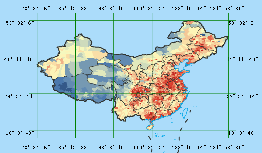

### Introduction

Map grid can divide grids according to the planar coordinate and longitude and
latitude. Take the grid as unit, describe or express the attribute
classification, statistical classification and change parameters, etc.

Map grid includes the graticule and measure grid. Graticule divides the grid
from the origin of coordinates according to the spacing interval of latitude
and longitude, and display map grid; Measure grid divides the grid from the
origin of coordinates according to the vertical intervals and horizontal
intervals, and display the map grid. When the coordinate system is the
geographic coordinate system or projected coordinate system, grid type can be
Graticule or Measure Grid. When map coordinate is planar coordinate system,
grid type only can be Measure Grid.

### Basic Steps

1. Open a map in the current workspace, in the Mapping group on the Map tab, click the Map Grid.
2. In the Grid Type, you can select the Graticule or Measure Grids type. If it is the geographic coordinate system, only the Graticule is available; if it is the planar coordinate system, only the Measure Grid is available; if it is the projected coordinate system, both can be used.
3. The Type parameter has two values for the resulting rang: custom range and range of the dataset you specified.
4. The parameters are different according to the type you specified. Now the following will introduce the parameters. 
* **Graticule**

Set the grid range and difference of warp and weft of cell according to the
grid location. Note: End longitude and latitude must be bigger than start
value. The longitude values range is - 180 to 180, and the latitude range is -
90 to 90.

Start Lon/Lat: The start longitude and latitude of grid.

End Lon/Lat: The end longitude and latitude of grid.

Lon Difference: the left and right longitude difference of every cell, namely,
the cell width. This value should be less than the difference of end and start
longitude.

Lat Different: the up and down latitude difference of every cell, namely, the
cell width. This value should be less than the difference of end and start
longitude.

Note: If the grid type is a latitude and longitude grid, you can check
**Display as DMS** to switch the coordinate input box to degrees: minutes:
seconds in the form set.

* **Measure Grid**

Set the grid range and cell width and height according to the geographic
coordinates. Notes: The maximum X/Y should be larger the minimum X/Y.

Minimum X/Y: the start point planar coordinate of grid. The unit is meter. It
can be arbitrary value, but better has geographical sense. Usually it is
integer.

Maximum X/Y: the end point planar coordinate of grid. The unit is meter. It
can be arbitrary value, but better has geographical sense. Usually it is
integer.

Cell width: the cell width in the grid. The unit is meter. This value should
be less than the difference of maximum X and minimum X.

Cell height: the cell height in the grid. The unit is meter. This value should
be less than the difference of maximum Y and minimum Y.

* Rows: The row and column of grid calculated by grid range and unit width/height. The default is 6 columns and 4 rows.
* Click the dataset type, it can set as a point dataset, line dataset, region dataset, and CAD dataset. 

Point Dataset: the result grid dataset is a point dataset. This dataset is a
grid point array in the given grid range.

Line Dataset: the result grid dataset is a line dataset. This dataset is a
grid line array within the given grid range.

Region Dataset: the result grid dataset is a region dataset. This dataset is a
grid array within the given grid range.

CAD Dataset: the result dataset of grid is CAD dataset. This dataset can
display grid line and label within the given grid range.

* When the dataset type is the line dataset or CAD dataset, it can set the smooth coefficient. The default is 2 and the range is [1,5]. If the smooth coefficient is 1, don't process.
* When the dataset is the line dataset or CAD dataset, you can check the Display main segment line. Check label grid, displaying label in the main segment line. You can also click the **AaBb** button. In the text style settings, set the text properties, as shown below. 
* Set the datasource and save name of grid data in the Result Data. After clicking OK, map window can display map grid data.

