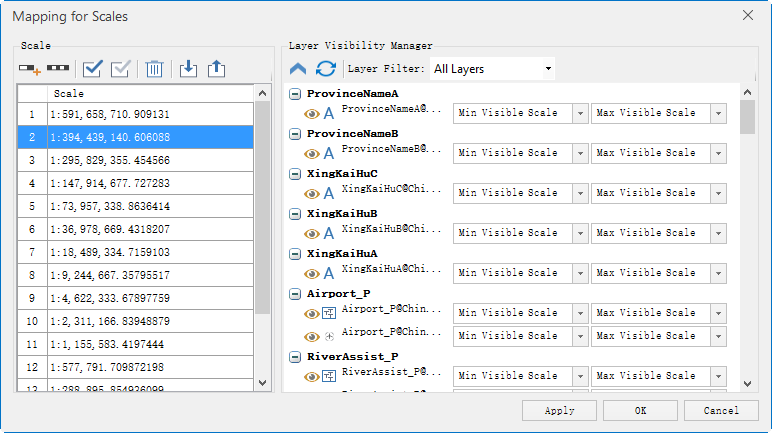
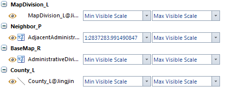

### Introduction

You can set the visible layers on some special scales through the feature. In the dialog box, you can check and modify not only the visible layers on different scales conveniently but also the minimum/maximum visible scales of each layer.

### Basic Steps

1. Open the map that needs to adjust the scale.
2. On the Mapping group in the Map tab, click Mapping for Scales. Or you can click Mapping for Scales in the Layer Manager.
3. The "Mapping for Scales" dialog box appears, as shown below.

4. The scale used in managing image. 

Manage the scales used in images through tool bar buttons.

If set the fixed scales or minimum and maximum visible scales for the map layers, the fixed scales or minimum and maximum scales will display in the list by default. And users can continue to modify; If the map layer didn't set fixed scales or the minimum/maximum scales, the scale list is null and users should add the grading scales.

Toolbar Button Description

* **Add** Button: Click "Add" button to add the scale. The first scale added is the current scale of the map by default; If the last scale in the list is selected, the added scale is twice the previous scale; if the selected scale is not the last one in the list, the added scale is half of the selected scale and the next scale.
* **Add Clip Scale** Button: Click "Add Clip Scale" button to add a map rating scale that conforms to the electronic map data specification, the default is level scale, the user can add, delete, adjust them as needed.
* **Select All** Button: Click "Select All" to select all the scales in the list. 
* **Select Inverse** Button: Click "Select Inverse" to select inverse all the scales in the list.
* **Delete** Button: Click "Delete" to remove the needless scales.
* **Import** Button: Click "Import" to import the scale configuration file saved as *.xml into the list. 
* **Export** Button: Click the "Export" to save the scales in the list as *.xml. It is easy to use again.

5. Layer Visibility Manager 

Toolbar Button Description

* **Collapse/expand** Button: It is used to control the layer nodes in the management window of layer scale to collapse or expand. Click this button to collapse and expand the status. The default button is expand and click it to collapse all the layer nodes; When the layer node is collapsed, the button is expand status and click it to expand all the layer nodes.
* **Refresh** Button: The refresh button is used to refresh all the visible layer nodes in the "Mapping for Scales".
* Layer Filter: The system provides two types: All Layers and Visible Layers. When select "All Layers", the layer scale management window will show all the layers on map; When select the "Visible Layers", the contents of layer scale management window will change with the scales. When select a scale, the right will show the visible layers under this scale. Beside, The setting of Max Visible Scale is the layer of "Max Visible Scale", which will be displayed in full extent. 

You can set the Min Visible Scale and Max Visible Scale in the ribbon > "Layer
Properties" tab > "Filter Settings". Please refer to [Set the visible scales
region of layer](../AdvanceSetting/ScaleRanges).

### The management window of layer scale

Classify the layers according to the stacking order, and the name is
represented by bold. The left button can expand/collapse all the layers in
this class. The management window of layer scale is as follows:

* Visible: The  button in front of dataset type graphical representation is used to control the dataset display in the map window. Click this button to control the visibility of a layer. When the button is highlighted, the layer will be visible in the map window; When the button is gray, the layer is invisible.
* Layer Name: The layer name displayed in the layer manager. In front of the name, it is the graphical representation of this layer dataset type.
* Min Visible Scale: It controls the minimum visible value when this layer scales in the map window. The dropdown menu lists all the scales in the left scale list and the default is the minimum visible scale. After set the minimum scale, if the map scale is less than the minimum scale of layer, this layer is invisible.
* Max Visible Scale: It controls the maximum visible value when this layer scales in the map window. The dropdown menu lists all the scales in the left scale list and the default is the maximum visible scale. After set the minimum scale, if the map scale is larger than or equal to the maximum scale of layer, this layer is invisible.
* Set the layer scale in bulk: When select a scale in the scale list of the dialog box, you can select multiple layers in the layer list through using the Shift or Ctrl key. Click the right mouse button to set the selected scale to the maximum or minimum visible scale for the selected layers, or to clear the visible scale range for the selected layer settings.

