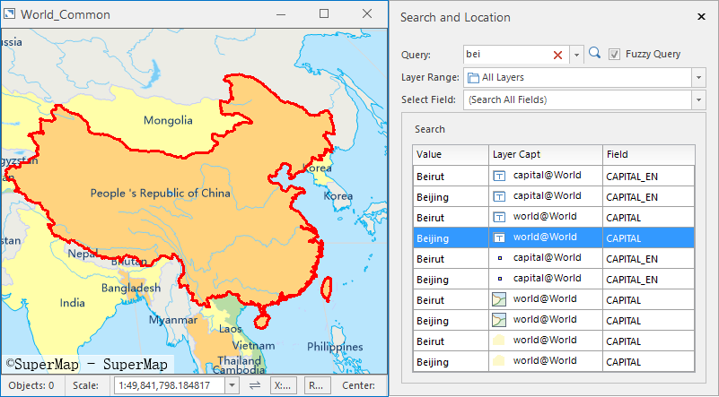

### Instructions

You can search any value from all fields of all layers in the current map. Also you can specify a fixed layer or a fixed field to execute exact query or fuzzy query.

### Basic Steps

1. Open your map, and then click "Search And Location" in the "Map" tab and on the "Browse" group to open the "Search and Location" dialog box.
2. **Search** : Enter a string you want to find.
3. **Fuzzy Searching** : Check it and all values that contain the string you have entered will be found out. On contrary, only the values that equal the string you entered can be listed.
4. **Layer Range** : Specify the string will be found from which layers. Four selections are provided for you.
  * **All Layer** : Search values from all layers of the current map. 
  * **Visible Layer** : Search values from current visible layers. 
  * **Selectable Layer** : You can select one or more layers from the Layer Manager and then the system will search values from the selected layers.
  * **Specify a layer** : You can select a layer from the "Layer Range" drop-down list and then the system will search values from the layer.
5. **Select Field** : All available fields are listed in the drop-down list, you can set up searching values from one field or all fields.
6. Click the search icon. Or focus your mouse on the Search text box, then clicking Enter.
7. You can double click a row in the search result table, and the system will locate to the relative element in your map. 
  * **Value** : The found attribute values.
  * **Layer** : The layers that the relative value belongs to.
  * **Field** : The field that the relative value is located in.
  
