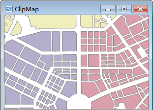
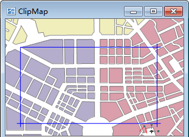
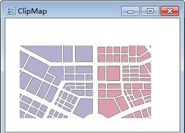
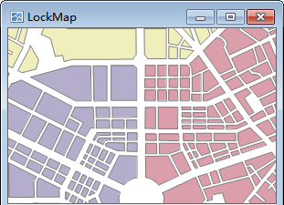
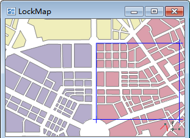
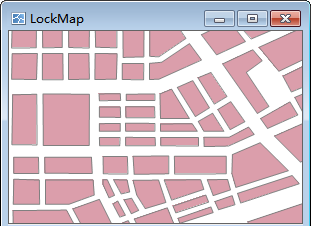
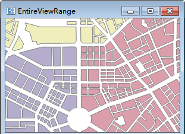
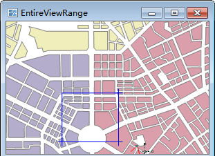
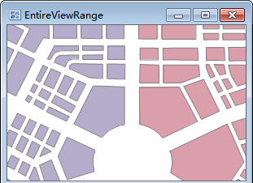

The Bounds group organizes commands for getting map bounds as well as Centre Point, and Current View and Map Bounds.
  
### Centre Point

Display or set the centre point coordinate value in X and y. Users can input values in the text boxes to determine a new centre point in the map window.

### Current View

This command is used to view the map visible information in current map window, including position information, such as left, top, right and bottom. You can edit these text boxes.

The application provides the current window, entire map, select object, copy and paste four settings, the specific description is as follows:

  * Entire Map: Click Entire Map to set the union of all layer ranges in the current map to the output range.
  * Select Object: Provides Select Object and Draw Range. Select Object refers to the current map window through the mouse to select one or more objects, the selected object range is set to the output range. Draw Range refers to the current map window, by clicking the mouse to determine a rectangular area for the output range.
  * Copy and Paste: Click Copy button to copy the currently set range and click Paste button to set the left, bottom, right, and top values of the copy range to the current range.

### Map Bounds

The Map Bounds command is used to view the spatial extent of the current map. The spatial extent of the map is the bounding box of all datasets in the map. When there are datasets added or removed from the map, the spatial extent may change.

### Clip Visible Bounds

The Clip Visible Bounds command lets you specify the extent of the map you want to display in the map window. The clip map operation doesn't physically clip the dataset. It only provides the visual effects of clipping.

Basic Steps

  1. Check the Clip Visible Bounds box to enable the Clip Map buttonDropDown to the right.
  2. Click the drop-down arrow and select a shape. Draw a shape on the map to specify the extent you want to clip from the map. 
  3. The extent within the specified shape remains visible, while the extent beyond the shape is hidden.

| |   
---|---|---  
The original map| Draw a rectangle to clip map| After map clipping  

### Lock Maximum Display

The Lock Maximum Display command lets you lock the specific extent of the map. The extent beyond the locked extent is not visible. The visible extent of a map from the clip map operation can be zoomed or panned in the map window after the operation. However, the locked extent of a map keeps fitting to map window.

Basic Steps

  1. Check the Lock Maximum Display box to enable the Lock Extent buttonDropDown to the right. Currently, the maximum display bounds of the map is the map bounds by default.
  2. Click the drop-down arrow and select a shape. Draw a shape on the map to specify the extent you want to lock.
  3. The locked extent fits to map window.
  4. You can click Set As Map Bounds to set the maximum lock extent of the map to map extent. Also, you can draw another shape to lock again.

| |  
---|---|---  
The original map| Draw a rectangle to lock extent| The locked extent  

### Customize Full Extent

Set the full extent of the map. After customizing the full extent, you can clip Ribbon/Map Operations/Browse/Full Extent or press F6 to display the full extent you specified.

Basic Steps

  1. Check the Custom Full Extent box to enable the Full Extent buttonDropDown to the right.
  2. Click the drop-down arrow and select a shape. Draw a shape on the map to specify the full extent.
  3. The specified extent fits to map window.
  4. You can click Clear in the Full Extent drop-down list to undo the full extent setting operation. Also, you can draw another shape to reset the full extent.

| |   
---|---|---  
The original full extent| Draw a rectangle to set it as full extent| The new full extent  

### Note

  * When select a bound way, such as Clip Visible Bounds, Lock Maximum Display Range or Custom Full Extent, you can click right mouse button to cancel the drawing state of mouse.
  * When setting the clip visible bounds, you can also specify the extent by selecting objects instead of drawing a shape. If you choose to select objects to set the full extent or visible extent, make sure that you select objects in a region layer.
  * Map clip extent only applies to current the projection of the map, and need to be reset if the map projection is changed.