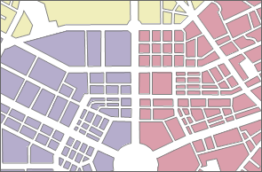
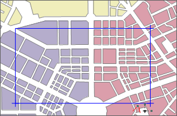
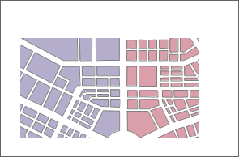
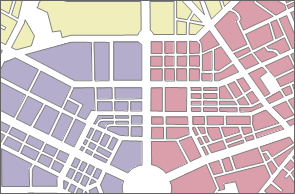
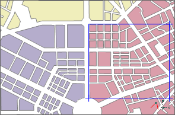
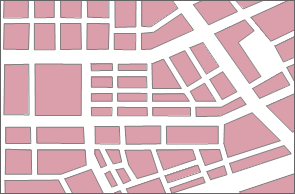
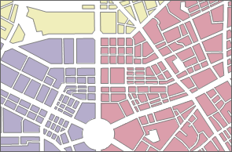
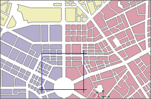
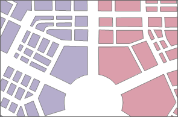

The **Bounds** panel display abundant information on your map like map scales, centre point, and so on.

### Set Map Scale

You are allowed to zoom your map in or out by a series of visible scales.

**Current Scale**

Displays and sets the scale for the current active map. The value changes with the map zoom. Also, you can directly type a scale in the text and press Enter to switch to the scale.

**Fixed Scales**

After checking the checkbox, the **Set Scale...** button becomes active. You can set a series of scales to zoom your map at certain scales.

**Set Scale**

You can achieve zooming the map at fixed scales in the combination of **Fixed
Scale** and **Set Scale...** commands. Click the **Set Scale** button to
display the **Scale Manager** dialog box where you can click the **Add**
button to add a scale to the list.

  * After adding a scale, you can edit the value to specify the desirable scale. 

**Note** : If there are no scales in the dialog box, the first scale added
through any method is identical to the current scale of the map by default. If
the selected scale is the last scale, the scale added through Add is twice the
previous scale. If the selected scale is not the last one in the list, the
scale added through Add is half of the selected scale and the next scale.
After zooming of the map, you can use Current Scale to add the current scale
of the map.

  * If you want to use common clip scale, you can select Add Clip Scale button and set the clip scale to map fixed scale.
  * After adding multiple scales, click OK to finish. While zooming, the scale of the map will switch between those fixed scales defined.

### Clip Visible Bounds

Specify the bounds of your map you want to display in the map window. The clip
map operation won't clip your data. It only provides the visual effects of
clipping.

Check the **Clip Visible Bounds** box to activate the **Select Object**
dropdown button. Click the drop-down button and select an item. Draw a shape
on your map to specify the bounds you want to clip from your map.

| |  
---|---|---  
The original map| Draw a rectangle to clip map| After map clipping  
  
### Lock Maximum Display Bounds

Locks the specific bounds of your map. When you pan or zoom your map, the product will display content of your map within the bounds and hide other content.

  * Check the **Lock Maximum Display Bounds** box to enable the **Select Object** dropdown button. The bounds of your map is the maximum display bounds by default. Click the drop-down arrow, select an item, and draw a shape on your map to specify the bounds you want to lock.
  * The locked extent fits to your map window.
  * You can click **Set as Map Bounds** to set the maximum lock bounds of your map to map bounds. Also, you can draw another shape to lock again.
| |   
---|---|---  
The original map| Draw a rectangle to lock extent| The locked extent  

### Custom Full Bounds

Set the full bounds of your map. After customizing the full bounds, you can clip **Maps** > **Browse** > **Full Extent** or press F6 to display the full bounds of your map.

  * Check the **Custom Full Bounds** box to enable the **Select Object**.
  * Click the drop-down button, select an item, and draw a shape on yoru map to specify the full extent.
  * The specified extent fits to map window.
  * You can click **Clear Custom Bounds** to clear the full bounds you set.

| |  
---|---|---  
The original full extent| Draw a rectangle to set it as full extent| The new full extent  

### Centre Point

Displays or sets the centre point coordinate value in X and y. You can enter values in the text boxes to determine a new centre point in the map window.

### Current View

This area displays information on the visible content in the current map
window, including position information, such as left, top, right and bottom.
You can edit these values directly.

The application provides the current window, entire map, select object, copy
and paste four settings, the specific description is as follows:

  * **Whole Map** : sets the union of all layer bounds in the current map to the output range.
  * **Select Object** : Provides Select Object and Draw Range. Select Object refers to the current map window through the mouse to select one or more objects, the selected object range is set to the output range. Draw Range refers to the current map window, by clicking the mouse to determine a rectangular area for the output range.
  * **Copy and Paste** : Click Copy button to copy the currently set range and click Paste button to set the left, bottom, right, and top values of the copy range to the current range.

### Map Bounds

Displays the spatial bounds of your map. The spatial bounds refer to the
bounding box of all datasets in the map. If you add or remove a dataset from
your map, its spatial bounds may change. You can't edit the bounds directly.

**Note**

  * When select a bound way, such as Clip Visible Bounds, Lock Maximum Display Range or Custom Full Extent, you can click right mouse button to cancel the drawing state of mouse.
  * When setting the clip visible bounds, you can also specify the extent by selecting objects instead of drawing a shape. If you choose to select objects to set the full extent or visible extent, make sure that you select objects in a region layer.
  * Map clip extent only applies to current the projection of the map, and need to be reset if the map projection is changed.

