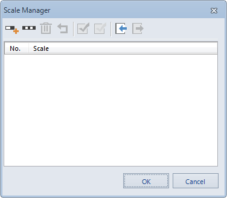
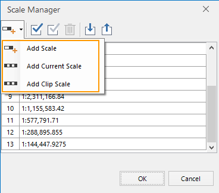
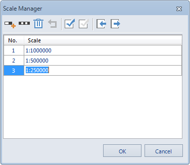

Set a set of fixed scales between which the map can switch when zoomed.

### Current Scale

Display and set the scale for the current active map. The value changes with
the map zoom. Also, you can directly type a scale in the text and press Enter
to switch to the scale.

### Fixed Scales

When checked, the map will zoom at fixed scales you define. The map will not
zoom to scales that are not in the fixed scale list. The Scale Manager button
becomes active when the Fixed Scales box is checked.

### Set Scale

You can achieve zooming the map at fixed scales with the combination of the
Fixed Scales and Set Scale commands. Click the Set Scale button to display the
Scale Manager dialog box, on which you can click the Add button to add a scale
to the list.

  

  
When a scale is added to the list, you can edit the value to specify the
desirable scale.

**Note** : If there are no scales in the dialog box, the first scale added
through any method is identical to the current scale of the map by default. If
the selected scale is the last scale, the scale added through Add is twice the
previous scale. If the selected scale is not the last one in the list, the
scale added through Add is half of the selected scale and the next scale.
After zooming of the map, you can use Current Scale to add the current scale
of the map.

If you want to use common clip scale, you can select Add Clip Scale button and
set the clip scale to map fixed scale.

After adding multiple scales, click OK to finish. While zooming, the scale of
the map will switch between those fixed scales defined.

 |   
---|---  
Figure: Add scale | Figure: Add multiple scales  
  

