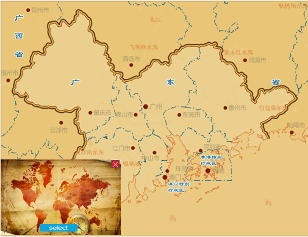
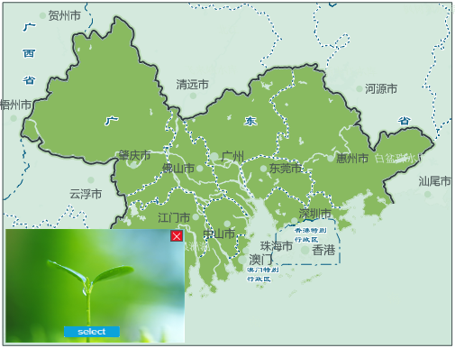

### Function Introduction

SuperMap iDesktop introduces the ability to change your map styles based on
the style image you specify. Besides, you can adjust the hue, brightness,
contrast, and saturation of your map.

**Application Scenarios**

* If you have had a map, you want to use it not only in one occasion. You can change its colors to use it in different situations. Such as your map uses warm colors when you need a map using cool colors, you can use the feature to change it conveniently and easily. 
* One map can has a lot of styles at the same time like subtle grey style, ancient building style, oil painting style, and so on.

**Highlighted Features**

* The application provides multiple style images. You are allowed to specify your own style pictures. 
* **Style Transfer Settings** : when extracting colors from a style image, you can set its compression mode and the color count.
* **Adjust colors** : you can adjust hue, brightness, contrast, saturation, soften, and sharpen of layers (text, line, region). Besides, iDesktop supports other color settings like grey, black and white, and so on. 
* **Undo/Redo** : the **Undo** feature (or Ctrl Z) can undo the last operation. The **Redo** feature (or Ctrl Y) supports redoing the operation you have undone.

### Operating Instructions

Multiple groups of style images are predefined including dark styles, colorful styles. Importing your own images also is allowed.

1. Open your map.
2. **Using style image** : click the **AI Mapping** tab> **Style Transfer** Gallery. Select the style image you want. iDesktop will display your map with the new style instantly.
3. **Using own image** : click **AI Mapping** tab> **Style Transfer** Gallery > **Custom** to upload your own style image. 
4. In the style image preview window click **Select** button to change the style image.

### Transfer Settings

You can specify the compression mode and the number of colors that will be extracted from your style image to make an improvement in image processing.

1. Click **AI Mapping** tab > **Style Transfer** Gallery > **Transfer Settings** to open the **Style Transfer Settings** dialog box.
2. **Compression Mode** : Four compression modes are provided aiming to enhance the performance of image processing. 
* **None** : iDesktop won't compress the style image. 
* **Antialias** : The feature uses convolutions for resampling an image. The feature provides the best results among other algorithms but has low performance. The algorithm is set to default because of its high-quality results.
* **Nearest Neighbour** : The feature uses K nearest neighbor which is a supervised classification (or regression) algorithm that in order to determine the classification of a point, combines the classification of the K nearest points. The quality is lower than other available algorithms. However, it has the best performance.
* **Linear Interpolation** : The feature uses simple linear interpolation to resample an image. The output quality is less than Cubic spline interpolation but performance is better.
* **Cubic Spline Interpolation** : The feature uses cubic interpolation to resample an image. The output quality is less than Antialias but performance is better, because it uses internal supersampling rather than convolutions.
3. **Colors Count** : The number of colors to be extracted from the style image. Default color number ranges from 50 to 200. You can set a proper number.

### Adjust Colors

Adjust colors of the resulting text, lines and polygons by setting their
brightness, contrast, and saturation to get a better effect. Besides, you can
set a gray, black and white, or colorful map.

* Click **AI Mapping** tab> **Map Color Fixer** group > **Hue** ( **Brightness** , **Contrast** , **Saturation** , or **Soften/Sharpen** ) to open the color adjustment panel where you can adjust the hue (brighness, contrast, saturation, etc.) of all layers. 
* Click **+** to adjust the brightness, hue, contrast, and saturation of fillings, lines, outlines, and labels separately.

**Parametric Description** :

* **Hue** : adjusts the hue of your map.
* **Brightness** : adjusts the brightness of your map.
* **Contrast** : adjusts the contrast of your map.
* **Saturation** : adjusts the saturation of your map.
* **Soften/sharpen** : softens/sharpens your maps. 
* **Colorful** : changes your map style from gray to colorful.
* **Gray** : changes your map style to gray.
* **Black and White** : changes your map style to black and white.
* **Color Invert** : invert colors of your map.

### Applications

Given a map, the owner can use the same map to express different themes. Such
as environmental, antique, heritage, and so on.

 |
---|---
History-style Map | Environment-style Map

