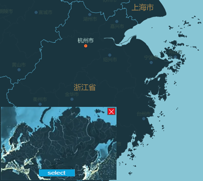

### Function Introduction

Renders your maps intelligently similar to the colors of the picture that you selected.

**Theory of Function**

By using the K-Means clustering algorithm gets main hues of the selected image and your map. In the meanwhile, builds relationships between the two kinds of hues according to the area of each color. And then assigns the main hue of image to your map to change its colors.

**Sample Applications**

  * If you have had a map, you want to use it not only in one occasion. You can change its colors to use it in different situations. Such as your map uses warm colors when you need a map using cool colors, you can use the feature to change it conveniently and easily. 
  * One map can has a lot of styles at the same time like subtle grey style, ancient building style, oil painting style, and so on.

 |  |  
---|---|---  
The original map | Transferred style map (cool colors) | Transferred style map (Chinese ink painting)  
  
**Note:** Undoing map operations (shortcut Ctrl+Z) is allowed.

### Operating Instructions

**Style Transfer** : Multiple groups of style images are predefined including dark styles, colorful styles. Importing your own images also is allowed.

  1. Open your map in iDesktop.
  2. **Using style image** : click the AI Cartography tab> Style Transfer group > Gallery. Select the style image you want and iDesktop will display the resulting map.
  3. **Using own image** : click AI Cartography tab> Style Transfer group > Gallery > Custom to upload your own image.
  4. In the style image showing window in the lower left corner of the map window, click on "select" button to change the style image.

**Transfer Settings** : Before specify a style image, you can set the compression mode and the number of colors that will be extracted from the style image to make an improvement in image processing.

  1. In the AI Cartography tab> Style Transfer group > Gallery > Transfer Settings to open the dialog box Style Transfer Settings.
  2. **Compress Mode** : Four compress modes are provided aiming to enhance the speed of reading and processing the image. 
  * **None** : iDesktop won't compress the style image. 
  * **Antialias** : The feature uses convolutions for resampling an image. The feature provides the best results among other algorithms but has low performance. The algorithm is set to default because of its high-quality results.
  * **Nearest Neighbor** : The feature uses K nearest neighbor which is a supervised classification (or regression) algorithm that in order to determine the classification of a point, combines the classification of the K nearest points. The quality is lower than other available algorithms. However, it has the best performance.
  * **Linear Interpolation** : The feature uses simple linear interpolation to resample an image. The output quality is less than Cubic spline interpolation but performance is better.
  * **Cubic Spline Interpolation** : The feature uses cubic interpolation to resample an image. The output quality is less than Antialias but performance is better, because it uses internal supersampling rather than convolutions.
  3. **Color Count** : The number of colors to be extracted from the style image. Default color number ranges from 50 to 200. You can set a proper number as needed.

**Map Color Fixer** : Adjust colors of the resulting text, lines and polygons by setting their brightness, contrast, and saturation to get a better effect.

  1. In the AI Cartography tab> Map Color Fixer group, the following information can be adjusted. 
  2. **Brightness** : Adjusts the brightness of fill, outlines, line, and labels.
  3. **Contrast** : Adjusts the contrast of fill, outlines, line, and labels.
  4. **Saturation** : Adjusts the saturation of fill, outlines, line, and labels.

### Applications

Given a map, the owner can use the same map to express different themes. Such as environmental, antique, heritage, and so on.

 |   
---|---  
History-style Map | Environment-style Map  