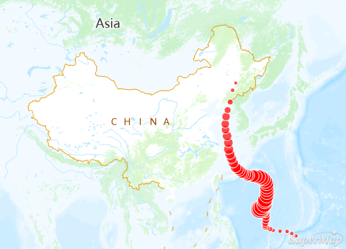
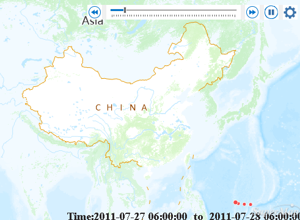

Temporal data is data indicating a state in time, like the land-used status in a given year. The feature of playing temporal data is to display the temporal data in your map in a certain time sequence, thereby you can view the patterns and tends of data with time. As following pictures show: the figure 1 is As shown in the figures below, Figure 1 shows the typhoon track point elements. The time field indicates the typhoon observation time. After setting parameters, the playback effect is shown in Figure 2.

 |   
---|---  
Figure 1: Typhoon track points | Figure 2: Play the typhoon track points at 1-hour intervals  
  
To play temporal data in a map, please follow three steps below:

  * Step One: [Prepare temporal data](PrepareTemporalData.htm)
  * Step Two: [Enable temporal data of layers](SetDataTime.htm)
  * Step Three: [Play temporal data](PlayTemporalData.htm)