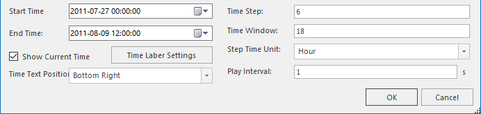
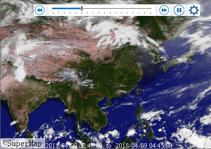

Before playing the temporal data, you need to set the time attribute of the temporal data. For details, please refer to the [Enable time](SetDataTime.htm) page.

###  Temporal data player

The time line in the temporal data player determines the starting time to play temporal data, and click the "Play" button to begin playing, and the time slider moves in the time line. The map window is refreshed every time the slider moves one space. The time spanned by one cell is equal to the time step interval.

Also, you can drag the time slider or clicking the previous/next frame button to view data at some time. When the slider moves from one time scale to next time scale, the contents showing in the map belong to one frame.

  
Figure: Layer player 

  * **Play** : Click  to play temporal data from the slider position to end time. 
  * **Pause** : Click  to pause playing temporal data.
  * **Next Frame** : Click  to make the map back to the previous state.
  * **Previous Frame** : Click  to view the next state of map.

By default, the system queries all time fields of visible time-enabled layers. The minimum and maximum values of time values are taken as the start and end time of the timeline respectively. You can also customize the start and end time of the timeline. The scale interval of the timeline is equal to the time step interval. If the starting time of timeline is 2011/07/23 06:00:00 and scale interval is 6 hours, then the time of the next scale is 2011/07/23 12:00:00, and so on. According to the scale that the slider stays at the time line, estimate the display time extent of the current window.

###  Set playing parameters

  
Figure: Playing parameters 

  1. **Setting a time step interval** : 

The time step interval is the time represented by the time slider moving once. For example, to visualize a typhoon track, set the time step interval as 6, and then the typhoon position will be displayed for every 6 hours and that means when the time slider moves from 2011/07/23 06:00:00 to 2011/07/23 12:00:00 the time extent displayed in the map window should be (Time 2011/07/23 06:00:00 to 2011/07/23 12:00:00 and so on.

If there are multiple time-enabled layers in your map, the default time step interval is set to the minimum time interval of all time-enabled layers. Of course, you can set a time step interval.

  2. **Set a time window** : 

The default time window is 0, and the time extent displayed in your map is from the current time to the sum of current time and the time step interval, for example, if the current slider time is 2011/07/23 06:00:00, then the time extent displayed in the current window is from 2011/07/23 06:00:00 to 2011/07/23 12:00:00. And if the time window is set to 12 hours, then the data in the first 12 hours before the current time will also be displayed. And if the current slider time is 2011/07/23 06:00:00 and the time step interval is set to 6 hours, and then the time extent displayed in the current window is from 2011/07/22 18:00:00 to 2011/07/23 12:00:00.

  3. **Time extent** : 

The program calculates the maximum and minimum time according to fields of all time-enabled visible layers as the starting time and end time of the time slider. You can also set the time extent of time-enabled data thereby change the starting time and ending time of the time slider.

  4. **Play Interval** : 

The map window is refreshed every time the slider moves one space on the time line, and the contents shown on the window per refreshing is called a frame, and you can control time of displaying one frame by setting a play interval.

  5. **Show Current Time** : 

Checking "Show Current Time" allows you to view the time extent corresponding to the frame and you can set the style of the time extent window and its position on the map window. Here we provide 9 positions.

###  Play

Click the Play button to visualize your temporal data. You can control the displayed contents of each frame by setting parameters in the "Playing Settings" dialog box. The following two situations should be noted:

  * To the layers that only one time field is specified, the object whose field value is within the range displaying in the corresponding time extent window is displayed in the map.
  * To the layers that two time fields (the starting time field and the ending time field) are specified, the object can be displayed in the map window only when the time period between the value of its starting time field and the value of its ending time is within the range displaying in the corresponding time extent window.

For example: the time step is set to 6 hours, and the time window is set to 12 hours, and when the time slider moves at the scale 2011/07/23 06:00:00, the time range displaying in the time extent window is (2011/07/22 18:00:00-2011/07/23 12:00:00), and at this time, to the layers that only one time field is specified, of which, there is an object whose field value is 2011/07/22 21:00:00, and we can determine its field value is within the time range of the current window, hence the object can be displayed. To the layers that two time fields are specified, there is an object whose time field values are from 2011/07/22 15:00:00 and 2011/07/23 8:00:00 respectively, and its time range is (2011/07/22 15:00:00,2011/07/23 8:00:00) which is within the within the time range of the current window, and so the object also can be displayed in the map.

Following animation is playing the satellite cloud pictures at each observation time on one day in a mosaic dataset. Specify the field Time of the footprint attribute to record each observation time and set both the time step and time window to 1 hour, and set the play interval to 0.5 second and the playback is:

  
Figure: Playback of satellite cloud pictures at each observation time on one day in a mosaic dataset  
  
###  Output to a GIF

iDesktop allows you to output the playing of your temporal data as a GIF. The output range is the range of current map window.

Operation instructions: click the last button in the play toolbar to open the Save As dialog box. In the dialog box, specify the file name and path.

**Note** : iDesktop will take the range of the current map window as the result file range. It is suggested to set an appropriate map range and a map scale before playing your data.

**Related topics** :

 [An overvire of temporal data](LayerPlay.htm)

 [Prepare temporal data](PrepareTemporalData.htm)

 [Enable time](SetDataTime.htm)