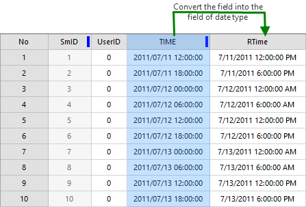
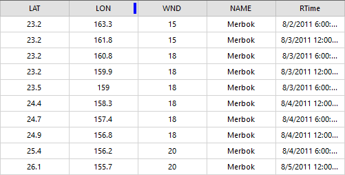
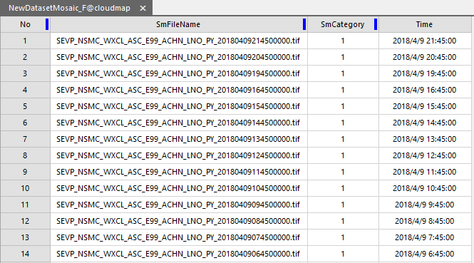
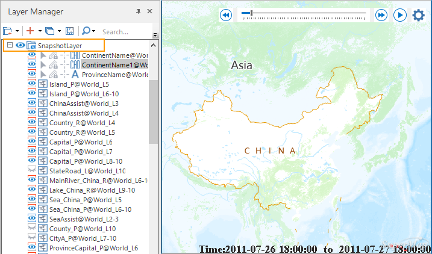

### The storage of temporal data

Temporal data stored in UDB/UDBX datasources, PostGIS databases, or Oracle
databases can be played in SuperMap maps.

A time field for saving each observing time is required in the attribute table
or you can set up two time fields, and one is for recording observation-
starting time and another one is for recording observation-ending time. For
example: two time fields are required if you want to research flood submerging
region.

###  Obtaining time fields

The time field of temporal data must be in date type. And so if the time field
of your data is not in date type, please convert it first.

In general, all time values are saved in fields in text, string or numeral
types, and SuperMap provides functions to convert text or string fields to
fields in date type, but values in a text or string field must conform some
certain formats.

* The string formats supported include: YYYY, YYYYMM, YYYY/MM, YYYY-MM, YYYYMMDD, YYYY/MM/DD, YYYY-MM-DD, YYYYMMDDhhmmss, YYYY/MM/DD hh:mm:ss, YYYY-MM-DD hh:mm:ss.
* Among them, YYYY indicates a four-digit year, MM indicates a two-digit month, and DD indicates a two-digit day, hh indicates a two-digit hour (from 00 to 23), mm indicates a two-digit minute and ss indicates a two digit second.

Follow the following steps to convert fields to the fields of date type, for
more features on field conversions, please refer to " **[Update
Field**](../../DataProcessing/EditTabular/UpdateButton)".

1. Create a field of date type in your attribute table to save the converted values.
2. Use the feature "Update Field" and then in the pop-up dialog box set parameters. 
* Check "Whole Field".
* Specify "Operation Mode" as "Function".
* Specify "Operation Field" as the field storing time values, here we select "Time" (wide char type).
* Specify "Function" as "to_date".
3. And then click "Apply" to start converting.

Besides, you can create an index for the field of date type to improve
performance of visualization and query.

###  Formats of temporal data

Both vector data and image data with time attributes can be displayed in the
SuperMap map. The image data needs to be added to a mosaic dataset to display.

* **Vector data** : Vector data can express some geographic information with time like shapes and positions of geographic objects. For example: to record a typhoon track, each point in vector data indicates the position of the typhoon at an observation time which is recorded in the time field. According to the time line, when playing vector data, track points of typhoon are displayed one by one.
* **Image data** : Image data must be added to a mosaic dataset and time value is saved in the attribute table of Footprint dataset. 

First, create a mosaic dataset to add the target multi-temporal image to the
mosaic dataset. Then, create a new date type field to store the time value in
the footprint dataset property sheet of the mosaic dataset. The number of new
time fields is determined according to the time characteristics reflected by
the image. For example, if the image is an observation of a time period, it is
necessary to create a start and an end time fields. Finally, edit the time
field and fill in the time value corresponding to the image. As shown in the
figure below, the satellite cloud image of each observation time is added to
the mosaic dataset, and the observation time of the cloud image is recorded in
the Time field in the footprint attribute table.

###  Add temporal data into map

Add temporal data into the map and set layer styles. On the settings of layer
styles, please refer to [Set layer style](../LayerStyle/LayerStyleTab).
Apart from setting styles, when playing temporal data in a map, adding non-
temporal data layers to a snapshot group is suggested to improve map display
efficiency and to play it more smoothly.

All layers contained in a [snapshot
group](../LayerManagement/LayerSnapshot) will be taken as a snapshot
layer of map and only when the map view range changes, the snapshot layer will
be drawn. When playing temporal data, the map view range does not change
generally, and so only the layers which keep changing with time will be
refreshed thereby experience faster performance and smoother interaction.

**Related topics** :

 [An overview of temporal data](LayerPlay)

 [Enable time](SetDataTime)

 [Play temporal data](PlayTemporalData)

