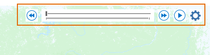
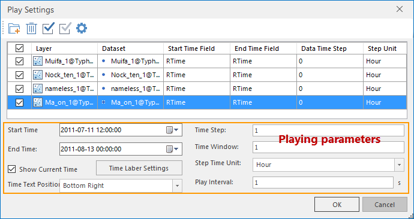

To visualize your temporal data, you must enable time on it and complete the settings of its time properties. Following contents describe the detail settings:

### Instructions

  1. After you have added your temporal data to your map, click "Map" > "Browse" group > "Temporal Data" button to bring the map window into the data-playing mode, in the meanwhile, the player appears in the map window.  
  
  
Figure: the player  

  2. Click  button to open the "Play Settings" dialog box.  
  
  
Figure: "Play Setting" dialog box  

  3. **Manage the layer list**: First loading data layers, click  button, then in the pop-up Select dialog choose one or more layers. After layers have been added, in the layer list set time properties for each layer.
  
  4. **Enable time on layers**: In the layer list, check the checkbox relative to the layer to enable time on it to visualize it. The layer relative to the checkbox which is not checked will not involve in the playback.

  5. **Specify time field**: The temporal data can have either one time field to record each observation time or two time fields to record each observation period, and so you can set time properties in your demands. 

  * If your temporal data has only one time field, both the Start Time Field and the End Time Field are set to the time field.
  * If your temporal data has two time fields, the Start Time Field and the End Time Field are set to corresponding time fields.

**Note** : The type of time field must be date, if not, please refer to [Obtaining time fields](PrepareTemporalData.htm#1).

  6. **Data Time Step** : Temporal data was obtained by acquiring data as a certain time interval like per hour or per day.The data time step is used to specify the time interval which can present the acquisition time characteristics and be used to calculate the default time step interval of the playback. If there are multiple time-enabled layers with different acquisition time, the default time step interval is set to the minimum acquisition time interval.
  7. And then set the required playing parameters, for details please refer to [Play Temporal Data](PlayTemporalData.htm).

**Relate topics** :

 [An overview of temporal data](LayerPlay.htm)

 [Prepare temporal data](PrepareTemporalData.htm)

 [Play temporal data](PlayTemporalData.htm)