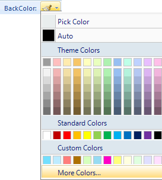

The Basic group on the Map Properties tab provides functions such as modifying map name and map display setting.

### Setting the Map Background Color

The color button to the right lets you set the background color for the map. To set the background color, you can click the color button to display the color panel, with which you can either pick a color, select a color or click Color Library to customize your own color. The specified background color will be applied to the map after the setting.

  
Figure: Set the background color  