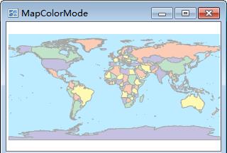
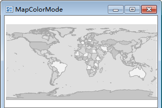

---
id: ColorMode
title: Setting the Map Color Scheme 
---  

The Basic group on the Map Properties tab provides functions such as modifying map name and map display setting.

### Color Mode

Set the color mode for all vector dataset to help preview the output effects. The default is Color. You can select another color mode through the drop-down list.

|   
---|---  
Color| Grayscale  