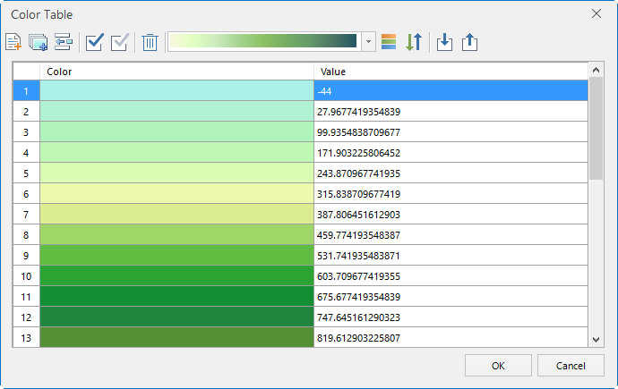

Color Table: Used for setting the colors for cell values of raster data. The color table specifies the colors for certain cell values, based on which value ranges are formed. The cell value without a specified color will be assigned a color based on the range it is located in.

### Description of the Color Table Dialog Box

You can select a scheme to render the grid layer from the Color Scheme drop-down list. Also, you can add or remove values to adjust the color table.

  
  
**Listbox**

  * No: The number of the record.
  * Color: The color for the cell value. You can click the cell in the Color filed to display the color panel, in which you can select a color to draw cells with the value of this record.
  * Value: The cell value. You can click the the cell in the Value field for twice to edit the value. Besides, you can click the heading of the Value filed to invert the values.

**Tool bar**

  * Add: Click Add to pop up the default color table. Add the selected colors to the color listbox.
  * Add in Bulk: Click Add Batch to pop up a dialog box.
    * Start Value: The start cell value.
    * End Value: The end cell value.
    * Step Size: The length of the value range.
    * Ranges: The number of value ranges.

You cannot set both the Step Size and Ranges. The Step Size equals to (End Value - Start Value) / Ranges.

  * Auto Calculate End: Tis parameter needs to be used with Size. It will calculate the end value according to the step size. For example, the start value is 150, and the end value is 1002, and the step size is 100, the auto end value is 950, not 1002.(It should ba integer.)
  * Insert: Insert a new record before the highlighted record in the table.
  * Select All: Select all records in the table. 
  * Inverse: Select the inverse records in the table.
  * Delete: Delete the selected records in the table
  * Drop-down Arrow: Click the dropdown arrow of Color Schemes to select the color scheme. Notes: when the are two or more records in the list, it only supports to modify the color schemes.
  * Default: Click Default to set the default scheme.
  * Reverse Color: Click the Color Inverse button to adjuset the color scheme inverse.
  * Import: Click Import to import the external color table to current list. See [Importing and Exporting Color Table](../../Analyst/Raster/SurfaceAnalyst/ImportExport) for more information.
  * Export: Click Export to export the current color table. See [Importing and Exporting Color table](../../Analyst/Raster/SurfaceAnalyst/ImportExport) for more information.

