---
id: CommonSetting
title: Map Properties - Basic
---  
### Rotation

Set the rotation angle of the current active map. You can enter a rotation
angle in the text box at right of the label. The map will be rotated by the
angle you specified. The rotation angle ranges from -360 to 360 degrees with
0.1 degree accuracy. A positive value represents counterclockwise rotation,
while a negative value represents clockwise rotation. After typing the value,
you can press Enter to rotate the map by the angle you specified.

For each rotation operation, the map will be rotated based on the original
status. The base point around which the map rotates is the center of the
visible extent of the current map window. The rotate operation will not change
the data in each layer of the map.

### Color Mode

The program introduces 5 color modes for vector datasets settings including
Default, Black and White, Gray, Reverse Black and White, and Reverse black and
white with other colors unchanges.

  

  
### Background Color

You can set the background color of your map.

### Display Settings

The Display Settings area provides a series of features to optimize the
display of points, lines, polygons, and text. The following content describes
the features.

  * **Min/Max Text Size** : the minimum and maximum sizes of text that can be displayed on your map. Text objects beyond this ranges will be hidden. When zooming in or out a map, the text can zoom with the map. The commands help you control the display of the text objects within a scale range.
  * **Max Visible Vertices** : the maximum number of vertices owned by a geometrical object displayed in the current map. If the number of vertices of a geometrical object is greater than the value, the object will be invisible.
  * **Display Overlaid Objects**

When there are too many label elements in your map, some elements may overlap
with each other, which causes a decline in map readability. The **Set
Overlay** function can control the display of text, labels, and thematic map
objects, which is conducive to better process a verity of overlapped objects
so as to get a satisfactory display effect.

If you want to display all text objects, check the Show Overlap box. To avoid
text overlaps, you can uncheck the box. iDesktop will filter and hide the text
objects which are created later than other objects.

**Overlay Settings**

Controls filtering various overlapped objects which can locate in a same layer
or in different layers. Note: For two overlapped objects, after you set
**Filter Overlap Item** , the application will preferentially display the
bottom object and filter the top object.

* **Show or Hide Points with Text**

If points in the point layer are too dense, when you make a label map, the
**Avoid Overlap** function of the label map will remove the overlapped labels,
so you may have an illusion that some points don't have labels. If you don't
use the **Avoid Overlap** function, then the labels may overlap with each
other. This item controls whether to display points in the point layer and
texts in the text layer which are created based on the point layer. If you
select it and the text of the point object is hidden, then this point will not
be shown either.

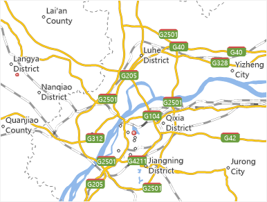 | 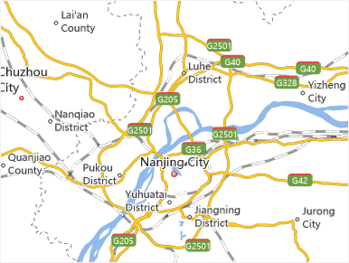  
---|---  
Before enabling the feature | After enabling the feature  

* **Points Overlap Points**

When point objects in a same layer or in different layers are overlapped with
each other, this item can control whether to filter the overlapped point
objects. If it is selected, the bottom point object will be shown whereas the
top point objects will be removed; otherwise, all the overlapped objects will
be shown.

* **Points Overlap Text**

The text here includes the annotation of the label map and the text of the
text layer (CAD layer). When point objects in the point layer overlap with
texts in the label map or text layer (CAD layer), this item can control the
display of overlapped objects including points and texts which contain labels.
If it is selected, the bottom point or text object will be shown whereas the
top objects will be removed; otherwise, all the overlapped objects will be
shown. Note: This item cannot control the overlaps among points or among
texts.

As shown in the figures below, the left map doesn't use any filter items,
while the right map uses the **Points Overlap Text** function. As the label
layer is above the point layer, if the points overlap texts, and you select
the **Points Overlap Text** check box, then the text objects will be removed,
and only the point objects are retained.

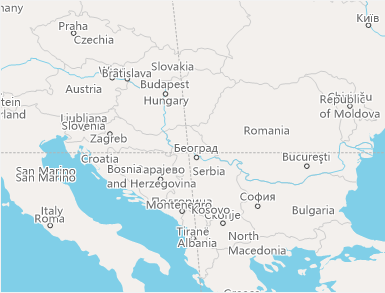 | 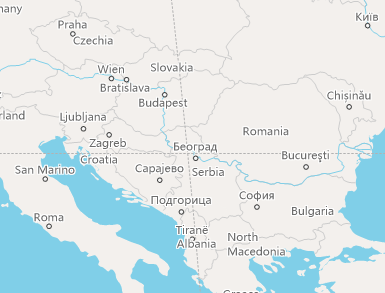  
---|---  
Before filtering overlapped points | After filtering overlapped points  

* **Text Overlap Text**

The text here includes the annotation of the label map and the text of the
text layer (CAD layer). When overlaps occur among texts or labels of the text
layer or the label map layer, this item can be used to control the overlaps.
If this check box is selected, the bottom object will be retained whereas the
top object will be removed; otherwise, all the overlapped objects will be
shown. Note: It firstly determines whether to execute the Avoid Overlap
function in the label map layer.

As shown in the figures below, the left map is the original map which doesn't
use any filter items, while the right map uses the **Text Overlap Text**
function. When the two or more overlapped text objects locate in a map layer,
if you select the **Text Overlap Text** check box, then the first display
object is retained, and the other overlapped objects are removed.

 | 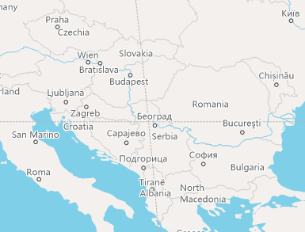  
---|---  
Doesn't select the **Text Overlap Text** item | Selects the **Text Overlap Text** item  
* **Graduated Symbols Map**

The graduated symbols on the statistical symbol thematic map may overlap with
each other, which can be in one or more layers. This item can be used to
control the display of the overlapped graduated thematic elements. If this
check box is selected, the bottom object will be retained whereas the top
object will be removed; otherwise, all the overlapped symbols will be shown.

* **Graph Thematic Map**

The statistical symbols on the statistical symbol thematic map (e.g., pie
chart and bar chart) may overlap with each other, which can be in one or more
layers. This item can be used to control the display of the overlapped
statistical symbols. If this check box is selected, the bottom statistical
symbol object will be retained whereas the top statistical symbol object will
be removed; otherwise, all the overlapped symbols will be shown.

**Overlap Bounds**

Sets the overlap distance between two objects, which can be determined by
specifying the width and height. For example, the width and height are 60 and
40 respectively, then the method to calculate the overlap bound is using the
circumscribed rectangle of the overlapped text objects as a unit; then this
rectangle is moved 60 units to the left and to the right, and also 40 units
upward and downward. The unit is 0.1mm. The overlap bound is applicable to all
the above 5 overlap items.

When the overlap distance (width or height of the overlap bound) is a positive
value, it indicates the distance between two objects. The objects will not be
displayed if the distance between them is less than or equal to this distance.
When it is a negative value, the objects will not be displayed if the distance
between them is greater than or equal to the absolute value of the distance.

  * **Fix Marker Angle** : after enabling the feature, marker symbols are fixed, which means they won't rotate with the rotation of your map. **Note** : The check box is active if the Rotation of the map is not 0.
  * **Fixed Text Angle** : after enabling the feature, words on your map will not rotate with the rotation of the map. **Note** : The check box is active if the Rotation of the map is not 0.
  * **Fix Text Direction** : after enabling the feature, each character is arranged in vertical direction. Even if you rotate the map, the characters will be kept in vertical direction.

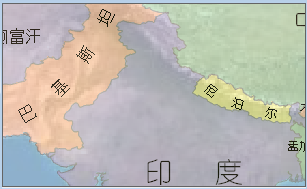|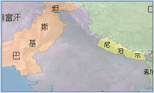  
---|---  
Before fixing text angle| after fixing text angle  

  * **Antialias Text** : smooths the edges of the text. You must enable the feature in both map properties panel and layer properties panel. 

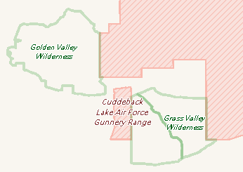 | 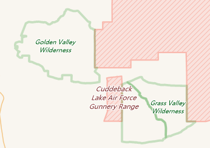  
---|---  
Before antialiasing text| After antialiasing text  
  
  * **Antialias Line** : smooths lines with an antialiasing algorithm to improve the display effect of your map. Note: You must enable the feature in both map properties panel and layer properties panel. 

  * **Compatible with Office Font**

Font size in SuperMap maps are not consistent with Office font. For text with
the same size, SuperMap will display smaller font than Microsoft Office font.
In the Map Properties panel, check Office font compatible ti enable
compatibility mode to display font in SuperMap maps with the same standard as
Microsoft Office standard.

While creating a new map window, the compatibility mode will be enabled by
default.  

 |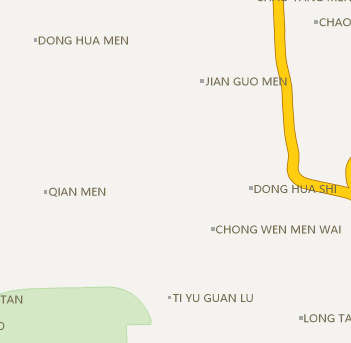  
---|---  
Before checking Office font compatible | After checking Office font compatible  

* **Alpha Channel**

When the Alpha channel is enabled, the A value of the layer color can be set
and make some map elements with certain transparency to enrich the effect of
the map. The translucent map can also be output. You can set Alpha channel for
these layers: Vector layer, thematic map layer, text layer.

  * **Used to Tune Colors in the Same Domain**

In the Map Properties panel, you can check the Alpha Channel option, then the
A value, as well as the RGB values, of the layer color can be set, as shown
below:

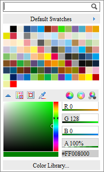  

  
Same RGB and different Alpha value can derive multiple colors in the same
color domain. As shown below, the grassland is (137, 206, 102), after
adjusting the A value, the grassland can have different grades of same color
domain:

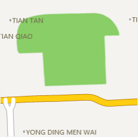 | 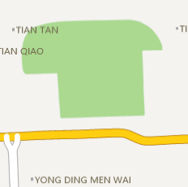 | 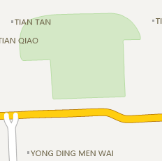  
---|---|---  
No Alpha Channel | Alpha Value: 70% | Alpha Value: 30%  

  * **Configure Semi-Transparent Map**

What mapping by Alpha value effectively does is reduce the saturation and
contrast of polygons with high alpha blending, making them fade into the
background and be less noticeable.

For example, when you overlay some analysis results on the base map, you can
set a transparent effect with Alpha value for the result polygons, and make a
visually beautiful map. As shown below, the service area analysis result is
overlapped with the based map with transparent effect, so you can notice the
result service areas:

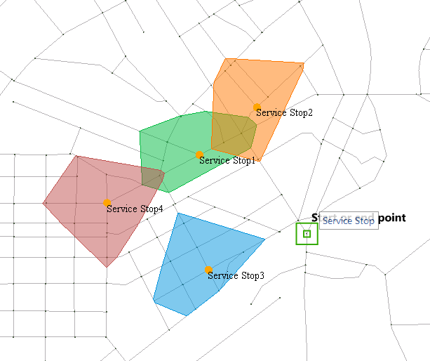  

  * **Support translucent map output**

The previous version of 8C does not support outputting transparent or
translucent maps. The application often used in the map cache output, the
output of the tile background transparent, so that the map cache can be very
good with other map content overlay display. The following figure shows the
output background transparent map cache and satellite image map overlay
display:

  

### Note

  * You can directly set the A value for the layer color or the background color of the attribute table in the scenes. This setting is independent of the Alpha channel setting in the Map Properties panel.

