When select image layer as the current layer in the layer manager, parameters settings about image would be showed in Layer Properties interface. The settings include the brightness, contrast, interpolation method, display method, and stretch mode, etc.
  
### No Value

  * No Value: You can enter a grid value directly in the text box, or click , pick the cell value (snapping is allowed) at the appropriate position in the image layer to set the specified cell value to no value. According to the color pattern of the image itself, set the different color values. Such as, single-band only need to set a single pixel value, RGB mode can be specified R, G, B three different colors.
  * No Value Transparent: Used to specify the color for No Value. When select it, No Value color defaults to transparent. If you don't select it, you can click the drop-down button and then select a color in the pop-up dialog box.

### Background Value

You can change the background color of specified pixel.

  * Background Value: Click  button, and then pick a pixel value (snapping is allowed) in the image layer as a background value. Also, you can directly enter a value in the text box as a background value.
  * Background Transparent: Click the drop-down button, you can set the changing color in the pop-up color panel.

### The transparent color settings.

The **Transparent Color Settings** is used to set a color of the image in the scene as the transparent color, i.e., the area covered by the specified color is set as the transparent effect.

  * Transparent: Check this box to set the specified valueless pixel transparent; uncheck the item to specify that the valueless color is still the specified color. The icon button  can be clicked to pick up a pixel color(snapping is allowed) from the image layer or select a color from the drop-down button, and then set the color transparent.
  * Tolerance: Assuming that the original color value is (r, g, b) and the tolerance is a, the color values that need to be displayed are in the range of (r-a, g-a, b-a) to (r + a, g + a, b + a).

### Basic Steps

  1. Select the image layer that needs color adjustment in the layer manager, set the layer as current layer.
  2. Checks the Transparent check box to activate transparent settings of the image layer, in the meanwhile, the color button on the right side of the check box is activated.
  3. Click the drop-down button to specify the transparent color in the image.
  4. Sets the tolerance of the transparent color. Users can use slider to adjust the tolerance, or directly input a number. The tolerance value is an integer from 0 to 255.
  5. The image layer will instant display the setting effect.

### Brightness

When the current layer is image layer, Brightness can be used to adjust the brightness of the layer. User can input the brightness value or use slider to adjust that. The results can be seen real-time.

### Contrast

When the current layer is image layer, Contrast can be used to adjust the contrast of the layer. User can input the contrast value or use slider to adjust that. The results can be seen real-time.

### Image Interpolation

When you zoom the image layer, the original image needs to be mapped to a larger or smaller pixels. SuperMap provides 5 ways for interpolation. They are: Nearest Neighbor, Low Quality, High Quality, High Quality Bilinear, High Quality Bi-cubic. The quality of image display relies on different interpolation approaches, the better quality of output image, the longer time is needed.

  * Nearest Neighbor: It is a simpler image interpolation method. This approach is fast in speed for processing, the worst in image display.
  * Low Quality: This appraoch execuates the filtering in order to guarantee high-performance shrinking, poor quality in image display when zooming out after the interpolation.
  * High Quality: The quality of image display is better, but the time for outputing image is longer.
  * High Quality Bilinear: Through the specified way, excuting the prescreening operation to ensure the high quality effect when zooming out the image.
  * High Quality Bi-cubic: Through the specified way, excuting the prescreening operation to ensure the high quality effect when zooming out the image. The best quality of output image is produced by this approach.

### Display Mode

Single band and multi-band images are distinguished by the band number of image data. The setting ways for display mode are different. It isn't supported that modifying the display mode for the images data whose bit depth are 32 or 24.

  * **Single Band Image**
    * **Default Display** : Using no stretch to display the image data, if the image data has color table, it will be displayed in color table, if no color table, it will be gray.
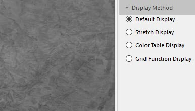  
Figure: Default Display  
    * **Stretch Display** : You can adjust the display effect for image by selecting Minimum Maximum, Standard Deviation, Gaussian, Percent Clip. Also you can adjust the color scheme for image display.
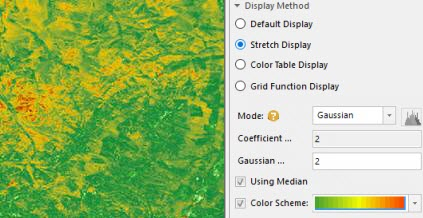  
Figure: Stretch Display  
    * **Color Table Display** : Using the color table of image to display, and you can adjust the color scheme.
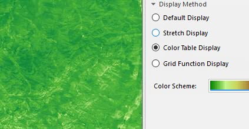  
Figure: Color Table Display  
    * **Grid Function Display** : It is used to acquire the display result after processing data for the image and raster data. When select this function, the above display will be invalid. But, you can modify the color display effect for the image and raster data after applying the grid function through the color scheme
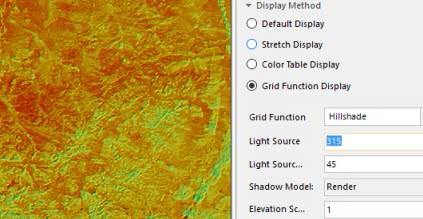  
Figure: The Display for Applying 3D HillShade Grid Function  

  * **Multi-band Images**
    * **Combination Display** : According to the specified color mode, the muli-band of images can be combined through the Combination Display to get a color image display effect. The display settings for image stretch are supported.
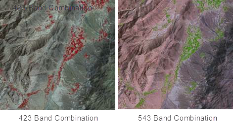  
Figure: Combination Display  
    * **Single Band Stretch Display** : Select a band to display, and then select a strectch way. You can adjust the display effect and the color display scheme for image through selecting Minimum Maximum, Standard Deviation, Gaussian, or Percent Clip.
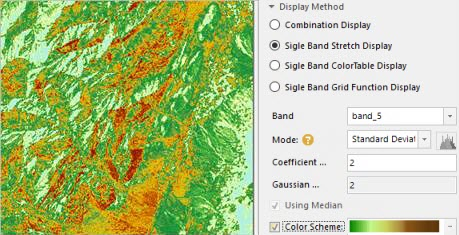  
Figure: Single Band Stretch Display  
    * **Single Band Color Table Display** : Select a band to display and then adjust the the color scheme.
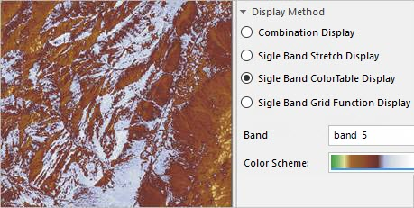  
Figure: Single Band Color Table Display  
    * **Single Band Grid Function Display** : Select a band to display and then apply the function to get the display effect. 
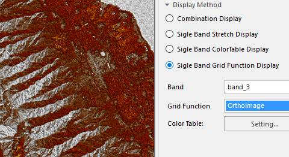  
Figure: Single Band Grid Function Display  

### The color mode of image

The display devices, such as the monitor, the projector, etc., and the printing devices, such as the printer, the press, etc., use different color models to generate colors. To better fit for different types of devices, SuperMap can define color in these seven color models: RGB, CMYK, RGBA, CMY, YIQ, YUV and YCC.

All the color modes are provided for you to choose in the Color Model drop-down list to set the color mode of image data.Click the Color Mode drop-down arrow and click a color mode from the drop-down list that shows up. The default color mode is RGB.

Color Mode | Description  
---|---  
RGB | Mainly used in the display system. RGB is the abbreviation for Red, Green and Blue. With the RGB color model, every color is defined by three values: red, green, and blue, each of which ranging from 0 to 255.  
CMYK | Mainly used in the printing system. CMYK is the abbreviation for Cyan, Magenta, Yellow and Black. The Cyan, Magenta and Yellow are used as the base color to form different colors and the Black is used to adjust the brightness and the purity.  
RGBA | Mainly used in the display system. RGB is the abbreviation for Red, Green and Blue, and A controls the transparency.  
CMY | Mainly used in the printing system. CMY is the abbreviation for Cyan, Magenta and Yellow. The Cyan, Magenta and Yellow are used as the base color to form the different colors.  
YIQ | Mainly used in the NTSC system.  
YUV | Mainly used in the PAL system.  
YCC | Mainly used for the JPEG format.  
  
### The color scheme for image

You can modify the color scheme, but the data must be single band and it must be the dataset which the format is 8 bit or 16 bit. If the image layer is multi-band or synthetic band, you can not change the color scheme of image.

### Extension

### Introduction

During the procedure of getting image data, image quality is reduced because of a lot of factors. Stretching image data aims at improving the display effect and quality of image data, thereby outstanding information interested by people or machines. The essence of stretching image data is to change brightness and contrast of image data.

**Stretch Methods**

Now, SuperMap Desktop provides some stretch methods: None, Standard Deviation, Minimum Maximum, Histogram Equalization, Histogram Specification, Gaussian, and Percent Clip.

  * No Stretch:No-stretch is to process the image data without any stretch, which is only valid for image data in the 8-bit unsigned integer type. The pixel value of image data displayed on the computer are from 0 to 255. Hence for image data in the 8-bit unsigned integer type, after the No-stretch process, all of them will be linear stretched and whose value will be converted into [0, 255]. 
  * Max and Min Stretch: Max and Min Stretch is a linear stretch, based on the maximum and minimum pixel values which will be considered as two endpoints of the stretched histograms. For example, an image is in 8-bit storage type and the range of its pixel values are from 30 to 200, then after Max and Min Stretch, the pixel values of the image will be redistributed and the new range is from 0 to 255. With this stretch method, contrast and brightness of the image are improved significantly so that the features in the image will be more easily identified. 

As the following pictures show, the left picture has not been stretched yet. Image colors are more dark. After stretching the image, we get the right picture, which looks more clear. And we can see that its contrast is improved a lot.

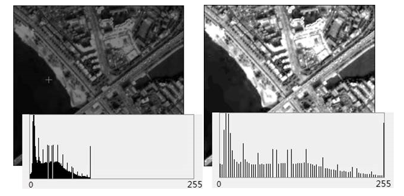  

  * **Standard Deviation Stretch** : This method performs statistics on the original image data, which is mainly to get the value range of a standard deviation, then to recalculate the range of the standard deviation according to its stretch coefficient, and ultimately to do the linear stretch for the last calculated range of standard deviation to make its values distribute within [0,255]. 

The following pictures describe the stretching method Standard Deviation vividly by combining a histogram. The left picture has not been stretched yet. After stretching the image using the Standard Deviation, we get the right picture. We can find that the standard deviation of the histogram increases, which means that both pixel display value and deviation of mean value decreases.

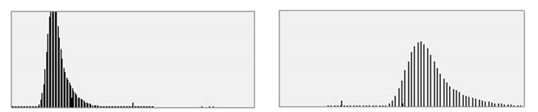  

  * Gaussian stretch: The purpose of Gaussian Stretch is to make pixel values of image data tend to the normal distribution. If Using Median is selected, then Gaussion stretch would be performed with the median of cell value as center. If not selected, then Gaussion strethch would be performed with the maximun of cell value as center.
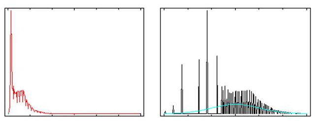  

  * **Histogram Equalization** : The feature performs the stretching of nonlinearity on image data and reassigns pixel values to make the number of pixels almost the same within a certain gray range. And so, for a histogram, this way can increase the contrast of its peak and decrease the contrast of two sides of its valley bottom. The resulting histogram will be evenly segmented.
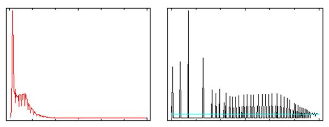  

  * **Histogram Specification** : The feature changes the search table to make the histogram of an image similar to the histogram of another image. This feature is commonly used for joining two adjacent images or pre-processing multi-temporal satellite images for researching their dynamical changes. This feature can eliminate some effect differences between two adjacent images caused by solar altitudes or atmospheric effects.
  * **Percent Clip** : The stretch display can be separately provided for each band of the multi-band video data. Through this mode, the application removes the pixels which are located at the parts of small value and big value and others are stretch through Minimum Maximum. You can click  button to open the histogram of each band, and specify the minimum and maximum percentage values excluded from the stretch, Represent the percentages of the pixels that need to be excluded from the stretch respectively. 

As follows, figure 1 is the display effect image for Minimum Maximum. Figure 2 is the image through Percent Clip, it's more clear than figure 1, since the pixels which are located at the parts of small value and big value that are shown in the following histogram has been removed.

  
Figure 1: Max and Min Stretch  
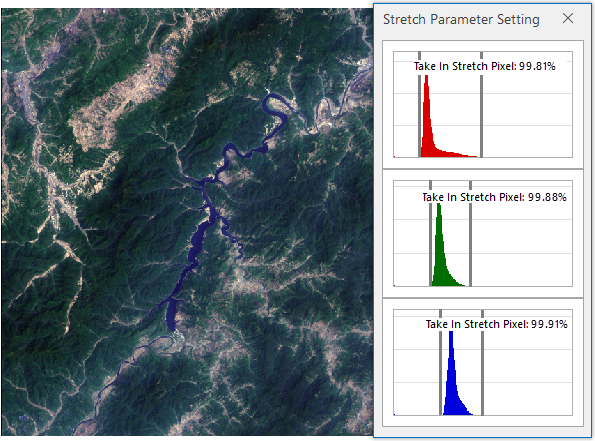  
Figure 2: Percent Clip  

**Stretch Coefficient**

Coefficient is only supported when the mode is Standard Deviation or Gaussian
stretch.

  * Standard deviation stretch coefficient: This parameter is available only when the stretch method is standard deviation stretch. The standard deviation stretch coefficient determines the value range of the standard deviation. If the range of the standard derivation is [a,b] and the standard deviation stretch coefficient is n, then the value range of the standard deviation is [an,bn]. The standard deviation stretch coefficient is 2 by default, i.e., the application uses a double standard deviation to stretch.
  * Gaussian stretch: This parameter is available only when the stretch method is Gaussian stretch. If the range of the image data cell value is [a,b] and the Gaussian stretch coefficient is n, then the image cell value will be N multiple name stretched with the center unchanged and displayed within the range of [0,255]. The Gaussian stretch coefficient is 2 by default.

As shown in the figure below, the figure 1 doesn't do any stretch processing, whose hue is quite dark, and this is not conducive to distinguish the ground objects. After stretching the image as shown in the figure 2, the image contrast is significantly enhanced, a lot of ground features are clearly displayed.

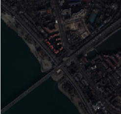 |   
---|---  
Figure:1: Original image | Figure:2: Image after stretch  
  
### Note

Image stretch does not support the image data stretch of the format which are true color 24 bit or 32 bit. The single-band and multi-band image layer are supported for image data stretch.