Right click your image layer in the layer manager and select **Layer
Properties** to open the **Layer Properties** panel where you can set raster
parameters like brightness, contrast, interpolation method, display method,
stretch mode, etc.

### NoValue

* **NoValue** : You can enter a grid value directly in the text box or click the **Pick** icon to pick a cell value (snapping is allowed) from your image layer as a NoValue. According to the color pattern of the image itself, set the different color values. Such as, for a single-band image, you need to set a single pixel value only. For RGB mode, you can specify R, G, and B values respectively.
* **NoValue Transparent** : Specify a color of NoValue areas. If checking the box, NoValue areas are transparent by default. Else if you don't check it, you can click the drop-down button and select a color.

### Background Value

You can change the background color of areas with the specified pixel.

* **Background Value** : Click the **Pick** icon and pick a pixel value (snapping is allowed) in your image layer as a background value. Also, you can enter a value in the text box directly.
* **Background Transparent** : Click the drop-down button and select a color from the pop-up color panel.

### Transparency Setting

Set areas with the specified color in your image layer transparent. To have a
good transparent effect, you need to set the feature **Transparent** combining
with the feature **Transparent Tolerance**.

* **Transparent** : If you check the box, you can click the **Pick** icon and pick up a pixel color(snapping is allowed) from your image layer or select a color from the drop-down button. And then the areas with the specified color will be transparent.
* **Transparent Tolerance** : Assuming the original color value is (r, g, b) and the tolerance is a, the color values to be displayed ranges from (r-a, g-a, b-a) to (r + a, g + a, b + a).

**Basic Steps**

1. Select the image layer that needs color adjustment in the layer manager, set the layer as current layer.
2. Checks the Transparent check box to activate transparent settings of the image layer, in the meanwhile, the color button on the right side of the check box is activated.
3. Click the drop-down button to specify the transparent color in the image.
4. Sets the tolerance of the transparent color. Users can use slider to adjust the tolerance, or directly input a number. The tolerance value is an integer from 0 to 255.
5. The image layer will instant display the setting effect.

### Brightness

When the current layer is an image layer, Brightness can be used to adjust the
brightness of the layer. User can input the brightness value or use slider to
adjust that. The results can be seen real-time.

### Contrast

When the current layer is image layer, Contrast can be used to adjust the
contrast of the layer. User can input the contrast value or use slider to
adjust that. The results can be seen real-time.

### Image Interpolation

When you zoom the image layer, the original image needs to be mapped to a
larger or smaller pixels. SuperMap provides 5 ways for interpolation. They
are: Nearest Neighbor, Low Quality, High Quality, High Quality Bilinear, High
Quality Bi-cubic. The quality of image display relies on different
interpolation approaches, the better quality of output image, the longer time
is needed.

* **Nearest Neighbor** : It is a simpler image interpolation method. This approach is fast in speed for processing, the worst in image display.
* **Low Quality** : This appraoch execuates the filtering in order to guarantee high-performance shrinking, poor quality in image display when zooming out after the interpolation.
* **High Quality** : The quality of image display is better, but the time for outputing image is longer.
* **High Quality Bilinear** : Through the specified way, excuting the prescreening operation to ensure the high quality effect when zooming out the image.
* **High Quality Bi-cubic** : Through the specified way, excuting the prescreening operation to ensure the high quality effect when zooming out the image. The best quality of output image is produced by this approach.

### Display Mode

Single band and multi-band images are distinguished by the band number of
image data. The setting ways for display mode are different. It isn't
supported that modifying the display mode for the images data whose bit depth
are 32 or 24.

* **Single Band Image**
* **Default Display** : Using no stretch to display the image data, if the image data has color table, it will be displayed in color table, if no color table, it will be gray.

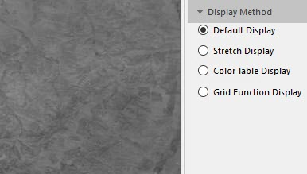

* **Stretch Display** : You can adjust the display effect for image by selecting Minimum Maximum, Standard Deviation, Gaussian, Percent Clip. Also you can adjust the color scheme for image display.

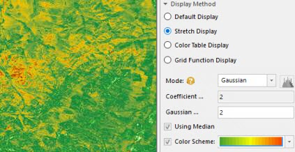

* **Color Table Display** : Using the color table of image to display, and you can adjust the color scheme.

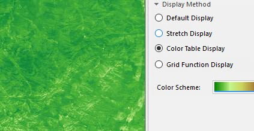

* **Grid Function Display** : It is used to acquire the display result after processing data for the image and raster data. When select this function, the above display will be invalid. But, you can modify the color display effect for the image and raster data after applying the grid function through the color scheme

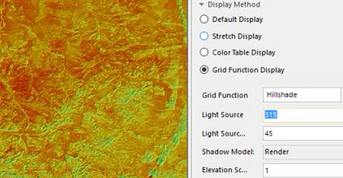

* **Multi-band Images**
* **Combination Display** : According to the specified color mode, the muli-band of images can be combined through the Combination Display to get a color image display effect. The display settings for image stretch are supported.

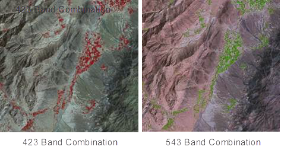

* **Single Band Stretch Display** : Select a band to display, and then select a strectch way. You can adjust the display effect and the color display scheme for image through selecting Minimum Maximum, Standard Deviation, Gaussian, or Percent Clip.

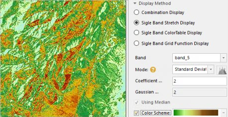

* **Single Band Color Table Display** : Select a band to display and then adjust the the color scheme.

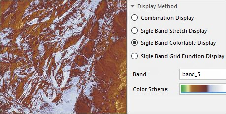

* **Single Band Grid Function Display** : Select a band to display and then apply the function to get the display effect. 

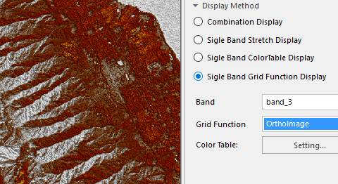

### The color mode of image

The display devices, such as the monitor, the projector, etc., and the
printing devices, such as the printer, the press, etc., use different color
models to generate colors. To better fit for different types of devices,
SuperMap can define color in these seven color models: RGB, CMYK, RGBA, CMY,
YIQ, YUV and YCC.

All the color modes are provided for you to choose in the Color Model drop-
down list to set the color mode of image data.Click the Color Mode drop-down
arrow and click a color mode from the drop-down list that shows up. The
default color mode is RGB.

Color Mode | Description
---|---
RGB | Mainly used in the display system. RGB is the abbreviation for Red, Green and Blue. With the RGB color model, every color is defined by three values: red, green, and blue, each of which ranging from 0 to 255.
CMYK | Mainly used in the printing system. CMYK is the abbreviation for Cyan, Magenta, Yellow and Black. The Cyan, Magenta and Yellow are used as the base color to form different colors and the Black is used to adjust the brightness and the purity.
RGBA | Mainly used in the display system. RGB is the abbreviation for Red, Green and Blue, and A controls the transparency.
CMY | Mainly used in the printing system. CMY is the abbreviation for Cyan, Magenta and Yellow. The Cyan, Magenta and Yellow are used as the base color to form the different colors.
YIQ | Mainly used in the NTSC system.
YUV | Mainly used in the PAL system.
YCC | Mainly used for the JPEG format.

### The color scheme for image

You can modify the color scheme, but the data must be single band and it must
be the dataset which the format is 8 bit or 16 bit. If the image layer is
multi-band or synthetic band, you can not change the color scheme of image.

### Stretch

During the procedure of getting image data, image quality is reduced because
of a lot of factors. Stretching image data aims at improving the display
effect and quality of image data, thereby outstanding information interested
by people or machines. The essence of stretching image data is to change the
brightness and contrast of image data.

Now, SuperMap provides multiple stretch types including None, Standard
Deviation, Minimum Maximum, Histogram Equalization, Histogram Specification,
Gaussian, and Percent Clip.

Supports setting the stretch mode for image layers in bulk. Select multiple
image layers from the **Layer Manager** , and then set the stretch mode in the
**Layer Properties** panel.

* **None** : processes your image data without stretching. The item is only valid for 8-bit unsigned integer image data. The pixel value of image data displayed on a computer ranges from 0 to 255. Hence for 8-bit unsigned integer image data, if you select **None** , the product will display it by using the **Maximum Minimum** mode and its value will ranges from 0 to 255. 

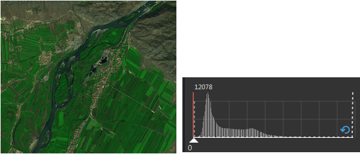

* **Maximum Minimum** : this stretch mode is a linear stretch. It stretchs image data based on its maximum and minimum pixel values to make all pixel values fall into [0,255]. The stretch method can improve the contrast and brightness of image data significantly, so that features in image data can be easily identified. 

As the following pictures show, the left picture is the resulting map. Image
data is more clear and its contrast is improved a lot.

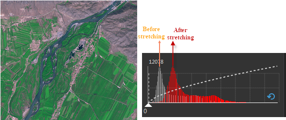

* **Standard Deviation** : This method performs a statistic on the original image to get a standard deviation range, then recalculating the standard deviation range according to the stretch coefficient. Finally, the feature stretches pixel values within the resulting range linearly to make them fall into [0,255]. 

As the following picture shows, if the coefficient is 1, the percentage of
pixels in all pixels is 68%. If we set the coefficient to 2, the pixel values
falling outside the standard deviation range will be pushed to the ends (0 or
255), while other value will be stretch in between 0 to 255. The feature is
often used for brightening raster datasets with dark colors.

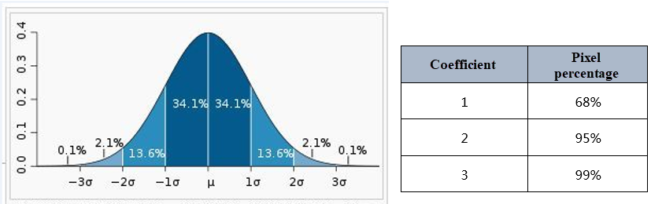

Below shows an example of a stretch: The red histogram represents the pixel
values in the following image. Compared to the gray histogram, the standard
deviation in the red histogram is increased, which means the deviation of
pixel values from the average is reduced.

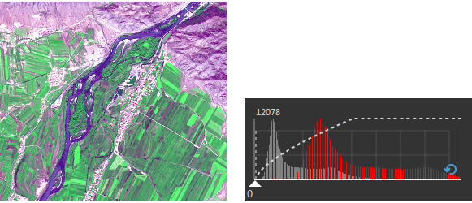

The resulting image and the histograms
* **Gaussian** stretch: The stretch type can make pixel values of image data tend to the normal distribution.
* **Gaussian Coefficient** : Each pixel multiplies by the coefficient, and being stretched in between 0 to 255.
* **Using Median** : the feature allows the Gaussion stretch to take the median of pixel values as center. Otherwise, the Gaussion stretch would take the maximun pixel value as center.
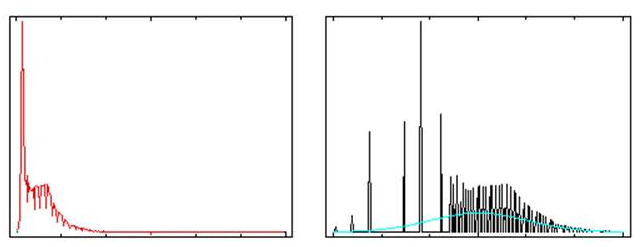

* **Percent Clip** : The stretch display can be separately provided for each band of the multi-band video data. Through this mode, the application removes the pixels which are located at the parts of small value and big value and others are stretch through Minimum Maximum. You can click 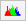 button to open the histogram of each band, and specify the minimum and maximum percentage values excluded from the stretch, Represent the percentages of the pixels that need to be excluded from the stretch respectively. 

In the example below , figure 1 is the display effect image for Minimum
Maximum. Figure 2 is the image through Percent Clip, it's more clear than
figure 1, since the pixels which are located at the parts of small value and
big value that are shown in the following histogram has been removed.

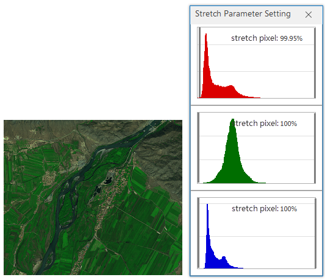 | 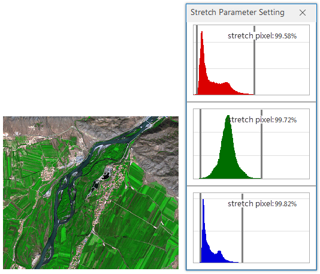
---|---
Figure 1: Without specifying a stretch range | Figure 2: Setting a stretch range
* **Histogram Equalization** : performs a nonlinear stretch on image data and reassigns pixel values to equalize the number of pixels within a certain gray range. This way can increase the contrast of a histogram at peak and decrease the contrast of two sides.The resulting histogram will be evenly segmented. 
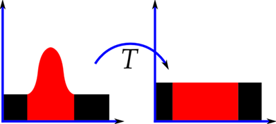

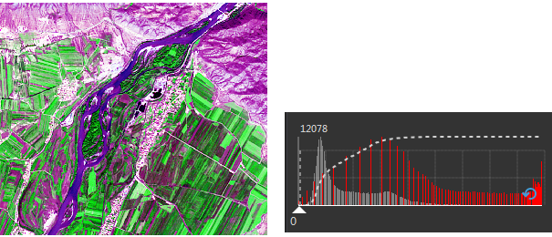

After a histogram equalization, the contrast of your image will increase a
lot. The stretch will reduce the level of gray on your image, thereby
increasing the contrast. Hence, after the operation, some required information
(gray area) on your image may be lost.

* **Histogram Specification** : The feature changes the search table to make the histogram of an image similar to the histogram of another image. This feature is commonly used for joining two adjacent images or pre-processing multi-temporal satellite images for researching their dynamical changes. This feature can eliminate some effect differences between two adjacent images caused by solar altitudes or atmospheric effects.

The differences between the **Histogram Equalization** and the **Histogram
Specification** is that the resulting image will be more balanced after
performing the former. While the latter will import a histogram XML file and
display image data according to the file.

**Stretch Coefficient**

Coefficient is only supported when the mode is Standard Deviation or Gaussian
stretch.

* Standard deviation stretch coefficient: This parameter is available only when the stretch method is standard deviation stretch. The standard deviation stretch coefficient determines the value range of the standard deviation. If the range of the standard derivation is [a,b] and the standard deviation stretch coefficient is n, then the value range of the standard deviation is [an,bn]. The standard deviation stretch coefficient is 2 by default, i.e., the application uses a double standard deviation to stretch.
* Gaussian stretch: This parameter is available only when the stretch method is Gaussian stretch. If the range of the image data cell value is [a,b] and the Gaussian stretch coefficient is n, then the image cell value will be N multiple name stretched with the center unchanged and displayed within the range of [0,255]. The Gaussian stretch coefficient is 2 by default.

As shown in the figure below, the figure 1 doesn't do any stretch processing,
whose hue is quite dark, and this is not conducive to distinguish the ground
objects. After stretching the image as shown in the figure 2, the image
contrast is significantly enhanced, a lot of ground features are clearly
displayed.

 | 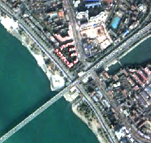
---|---
Figure:1: Original image | Figure:2: Resulting image

### Note

Image stretch does not support the image data stretch of the format which are
true color 24 bit or 32 bit. The single-band and multi-band image layer are
supported for image data stretch.

