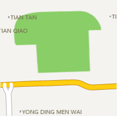
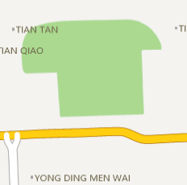
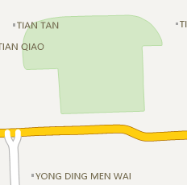
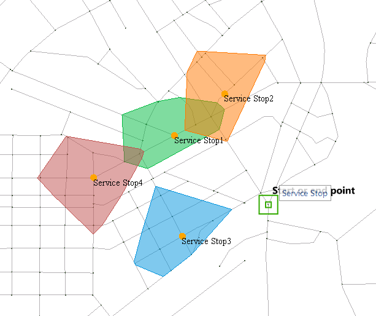

### Alpha Channel

When the Alpha channel is enabled, the A value of the layer color can be set and make some map elements with certain transparency to enrich the effect of the map. The translucent map can also be output. You can set Alpha channel for these layers: Vector layer, thematic map layer, text layer.

  1. **Used to Tune Colors in the Same Domain**

In the Map Properties panel, you can check the Alpha Channel option, then the A value, as well as the RGB values, of the layer color can be set.
Same RGB and different Alpha value can derive multiple colors in the same color domain. As shown below, the grassland is (137, 206, 102), after adjusting the A value, the grassland can have different grades of same color domain:

 |  |   
---|---|---  
No Alpha Channel | Alpha Value: 70% | Alpha Value: 30%  
  2. **Configure Semi-Transparent Map**

What mapping by Alpha value effectively does is reduce the saturation and contrast of polygons with high alpha blending, making them fade into the background.

For example, when you overlay some analysis results on the base map, you can set a transparent effect with Alpha value for the result polygons, and make a visually beautiful map. As shown below, the service area analysis result is overlaid with the based map with transparent effect, so you can notice the result service areas:

  
Figure:Transparent Service Area  

  3. **Support translucent map output**

The previous version of 8C does not support transparent or translucent map output. The application often used in the map cache output, the output of the tile background transparent, so that the map cache can be very good with other map content overlay display. The following figure shows the output background transparent map cache and satellite image map overlay display:

  
Figure: Overlaid Roads and Satellite Image  

### Note

  * You can directly set the A value for the layer color or the background color of the attribute table in the scenes. This setting is independent of the Alpha channel setting in the Map Properties panel.