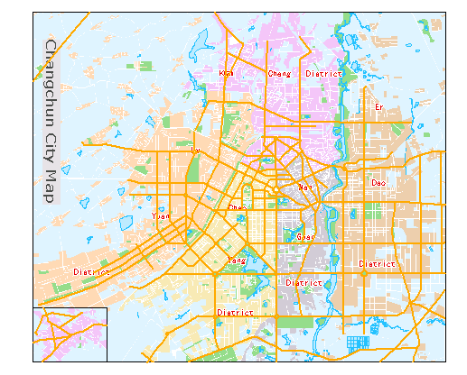
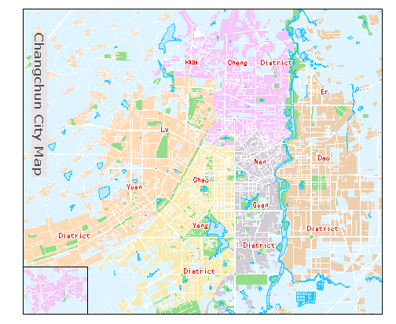

No matter what type your layer is, you can set these parameters we introduced below.

### Set Layer Transparency

Set the transparency of your layer. You can move the slide bar that shows up
by clicking the Transparency right arrow to change the transparency of the
current layer. The transparency ranges from 0 to 100 (default). 0 indicates
fully transparent and 100 denotes fully opaque.

### Adjust Layer Order

The layer order directly affects the map display effects. There are two primary rules for layer ordering.

* According to the bounds, the order to place layers is small->medium->large. 
* According to layer types, the order to place layers is text->point->line->region. 

Note: The rules above is only an suggestion. You can decide how to place the
layers according to your needs.

Below shows the effects for before and after placing a layer to the bottom. We
can see the importance of the layer order to a map.

 | 
---|---
Before placing the layer to the bottom| After placing the layer to the bottom

We found that a line layer disappear from the map. Actually, it is not
removed, but being placed at the bottom.

There are two ways to change the layer order.

**Use Layer Control**

1. Open your map first. And then you can open the **Layer Control** dialog box with the following methods:
* In the **Layer Manager** , click the **Layer Control** button.
* In the **Layer Manager** , right click on your layer and select **Layer Control**.
2. In the **Layer Control** dialog box, select one or more layers and change the order of the layers with the buttons provided on the toolbar. About more information about layer order controlling, please refer to [Layer Control](../LayerManagement/LayerControl).

**Drag Layers**

1. In the **Layer Manager** , select one or multiple layers.
2. Drag the selected layer or layers to the target position.
3. Release your mouse.

**Layer nodes can be dragged**

In the Layer Manager toolbar, you can set whether the layer nodes can be
dragged in the Layer Manager by clicking **Layer nodes can be dragged** in the
**Layer Control** drop-down list.

* If the feature is checked, you are allowed to adjust the order of your layers by dragging layer nodes.
* If the feature is not checked, the order of layers is fixed, and so you can not change it which can avoid some misoperation.

### Set Visible Scales

The Layer Properties tab provides commands to filter objects in layers.

**Min Visible Scale**

Set the minimum visible scale for the layer. If you zoom out beyond this
scale, the layer will be invisible.

You can directly type a scale in the Min Visible Scale combo box or click the
drop-down arrow and select a scale from the list. Also, you can click Clear in
the drop-down list to clear the min visible scale setting.

**Max Visible Scale**

Set the maximum visible scale for the layer. If you zoom in beyond this scale,
the layer will be invisible.

You can directly type a scale in the Max Visible Scale combo box or click the
drop-down arrow and select a scale from the list. Also, you can click Clear in
the drop-down list to clear the max visible scale setting.

### Filter Expression

Set filter expression to display objects that meet the condition.

You can either directly type a SQL expression in the Filter Expression text
box or click the button with ellipse to the right to display the [SQL
Expression dialog box](../../Query/SQLDia) where you can compose a SQL
expression.

Click the **Set Join Attribute Table...** to display the
[Relate](../../Query/JoinItemsDia) dialog where you can establish the
relationship between tables for composing filter expression with fields from
related tables.

