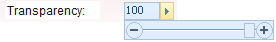

---
id: LayerTransparent
title: Setting the Layer Transparency
---  

### Transparency

Set the transparency of the current layer. You can move the slide bar that shows up by clicking the Transparency right arrow to change the transparency of the current layer. The transparency ranges from 0 to 100 (default), with 0 and 100 indicating fully transparent and fully opaque respectively.

  