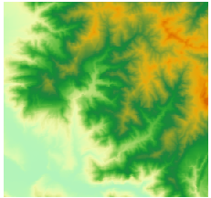
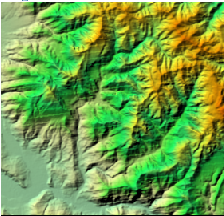
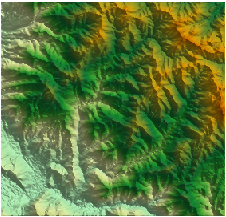
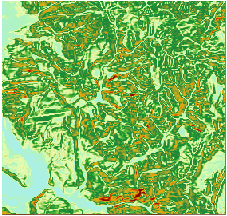
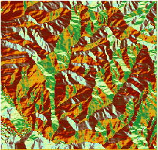
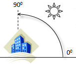

The Grid Parameters group on the Layer Properties panel provides a seriers of
features to set Brightness, Contrast, Color Table, Values, Transparent, etc.
of your raster data.

### Set special value

* **Special Value** : When you want to set a special display effect to some grids with specified value, you can click the **Pick** icon and move your mouse cursor onto your map window to pick up a pixel (snapping is allowed) as a special value. Or you can type a value into the text box directly.
* **Special Styles** : Set a special color for special grids by clicking the drop-down button and choose a color from the pop-up color panel. 
* **Special Value Transparent Display** : Set whether the specified special grids are transparent. Checking it means yes. 

### Set a background value

Replaces the background color of specified grids with aother color.

* **Background Value** : You can click the **Pick** icon and move your mouse cursor onto your map window to pick up a pixel (snapping is allowed) as a background value. Or you can type a value in the text box directly.
* **Transparent** : Click the drop-down button and select a color.

### Transparency Settings

Specify a color and make it transparent in a raster layer. To make the
operation worked well, you can set **Transparent** and **Transparent
Tolerance** together.

* **Transparent** : set the specified NoValue pixel transparent. Uncheck the item means that the color of NoValue areas won't change.
* **Transparent Tolerance** : Assuming that the original color value is (r, g, b) and the tolerance is a, the color values that need to be displayed are in the range of (r-a, g-a, b-a) to (r + a, g + a, b + a).

### Brightness

When the current layer is a raster layer, it is used to adjust the brightness
of the raster layer.

### Contrast

When the current layer is a raster layer, it is used to adjust the contrast of
the raster layer.

### Interpolation Method

During browsing of image layer, the original image needs to be projected to a
bigger or smaller group of pixels. SuperMap provides following interpolation
methods: Neareast Neighborhood, Low Quality, High Quality, High Quality
Bilinear, Hight Quality Bicubic.

* **Nearest Neighborhood** : An easy image interpolation method, which is fast, however with relatively low quality.
* **Low Quality** : This method will implement filter to ensure high quality. After interoplation, zooming in will not get high quality.
* **High Quality** : During zooming, the image will display in high quality. However, the output of image will take relatively long time.
* **High Quality Bilinear** : Implement filter through specifying high quality bilinear interpolation method, ensuring the high quality display effects.
* **High Qulaity Bicubic** : Implement filter through specifying bicubic interpolation method, ensuring the high quality display effects. The image display quality for this method is highest.

### Color Table

When the current layer is a raster layer, it is used to set the color of the
grid cells.

 [Introduction to Color
Table](ColorTableDia)

### Grid Function

You can apply some approaches for analyzing and processing the grid datas
through Grid Function. When accessing and checking grid data, these functions
will dynamically applied to raster data.

Currently, the application provides four grid function settings: 3D hillshade,
orthoimage, slope and aspect. You can quickly browse effects of 3D hillshade,
orthoimage, slope or aspect maps without performing any analysis. As following
pictures show, each result map is obtained by setting different grid functions
for the same DEM data.

 |  |  |  |
---|---|---|---|---
The original DEM | Orthoimage | 3D hillshade | Slope | Aspect

* **None** : It means you can not set an azimuth angle of light source, an altitude angle of light source, and a height scaling factor.
* **Orthoimage** : The digital differential correction technique is adopted to obtain the reasonable sunshine intensity of the current point by the elevation of the neighboring grid, thereby correct raster data.The azimuth angle of the light source, the altitude angle of the light source, and the height scaling factor can not be set by default.
* **Hillshade** : An map with three dimensional hill-shading effect can be generated by considering the angle and shadow of light source on raster surface. A 3D hillshade mao is a raster map reflecting terrain fluctuation by simulating shadow of real surface. By taking into account the angle and shadow for grid surface lighting source, generates 3D hillshade. The gray value of each pixel is obtained by illuminating the map with the imaginary light source and combining the slope aspect information obtained from the raster data. The gray value of the slope facing the light source is the highest, the gray value of the back light source is low, and that is the shadow area, which can express the actual geomorphology and terrain of the grid. When selecting a 3D hillshade, you need to set an azimuth and an altitude angle of the light source. The default azimuth and altitude are 315 degree and 45 degree, and the elevation scaling factor is 1. 
* **Slope** : Generate a map with slope effect. The default azimuth and altitude are 315 degree and 90 degree, and the elevation scaling factor is 1.
* **Aspect** : Generate a map with aspect effect. The default azimuth and altitude are 360 degree and 45 degree, and the elevation scaling factor is 1.
* **Light Source Azimuth** : The Light Source Azimuth is used to determine the direction of the light source, which is expressed in terms of angle. As shown in the following figure, the north direction is 0 degrees, along the clockwise direction to start the measurement, from 0 degrees to 360 degrees to assign values in all directions, and so the vlaues of north is 360 degree, the values of east is 90 degree, the values of south is 180 degree, and the values of west is 270 degree. The default values of azimuth is 315 degree. 

* **Light Source Altitude** : Light Source Altitude is the inclination angle when the light source is irradiated, the angle range is from 0 degrees to 90 degrees. As shown in the figure, if the values of Light Source Altitude is 90 degree, light source direct exposure to the surface. The value is 45 degree by default. 

When the azimuth of Light Source is 315 degree and the altitude of Light
Source is 45 degree, its relative position with the surface as shown below:

* **Elevation Scaling Factor** : When the unit of grid is different with the unit of x and y coordinates, it is usually necessary to multiply the elevation value by an elevation scaling factor so that the units are consistent. Such as, the units of x, y coordinates is meter, but the unit of z coordinate is foot, since 1 foot is equal to 0.3048 meters, the specified scaling factor is 0.3048. If set to 1, it means no scaling. 

Suggest that the data to be analyzed uses the projection coordinate system
(unit: m). If x, y units are latitude and longitude and z units are meters,
you can use some of the appropriate z factors listed in the following table:

 **Latitude** | **Z-factor**
 --|--
 0 |0.00000898
10 |0.00000912
20 |0.00000956
30 |0.00001036
40 |0.00001171
50 |0.00001395
60 |0.00001792
70 |0.00002619
80 |0.00005156

**Shadow Model**

The default value is shadow.
