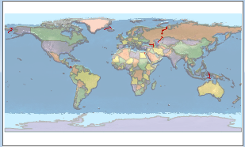
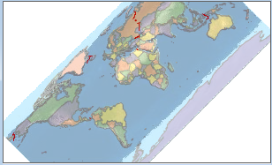
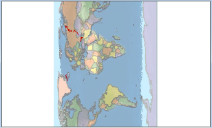

---
id: Rotate
title: Rotating the Map
---  

The Basic group on the Map Properties tab provides functions such as map name, show settings and so on.

### Rotating the Map

Set the rotation angle of the current active map. You can enter a rotation angle in the text box at right of the label. The map will be rotated by the angle you specified. The rotation angle ranges from -360 to 360 degrees with 0.1 degree accuracy. A positive value represents counterclockwise rotation, while a negative value represents clockwise rotation. After typing the value, you can press Enter to rotate the map by the angle you specified.

For each rotate operation, the map will be rotated based on the original status. The base point around which the map rotates is the center of the visible extent of the current map window. The rotate operation will not change the data in each layer of the map.

| |   
---|---|---  
The original status of the map| The map after 45-degree rotation| The map after 90-degree rotation  
  
### Note

It isn't recommended to rotate the cache map. If you want to get a better rotation, you can rotate the configured map first, and then generate the cache files.