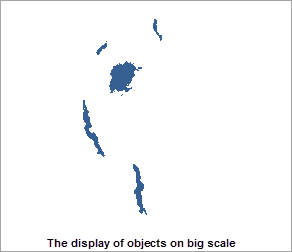
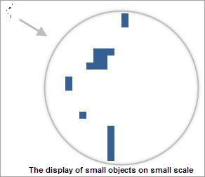
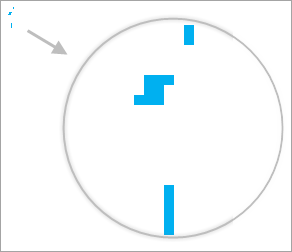
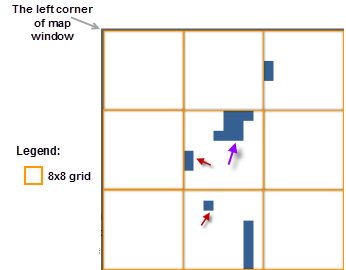
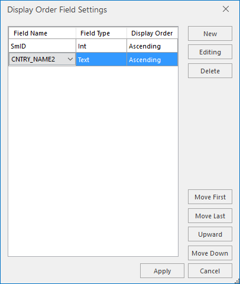
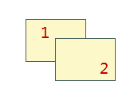
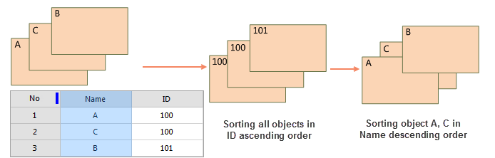

Set a vector layer as the current layer in the layer manager, then the layer properties dialog box displays some options for vector layer setting, including complete Line, optimize cross, scale symbol, min object size, filter expression and so on.
  
### Display Complete Lines

The Complete Line option ensures the line symbols are displayed completely, contributing the the optimization of line display. For more details, please refer to [Complete Line](../AdvanceSetting/Linedisplay.htm).

### Crossroads Optimization

In line layers, lines often intersect with each other. It is not beautiful and can not show the connectivity between the two line objects. For more details, please refer to [Optimize Cross](../AdvanceSetting/Linedisplay.htm).

### Scale Symbol

The Scale Symbol option controls whether symbols can be magnified or shrinked when zoom in or zoom out maps. It is applicable to marker symbol, line symbol, fill symbol and its border. The symbol size will be changed as the map after checking the check box. The measure of scale symbols is based on the base scale and the scale after map zooming. For more details, please refer to [Scale Symbol](../AdvanceSetting/SymbolZoom.htm).

### Antialiasing

Antialiasing: While drawing lines that are not horizontal or vertical on the screen, zig zags will appear. Antialiasing is used to reduce such effect.

Map antialiasing and layer antialiasing must be enabled together to make antialiasing take effect. Please refer to [Map Display Optimization](../../Optimization/MapOptimization/MapOptimization.htm#1) for map antialiasing.

### Show Overlay

For controlling whether or not objects overlaid will be displayed. If you check it, all objects will be displayed. You must also check the Show Overlay checkbox in the Map Properties panel to display the overlay object effect. Can also be set in the overlay settings, the specific content, please refer to [Overlay Setting](../../Optimization/MapOptimization/OverlaySetting.htm).

### Minimum Size of Objects

The text box on the right side of the Min Size label is used to set the minimum size that an object can be displayed in the current layer. For a zooming map, if the maximum value of the width and height of the minimum bounding box of any geometry object is less than the specified minimum size, then the object is invisible. Users can enter a number in the text box to set the minimum size. The unit is millimeter.

### Rarefy Display

When there are too many nodes on lines or polygons, you can rarefy these vector objects by setting a threshold, thereby improving map display performance. Note: The feature is worked on a line or region dataset.

* **Tolerances (pixel)** : Rarefy lines or regions if the number of their nodes is bigger than the specified thresold value. The tolerance unit is pixel, and the default value is 0.5. For example, if you specify the thresold value is 500, the line whose nodes are more than 500 will be rarefied.
* **Threshold** : Given the biggest number of object nodes, the system will thin the object within the tolerance range whose node number is bigger than the value.

The feature controls the display of data in the current screen without involving in the topological relations between objects, perhaps, there are some spaces appearing between two adjacent objects after performing the feature.

### Filter overlapping small objects

Only one object of all small objects will be shown within the given tolerance range. This feature can reduce the consumed time of displaying massive small objects on a small scale, and improve browsing performance.

* **Tolerance** : Specify the size of a region of a unit. The valid value is from 1 to 10 in pixel. 
* **Min Object Size** : The threshold of size of filter objects involved in the operation. The valid value range is from 1 to 10 in pixel.

**Overlapping small object** : the object whose bound's length and width are less than the specified threshold will be considered as a small object. Multiple small objects whose bounds' centers fall into a unit of the specified pixel area (a square area whose border is the same as the min object size) are considered as overlapping objects.

**Filter overlapping objects** : Only one object of all overlapping objects in a pixel unit will be shown.

Following pictures demonstrate how the feature works on small overlapping objects. The figure 1 shows the display of objects in a big scale and small scale.

 |   
---|---  
Figure 1: Without using the feature  
  
Set the tolerance to 8 pixels to divide the whole map into 8x8 grid boxes. Set the size of the minimum object to 2 mm. Objects having a rectangle boundary width and height less than 2 mm will be counted as small objects. All small objects (the red arrows in the figure 3) having center point in the grid will be hidden, except for the one small object (the purple arrow in the figure 3) that is selected by the system, depending on the object display order.

For more details on the object display order, please refer to Object Order Field.

  
Figure 2: The result after using the feature  
  
Figure 3: The demonstration of how the feature works  
  
Both the feature "Min Object Size" and the feature "Filter overlapping small objects" can reduce the consumed time of displaying massive small objects on small scale. But the difference is: for the former, all objects having a rectangle boundary width and height less than the given value are hidden, which will lead to there are no objects in some areas.

### Filter Expression

The function is used for setting filter expression to display objects meeting the condition. For more details, please refer to [Filter Expression](../AdvanceSetting/SymbolZoom.htm).

### Object Order Field

The order of drawing objects affects the display of objects in your map. But objects in a map can be shown as the order of field values. SuperMap introduces the feature of setting multiple fields which allows you to set multiple sorting fields, and so the objects will be shown in the order of the first field, and if there are objects have the same values, they will be sorted as the order of the second field and so on. You can adjust the order of sorting fields with the buttons at the right-bottom corner.

  
Figure: Setting the display order of objects

If you do not specify any sorting field, the objects will be shown as their drawing order. In general, take the field SmID ascending the rule display. Currently, only the single vector layer or a single thematic map layer are supported to set Object Order Field.

Field | Sorting | Icon  
---|---|---  
SmID | Ascending |   
SmID | Descending |   
  
As following pictures show: To adjust the order of displaying object A, B and C, the first sorting field is ID in ascending order, and then sorts the objects with the same ID values as the sorting field Name in descending order.

  
  
**Note** : The display order you set will be saved in the current workspace.

### Set Join Attribute Table

Click Set Join Attribute Table to set the associated field to connect to an external table. And then through the constructed filter with an external table field to filter the contents of the display layer. See [Display the filtered objects in the map](../AdvanceSetting/FilterObjects.htm) for specific operation steps.