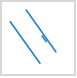

Set a vector layer as the current layer in the layer manager, then the layer
properties dialog box displays some options for vector layer setting,
including complete Line, optimize cross, scale symbol, min object size, filter
expression and so on.

### Complete Line

The Complete Line combo box ensure the line symbols are displayed completely,
contributing the the optimization of line display.

If the line length is less than a unit of the cycle length of the line symbol
or is not the integer multiple of the line symbol, the lack part will not be
displayed. The Complete Line command will calculate considering the line
length and line symbol length to draw a line whose length is very similar to
the original line.

Below shows the incomplete display of the line symbol like .
| 
---|---
Incomplete line| Complete Line

We can see the Complete Line command contributes to the map optimization.

### Optimize Crossroad

The situation that lines intersect with each other often happen in line
layers, which makes a map not beautiful and can not show the connectivity
between two line objects.

As shows in the figure below, we often need to optimize intersecting lines
like removing the intersection parts at the cross.

 | 
---|---
Before optimizing the crossroad | After optimizing the crossroad

* The feature **Optimize Cross** can work on common line layers and network line layers excluding CAD line layers and route data.
* This function can employ on double-line objects. It doesn't support single-line symbols.

 |  
---|---
Double-line |Single-line 
**Optimize Cross**

Check the box **Optimize Cross** in the **Layer Properties** to optimizing all
crossroads in your layer.

 | 
---|---
Before using cross optimization| After using cross optimization

### Scale Symbol

Scales symbols with map zooming. The command can be applied to the point
symbol, line symbol, fill symbol and the border lines of the fill symbol.

Check the **Scale Symbol** box to scale symbols with map zooming.

**Scale**

Defines a reference scale at which symbols will appear as their true sizes.
Symbols will appear larger as you zoom in your map and smaller as you zoom
out. Setting a reference scale is like freezing the size of symbols used in
your map; the way they look at the reference scale is maintained at all
scales. For instance, if you set the reference scale at 1:500000 and the
symbol size is 30. The symbol will be scaled up by 5 times to 150 if you zoom
the map to 1:100000.

The **Scale** command is active only if the **Scale Symbol** box is checked.
You can click the **Scale** drop-down arrow and select **Set Current Scale**
to set the reference scale to the current scale. Also, you can click Clear to
cancel the reference scale setting.

**Note** : If the reference scale is different form the current map scale,
disabling the feature **Scale Symbols** may make the symbol size change in the
current map window. At this moment, the symbol will be displayed according to
the current map scale.

### Antialiasing

Antialias: While drawing lines that are not horizontal or vertical on the
screen, zig zags will appear. Antialias is used to reduce such effect.

Map antialias and layer antialias must be enabled together to make
antialias take effect. Please refer to [Map Display
Optimization](../../Optimization/MapOptimization/MapOptimization) for
map antialias.

### Show Overlays

For controlling whether or not objects overlapped will be displayed. If you
check it, all objects will be displayed. You must also check the Show Overlay
checkbox in the Map Properties panel to display the overlay object effect. Can
also be set in the overlay settings, the specific content, please refer to
[Overlay Setting](../../Optimization/MapOptimization/OverlaySetting).

### Min Object Size

The text box on the right side of the Min Size label is used to set the
minimum size that an object can be displayed in the current layer. For a
zooming map, if the maximum value of the width and height of the minimum
bounding box of any geometry object is less than the specified minimum size,
then the object is invisible. Users can enter a number in the text box to set
the minimum size. The unit is millimeter.

### Rarefy Display

When there are too many nodes on lines or polygons, you can rarefy these
vector objects by setting a threshold, thereby improving map display
performance. Note: The feature is worked on a line or region dataset.

* **Tolerances (pixel)** : Rarefy lines or regions if the number of their nodes is bigger than the specified threshold's value. The tolerance unit is pixel, and the default value is 0.5. For example, if you specify the threshold value is 500, the line whose nodes are more than 500 will be rarefied.
* **Threshold** : Given the biggest number of object nodes, the system will thin the object within the tolerance range whose node number is bigger than the value.

The feature controls the display of data in the current screen without
involving in the topological relations between objects, perhaps, there are
some spaces appearing between two adjacent objects after performing the
feature.

### Filter overlapping small objects

Only one object of all small objects will be shown within the given tolerance
range. This feature can reduce the consumed time of displaying massive small
objects on a small scale, and improve browsing performance.

* **Tolerance** : Specify the size of a region of a unit. The valid value is from 1 to 10 in pixel. 
* **Min Object Size** : The threshold of size of filter objects involved in the operation. The valid value range is from 1 to 10 in pixel.

**Overlapping small object** : the object whose bound's length and width are
less than the specified threshold will be considered as a small object.
Multiple small objects whose bounds' centers fall into a unit of the specified
pixel area (a square area whose border is the same as the min object size) are
considered as overlapping objects.

**Filter overlapping objects** : Only one object of all overlapping objects in
a pixel unit will be shown.

Following pictures demonstrate how the feature works on small overlapping
objects. The figure 1 shows the display of objects in a big scale and small
scale.

 | 

Set the tolerance to 8 pixels to divide the whole map into 8x8 grid boxes. Set
the size of the minimum object to 2 mm. Objects having a rectangle boundary
width and height less than 2 mm will be counted as small objects. All small
objects (the red arrows in the figure 3) having center point in the grid will
be hidden, except for the one small object (the purple arrow in the figure 3)
that is selected by the system, depending on the object display order.

For more details on the object display order, please refer to Object Order
Field.

 | 

Both the feature "Min Object Size" and the feature "Filter overlapping small
objects" can reduce the consumed time of displaying massive small objects on
small scale. But the difference is: for the former, all objects having a
rectangle boundary width and height less than the given value are hidden,
which will lead to there are no objects in some areas.

### Filter Expression

The function is used for setting filter expression to display objects meeting
the condition. For more details, please refer to [Filter
Expression](../AdvanceSetting/SymbolZoom).

### Object Display Order Field

The order of drawing objects affects the display of objects in your map. But
objects in a map can be shown as the order of field values. SuperMap
introduces the feature of setting multiple fields which allows you to set
multiple sorting fields, and so the objects will be shown in the order of the
first field, and if there are objects have the same values, they will be
sorted as the order of the second field and so on. You can adjust the order of
sorting fields with the buttons at the right-bottom corner.

If you do not specify any sorting field, the objects will be shown as their
drawing order. In general, take the field SmID ascending the rule display.
Currently, only the single vector layer or a single thematic map layer are
supported to set Object Order Field.

As following pictures show: To adjust the order of displaying object A, B and
C, the first sorting field is ID in ascending order, and then sorts the
objects with the same ID values as the sorting field Name in descending order.

**Note** : The display order you set will be saved in the current workspace.

### Set Join Attribute Table

Click Set Join Attribute Table to set the associated field to connect to an
external table. And then through the constructed filter with an external table
field to filter the contents of the display layer. See [Display the filtered
objects in the map](../AdvanceSetting/FilterObjects) for specific
operation steps.

