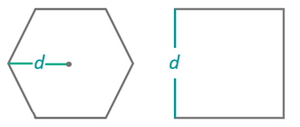
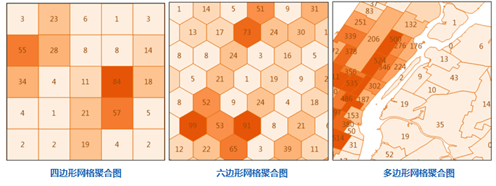

　　点聚合分析是指针对点数据集制作聚合图的一种空间分析。通过网格面或多边形对地图点要素进行划分，然后计算每个面对象内点要素的数量，并作为面对象的统计值，也可引入点的权重信息，考虑面对象内点的加权值作为面对象的统计值；最后基于面对象的统计值，按照统计值大小排序的结果，通过色带对面对象进行色彩填充。

　　点聚合分析类型包括：网格面聚合、多边形聚合，其中网格面聚合图按照网格类型又可分为：四边形网格、六边形网格。

##### 应用场景

- 可根据近几年全球恐怖袭击数据，分析恐怖袭击事件对各地区的影响，例如：伤亡人数、事件发生次数等。
- 分析自然灾害对各地区的影响，以及伤亡情况，例如地震、泥石流、暴雨等。

##### 功能入口

　　提供了两个功能入口，如下所述：

- 在“在线”选项卡的“分析”组中，选择“网格面聚合分析”或“多边形聚合分析”，即可弹出参数设置对话框。
- 在**工具箱**，双击“在线分析”中的“网格面聚合分析”或“多边形聚合分析”，或者选中对应功能，将其拖拽到“可视化建模”窗口中，双击即可弹出**参数设置**面板。

##### 分析参数说明

1. **iServer服务地址**：通过下拉选项登录iServer服务地址和帐号，详细说明请参见[数据输入](DataInputType.html)页面。
2. **源数据**：用于设置进行聚合分析的点数据集，单击下拉按钮选择即可，下拉选项中会自动过滤符合分析要求的源数据集，详细说明请参见[数据输入](DataInputType.html)页面。
3. **聚合类型**
  - 多边形聚合：若为多边形聚合分析，则需要设置需要聚合面数据集，比如行政区划面，设置方式请参加[数据输入](DataInputType.html)。
  - 网格面聚合：若为网格面聚合分析，还需要设置以下网格面类型、分析范围、网格大小、网格大小单位。

<!--   - 多边形聚合：根据指定的面数据集中多边形对象范围，来统计每个多边形内点要素的数量，若选择该方法，则需要设置需要聚合面数据集，比如行政区划面，设置方式请参加[数据输入](DataInputType.html)页面。
   - 网格面聚合：是指根据指定的网格大小，将分析范围划分若干个四边形或六边形，再将指定点要素数量汇总到各个网格中。选择网格面汇总需要设置以下网格面类型、分析范围、网格大小、网格大小单位。-->
4. **网格面类型**：必填参数，包括四边形网格和六边形网格。
5. **分析范围**：选填参数，指定范围内的点参与汇总分析，默认为源数据集的全幅范围。范围分析的输入顺序为左下右上，中间以英文的逗号隔开，例如：-74.050,40.650,-73.850,40.850。除了手动输入范围外，还可以通过复制属性中的数据集或对象范围，将其粘贴至此，粘贴后将左下右上等字符删除即可。
5. **网格大小**：必填参数，四边形网格为网格的边长；对于六边形网格为六边形顶点到中心点的距离，默认值为10。

　　

6. **网格单位**：必填参数，可选值：米、千米、码、英尺、英里，默认值为米。
7. **权重值字段**：指定待分析的点的权重值所在的字段名称，可设置多个字段，格式如：col7,col8。
   - 可以传递多个表示权重的字段索引，以逗号分隔，相当于对待分析的点进行多次操作，每次对应不同的权重值。
   - 如果该参数为空，则点的权重为1。
   - 无论该值设置与否，都会自动分析权重值为1的情况，即以点的个数作为面对象的统计值，结果体现在结果数据集的属性表字段里。
   - 当该字段设置时，则“统计模式”也必须设置，且二者的个数需要一致，一一对应。

8. **统计模式**：选填参数，支持的模式包含：最大值、最小值、平均值、总和、方差、标准差。统计模式的个数需与“权重值字段”个数保持一致。

9. 设置好以上参数即可执行分析，分析结果会自动在地图窗口中打开，结果数据的保存路径也会在输出窗口中打开，从该路径获取结果数据集。

　　

