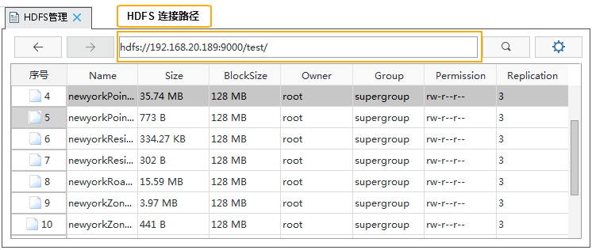

通过 SuperMap iDesktop 桌面可访问 Hadoop 分布式文件系统，实现与 HDFS 数据的交互。支持对文件系统的操作包含：读取文件，创建目录，删除数据、下载数据、上传数据等，并可通过任务管理器实时查看数据传输的状态，同时支持在传输数据突然中断时，记录数据传输的中断状态，在重新启动应用程序后自动恢复传输任务，无需用户

### 数据管理  
    
 在“在线”选项卡的“管理”组中，单击“数据管理”按钮，即可弹出“**HDFS管理**”窗口。
  
1. 首先需要连接所要管理的 HDFS 文件系统，即填写 HDFS 路径，如：hdfs://{ip}:9000。单击  按钮或按回车键进行连接。若地址输入错误，系统将提示：获取文件列表失败，请检查路径是否正确。请您修改配置后，重新连接。  
  
     
2. 成功连接后，程序将读取当前地址下的文件，在“HDFS管理”窗口以文件列表的形式显示，用户可对文件进行下载、删除、重命名等操作。  
  
- **下载**：在文件列表中选择单个文件，在右键菜单栏中选择“**下载**”项，弹出“下载”对话框，用户可修改“文件名称”和“本地路径”，即可下载所选数据。
- **删除**：支持删除一个或多个文件/文件夹。在文件列表中选择单个或多个文件/文件夹，在右键菜单栏中选择“**删除**”项，即可删除所选数据。
- **重命名**：支持对已有文件/文件夹进行重命名。在文件列表中选择单个文件/文件夹，在右键菜单栏中选择“**重命名**”项，在弹出的“重命名”对话框中，修改文件名称，即可对所选数据进行重命名。
  
3.**生成 meta 文件**：支持对文件系统中的 csv 文件，生成对应的 .meta 文件，该.meta文件记录了 csv 数据文件的元信息。 当使用csv 数据进行分布式分析服务时，需在 csv 存放目录下有与其对应的 .meta 文件，才可进行分析。
   
在文件列表中选择单个CSV文件，在右键菜单栏中选择“**生成meta文件**”项，弹出“生成meta文件”对话框。支持对对象类型、存储格式、编码类型、坐标系以及字段类型设置。    

 -   对象类型：csv 文件中的对象类型，用户可修改对象类型为点、线、面等。
 -   存储格式：提供 WKT 和 XYColumn 两种存储格式。
 -   编码类型：生成 meta 文件的编码类型。该选项的设置仅对记录预览生效，在 meta 文件中不做保存。应用程序提供了多种编码类型：UTF-8、GB2312、Big5、GBK、GB18030、UTF-16、UTF-32等。
 -   坐标系名称：支持设置生成文件的坐标系类型。
 -   首行为字段信息：设置生成 meta 文件是否将原 CSV 文件的首行作为字段名称。勾选该参数，则导入后的字段名称为首行的字段值，否则为属性信息。如果 CSV 文件首行指定了字段信息，则应用程序会自动读取。 

 -   字段设置：可在字段设置栏中，修改字段名称和字段类型。因 CSV 文件是以文本形式记录数据的纯属性文件，文件本身并没有字段信息，此处设置字段类型，可在 meta 文件中保存字段信息，方便程序在分布式分析时，快速的提取数据信息。 
	 
以生成以数据 newyorkPonit_P.csv 为例，生成.meta 文件内容如下所示：
   

 	  
  
### 上传数据  
  
支持上传本地数据至 HDFS 中。在“在线”选项卡的“管理”组中，单击“上传数据”按钮，弹出“选择文件”对话框，选择上传的文件即可。   

### 下载数据  
   
支持下载当前 HDFS 选中数据。在“在线”选项卡的“管理”组中，单击“下载数据”按钮，弹出“下载”对话框，功能与右键菜单栏中的下载功能一致。  
  

### 任务管理      
  
在上传数据和下载数据时，程序会弹出“**HDFS任务管理**”对话框，用户可在“HDFS任务管理”对话框中查看数据的上传进度，下载进度并支持暂停或删除传输任务。  
   
### 新建文件夹  
  
支持在当前 HDFS 文件系统中创建目录文件夹，在“在线”选项卡的“管理”组中，单击“新建文件及”按钮，弹出“新建文件夹”对话框，输入新的文件夹名称即可在当前路径下新建文件夹目录。  

### 恢复任务

若在数据传输过程中，遇到了断电、程序意外退出等导致数据传输中断的情况，程序会记录当前传输状态，在重启程序之后，在“在线”选项卡的“管理”组中，单击“**恢复任务**”按钮，弹出“恢复任务”对话框，用户可选择恢复下载任务数和上传任务数，单击“**确定**”按钮，继续程序中断前的传输任务，无需重新输入连接信息即可恢复任务。
  　　

