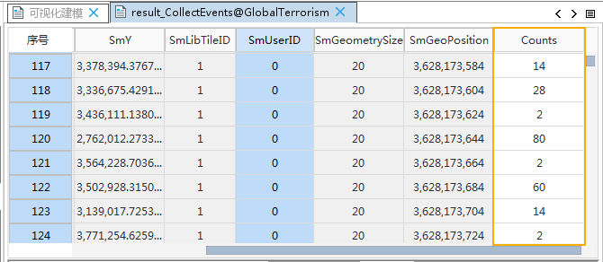

　　收集事件工具可将事件点数据转换为加权点数据，如犯罪或疾病事件点。用于数据的简单处理，目的是为了与其他空间统计分析功能结合使用。适用于点、线、面数据集。

### 　　分析原理

　　收集事件，将事件数据转换成加权数据。 

- 结果点数据集中包含一个 Counts 字段,该字段会保存每个唯一位置所有质心的总和。
- 收集事件只会处理质心坐标完全相同的对象,并且只会保留一个质心,去除其余的重复点。
- 对于点、线和面对象，在距离计算中会使用对象的质心。对象的质心为所有子对象的加权平均中心。点对象的加权项为1（即质心为自身），线对象的加权项是长度，而面对象的加权项是面积。

### 　　操作说明

　　提供了两个功能入口，如下所述：

- 在“空间分析”选项卡的“空间统计分析”组中，单击“实用工具”中的“收集事件”，即可弹出“收集事件”对话框。
- 在“可视化建模”选项卡中单击“新建”调出“工具箱”，双击“空间统计分析”→“聚类分布”→“收集事件”，即可弹出“热点分析”对话框。

### 　　主要参数

- **源数据**：设置待分析的矢量数据集，支持点、线、面三种类型的数据集。
- **结果设置**：设置结果数据所要保存在的数据源，及数据集名称。

### 　　结果输出

　　设置好以上参数后，单击对话框中的“运行”按钮，即可执行收集事件操作。以阿富汗和巴基斯坦1947-2016年的恐怖袭击数据为例，进行收集事件后得到的加权值如下图所示，Counts字段记录了每个事件点发生恐怖袭击的次数。

　　

###  相关主题

　　[聚类异常值分析](ClusterOutlierAnalyst.html)

　　[优化的热点分析](OptimizedHotSpotAnalyst.html)

　　[分析模式](AnalyzingPatterns.html)

