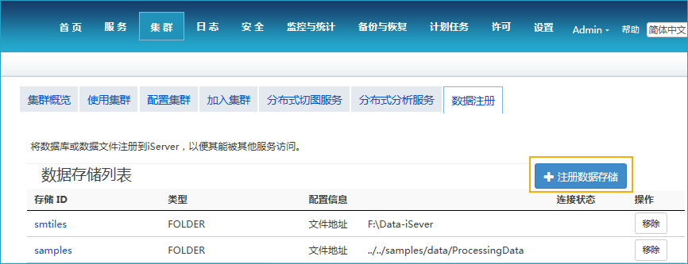
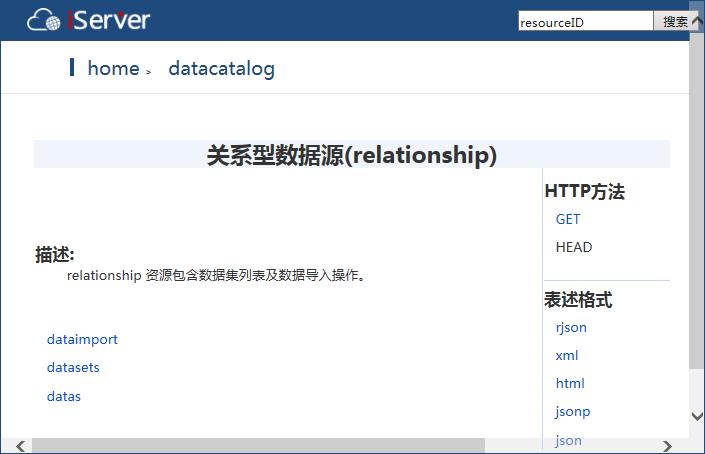
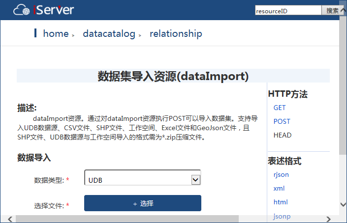
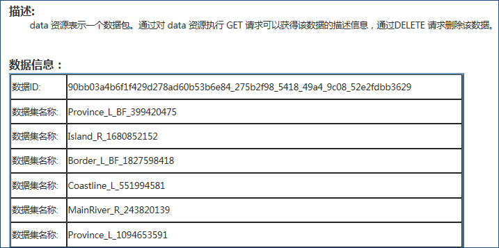

### 连接 iServer 服务  

在线分析数据输入前，需先启动 iServer 服务，通过设置 iServer 服务器的地址及用户名等登录信息，以确保能使用 iServer 服务。  
程序会自动记录用户在本机连接过的服务地址，再次连接时，可在 iServer 服务地址的下拉菜单中选择相应的服务地址，程序会自动连接；您也可选择新建连接，登录新的 iServer 服务。

  - 服务地址：设置已启动和配置 iServer 服务的IP地址；
  - 用户名/密码：设置有iServer管理员的帐号和密码。

### 数据输入  

　　在线分析的数据输入方式支持 **HDFS**、**iServer Catalog** 两种，其中数据的使用和准备请参见：[数据准备](DataPreparation.html)。

#### HDFS

　　使用 HDFS 的数据输入方式，单击“选择文件”右侧的“浏览”按钮，在弹出的对话框中输入 HDFS 的数据地址，并选择待分析的 csv 文件。需要注意的是：    
 
  1. HDFS 中可存储点、线、面等多种类型数据，但目前 iServer 只支持点数据进行分析，若用户选择点数据类型以外的数据进行分析，会提示分析失败。   
  2. 参与分析的 csv 数据需要有对应的 meta 文件，若未创建 meta 文件，单击“meta文件不存在，请设置后使用”提示框中的“确定”按钮，即可在随后弹出的对话框中设置相关参数，“保存”后即可为 csv 文件创建 meta 文件。

#### iServer Catalog

　  使用 iServer Catalog 的数据输入方式，单击数据集右侧的下拉按钮，在弹出的数据集列表中显示为当前服务地址中可用于分析的数据类型，用户选择用于当前分析的数据即可。
   用户还可通过“**注册数据**”和“**导入数据**”两种方式注册和导入新的数据用于当前分析。  

1.**注册数据**：单击注册数据按钮，程序将自动弹出 iServer 数据注册的服务页面，即可注册新的自管理数据存储位置，即磁盘共享目录、HDFS 目录和空间数据库。自管理的数据会出现在 sharefile 资源下。有关注册数据的详细说明请参见：[注册数据](DataPreparation.html)。      
  
   

2.**导入数据**：单击导入数据按钮，程序将自动弹出 iServer datacatalog 关系型数据列表页面。在该页面用户可进行导入数据的操作。**注意**：在导入数据前，请您将iServer Datastore 配置到当前连接的 iServer 服务地址中。
  
   

  - 在 relationship/dataimport 资源下，可以上传数据集。支持上传的文件类型包括：UDB数据源、CSV文件、工作空间、Excel 文件、 GeoJson 文件和Shape文件，且 udb 数据源、Shape文件与工作空间导入格式需要压缩为 *.zip 的格式。    

     

  - 上传成功的数据集，可在 relationship/datasets 资源的数据集列表中查看。  
       
   
  
3.通过以上两种方式输入成功的数据均会在数据集下拉菜单中显示，用户选择用于当前分析的数据即可。

