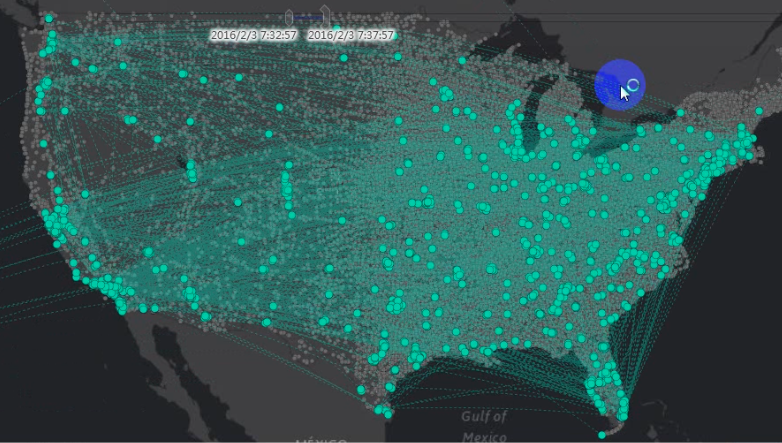

　　要素连接可根据空间、时间、属性关系，或这三者间的某种组合关系，将一个数据集中的属性连接到另一个数据集中，数据集可以是空间数据也可以是属性数据。要素连接会根据指定的条件，先确定满足连接条件的所有输入对象，再将满足要求的输入对象连接到源数据的对象。

　　连接要素工具可将信息从一个图层传递并追加到另一个图层。连接要素时，可以基于空间关系、属性关系、时间关系或三者的组合来连接要素。

##### 空间关系

　　确定要素彼此的空间关系，可用的关系将取决于正在连接的图层的几何类型（点、线或面）。提供的空间关系如下：邻近、包含、被包含、交叉、相交、重叠、邻接、不相交、同一，具体说明请参考[空间查询的基本算子](SpatialQuery_BasicOperators.html)
 - **邻近**：连接对象与源对象在指定的距离半径的范围内，则满足条件。
 - **包含**：源对象包含连接对象，不一定要完全包含，边界有交集也可以。 

包含  |图示| 说明     
 :----- |  :----: | :----  
包含_点点  | | 点重合。  
包含_线点  | |线A包含点B，B在A上，包括在线A的端点上。  
包含_线线  ||线 A 包含线 B，B 的端点可以与A的端点重合。   
包含_面点|   |面 A 包含点 B，B 可以在 A 的内部或边界上。 
包含_面线|   |面A包含线B，B 的端点可以在A的边界上。 
包含_面面|  |面 A 包含面 B，B 的边界可以与A的边界重合。 

 - **被包含**：源对象被连接对象包含。

被包含 | 图示| 说明     
 :----- |  :----: | :----   
被包含_点点 |   |点重合。 
被包含_点线 |    |点A被线B包含，A可以与B的端点重合。    
被包含_点面 |   |点A被面B包含，A可以在B的内部或边界上。
被包含_线线 |    |线A被线B包含，A的端点可以与B的端点重合。 
被包含_线面 |   |线A被面B包含，A可以在B的内部或边界上。   
被包含_线面 |    |面A被面B包含，A的边界可以与B的边界重合。 

 - **交叉**：源对象与连接对象有穿越关系。

交叉  |图示| 说明     
 :----- |  :----: | :----  
交叉_线线| | 线穿越线，从一侧进入，内部某处另一侧穿出，且内部交集只能是点。   
交叉_线面|| 线穿越面，线的两个端点至少有一个在面的外部。 

 - **重叠**：同类型对象重合，如点与点、线与线、面与面重合。  

重叠  |图示| 说明     
 :----- | :----: | :----    
重叠_线线  |    | 线 A 与线 B 部分重叠，详细制约关系见上文基本关系说明。若 B 完全在 A 上或 A 完全在 B 上，则不满足查询条件。   
重叠_面面  |    |面 A 与面 B 部分重叠。若 B 完全在 A 内或 A 完全在 B 内，则不满足查询条件。 
  
 - **相交**：源对象与连接对象有交集。

相交 |图示| 说明     
 :----- |  :----: | :----    
相交_点点|   |点A与点B重合。   
相交_点线|   |点A与线B有交集。 
相交_点面|  |点A与面B有交集。 
相交_线点|   |线A与点B有交集。 
相交_线线|   |线A与线B有交集。 
相交_线面|  |线A与面B有交集。 
相交_面点|  |面A与点B有交集。 
相交_面线|  |面A与线B有交集。 
相交_面面|  |面A与面B有交集。 

 - **邻接**：两个数据集中的对象有公共点或公共边。

邻接 |图示| 说明     
 :-----  | :----: | :----     
邻接_点线|    |点A在线B的端点上。 
邻接_点面|    |点A在面B的边界上。 
邻接_线点|   |点B在线A的端点上。 
邻接_线线|    |**线A邻接线B**有三种情况：       
邻接_线面|    |线A的一个端点在面B的边界上，其余在面B的外部；或者线A的一部分在面B的边界上，其余在面B的外部；或者线A全部在面B的边界上。 
邻接_面点|    |点B在面A的边界上。 
邻接_面线|   |线B的一个端点在面A的边界上，其余在面A的外部；或者线B的一部分在面A的边界上，其余在面A的外部；或者线B全部在面A的边界上。 
邻接_面面|    |面A与面B只有边界有交集。 

 - **不相交**：两个数据集中的对象没有交集。

不相交 |图示| 说明     
 :----- |  :----: | :----   
不相交_点点|   |点A与点B不重合。   
不相交_点线|   |点A与线B无任何交集。  
不相交_点面|   |点A与面B无任何交集。 
不相交_线点|   |线A与点B无任何交集。 
不相交_线线|   |线A与线B无任何交集。 
不相交_线面|   |线A与面B无任何交集。 
不相交_面点|   |面A与点B无任何交集。 
不相交_面线|   |面A与线B无任何交集。 
不相交_面面|   |面A与面B无任何交集。 

 - **同一**：两个数据集先求交，然后求交结果再与源数据集求并。

##### 应用场景

- 分析资金交易的流向，统计指定时间内，汇入同一个账户的金额总和。
- 通过要素连接工具，可将城市各辖区（如学区、警务区、社区等）附加信息追加到每一起犯罪中，进一步研究和分析犯罪对不同辖区的影响。 

##### 功能入口

　　提供了两个功能入口，如下所述：

- 在“在线”选项卡的“分析”组中，选择“要素连接”，即可弹出**要素连接**的参数设置对话框。
- 在**工具箱**，双击“在线分析”中的“要素连接”，或者选中对应功能，将其拖拽到“可视化建模”窗口中，双击即可弹出**参数设置**面板。

##### 分析参数说明

1. **iServer服务地址**：通过下拉选项登录iServer服务地址和帐号，详细说明请参见[数据输入](DataInputType.html)页面。
2. **源数据**：需要连接属性的数据，即将连接数据的要素和属性连接到源数据中，单击下拉按钮，选择源数据即可。源数据设置的详细说明请参见[数据输入](DataInputType.html)页面。
3. **连接数据**：必填参数，提供连接属性的数据，单击下拉按钮，选择连接数据，支持点、线、面类型的数据集。数据设置的详细说明请参见[数据输入](DataInputType.html)页面。
4. **连接方式**：必填参数，指源对象属性与连接对象的匹配关系，提供了一对一、一对多两种连接方式。
   - **一对一连接**：如果满足条件的连接对象是一个，那么就会将连接对象的连接字段属性值更新到源对象中；如果满足条件的连接对象是多个，那么将只统计满足条件的个数。
 
   - **一对多连接**：此方式会将每一个满足条件的多个对象，都保留到结果数据集中，例如：源数据集中的一个对象与连接数据集中的五个对象相匹配，结果数据集中将包含这五个对象
　　

5. 连接要素时，可以基于空间关系、属性关系、时间关系或三者的组合来连接要素，这三个复选框可人一样勾选一个、两个或者三个进行设置，具体说明如下：
  - **空间关系**：确定要素彼此的空间关系，可用的关系将取决于正在连接的图层的几何类型（点、线或面）。提供的空间关系如下：邻近、包含、被包含、交叉、相交、重叠、邻接、不相交、同一。
  - **时间关系**：确定对象彼此的时态关系，可用的关系取决于正在连接的图层的时间类型（时刻或间隔）。提供的时间关系如下：
 
时间关系 | 说明     
 :-----  |  :---- 
 **邻近** | 当源时间在连接时间的指定时间范围内时，源时间邻近连接时间。
 **之后** | 当源时间在连接时间之后，且与其间隔在指定时间范围内时，源时间则处于连接时间之后。
**之前** | 当源时间在连接时间之前，且与其间隔在指定时间范围内时，源时间则处于连接时间之前。
**包含** | 当连接时间发生在源时间间隔的起点和终点之间时，源时间包含连接时间。
**期间** | 当源时间发生在连接时间间隔的起点和终点之间时，源时间处于连接时间期间。
**终止** | 当源时间与连接时间在同一时间结束，且源时间在连接时间之后开始。
**被终止** | 源时间与连接时间在同一时间结束，且源时间在连接时间之前开始。
**相接** | 源时间与连接时间间隔在同一时间开始，且源时间在连接时间之前开始，在连接时间间隔终点之前结束。
**被相接** | 源间隔时间与连接时间在同一时间开始，且源时间在连接时间之后开始，在连接时间之后结束时。
**重叠** | 源时间间隔在连接时间间隔的起点前开始，连接时间终点前结束，则源时间与连接时间重叠。
**被重叠** | 源时间间隔在连接时间间隔的起点后开始，连接时间终点后结束。
**起始** | 源时间与连接时间间隔在同一时间开始，且源时间在连接时间间隔终点之前结束。
**被起始** | 源时间与连接时间间隔在同一时间开始，且源时间在连接时间间隔终点之后结束。
**相同** | 两个时间的起始时间或间隔完全一致，则这两个时间完全相同。

  - **属性关系**：确定对象彼此的属性关系，如果连接数据中的字段值等与源数据中的字段值想等或（不相等），满足条件的对象进行匹配。

6. **属性统计字段**：可以将符合条件的字段值进行统计，可统计单个字段信息，也可分别对多个字段进行统计，若设置了多个统计字段，那么统计模式也要对应设置多个。
7. **属性统计模式**：提供了最大值、最小值、平均值、总和、方差、标准差集中统计模式，单击下拉按钮设置即可。
5. **时间间隔单位**：必填参数，提供了秒、毫秒、分钟、小时、天、周、月、年，默认为秒。
8. **容限值**：设置满足条件的容限值。

##### 专题图参数

1. **数字精度**：此字段用于设置分析结果标签专题图中标签数值的精度，如“1”表示精确到小数点的后一位，默认值为1。
2. **分段模式**：设置专题图的分段模式，提供了等距离分段、对数分段、等计数分段、平方根分段、标准差分段几种分段方式。
3. **分段个数**：设置专题图的分段个数。
4. **颜色渐变模式**：设置专题图的颜色渐变模式，提供了绿橙紫渐变色、绿橙红渐变、彩虹色、光谱渐变、地形渐变几种颜色模式。

##### 结果数据

　　设置好以上参数之后，单击执行按钮即可进行要素连接，分析成功之后，地图窗口会自动弹出分析结果，同时输出窗口会提示结果数据集所保存在的工作空间路径，可从该路径获取结果数据路径。

　　下图为：

　　

