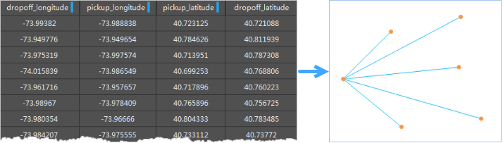

　　OD线(Origin-Destination Line)是起点和终点的连线，通常用于表示两点之间的某种关系，如航班线路、人口迁徙、交通流量、资金交易流向等。“O”表示出发点Origin，“D”表示目的地Destination，OD线构造分析就是根据OD的起始位置和终止位置，构造出来对应的OD线。

　　OD分析构造用于计算属性表数据中起点和终点间的通行量，并统计同一条线路中的属性信息（如出行人数等）。

　　

##### 应用场景

　　OD线构造分析可用于以下场景：

- 可以确定公交线网上的乘客分布规律，为公交线网优化提供数据。
- 通过个人出行调查获得数据，为城市综合交通体系规划与评价提供基础数据。
- 货流OD调查可以为分析、预测货物发生（即各交通区的货运人、运出量），分布（即各交通区之间及交通区与外地之间的货物来往量）提供必要的基础数据。

##### 功能入口

　　提供了两个功能入口，如下所述：

- 在“在线”选项卡的“分析”组中，选择“OD线构造分析”，即可弹出**OD线构造分析**的参数设置对话框。
- 在**工具箱**，双击“在线分析”中的“OD线构造分析”，或者选中对应功能，将其拖拽到“可视化建模”窗口中，双击即可弹出**参数设置**面板。

##### 参数说明

　　　OD分析构造分析的参数设置分为登录iServer、源数据、分析参数三个部分，前两部分的操作说明请参见[数据输入](DataInputType.html)页面，分析参数的介绍如下：

1. **iServer服务地址**：登录iServer帐号，具体操作请参见[数据输入](DataInputType.html)页面。
2. **行政区面数据集** ：必填参数，指定待分析数据集。
- **OD表数据集** ：必填参数，OD表数据集（仅支持属性表类型）。
- **行政区名称字段**：必填参数，指用来区别不同行政区面。
- **坐标字段数组**：必填参数，用来定义起始点和终止点坐标，单击下拉按钮，依次选择起始点X字段、起始点Y字段、终止点X字段、终止点Y字段，中间会自动用逗号隔开。
- **属性统计字段**：选填参数，仅支持系统字段以外的整形、长整形、浮点型的字段的名称。
- **属性统计模式**：选填参数，支持统计类型有最大值、最小值、平均值、记录集个数、总和、方差、标准差。
- 设置好以上参数之后，单击“**执行**”按钮，分析执行完成之后，分析结果会在地图窗口打开，分析结果的存储路径也会在输出窗口中提示。

　　下图为全球航班线OD分析结果图：

  

