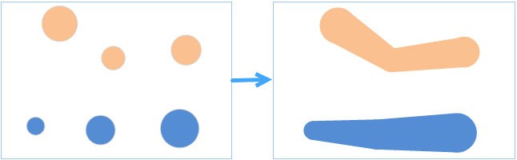
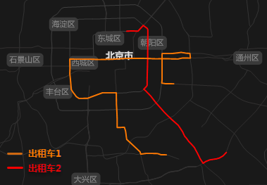
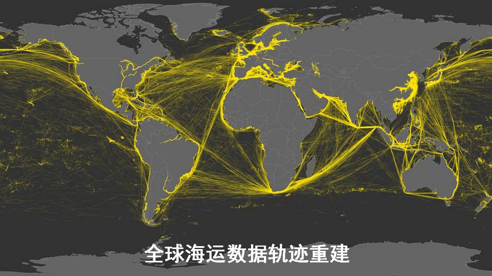

　　轨迹重建是指将连续时间下目标物所处的位置，连接并汇总到其轨迹中。可根据一个或多个轨迹字段确定轨迹，结果会以线对象或面对象表示轨迹，同时可以统计指定字段的数据，如统计台风的最大时速，或车的平均速度。

　　根据输入数据的类型，轨迹重建的结果数据类型会不同：

- 若源数据为点数据，则轨迹的结果数据为线数据，将相邻的轨迹点数据相连接，即可得到轨迹线；

- 若源数据为面数据集，则轨迹重建的结果为面数据，即对面对象计算最小外包，得到轨迹面数据。

##### 应用场景

- 车辆、飞机行驶轨迹：车辆在行驶用会每隔一段时间将其所处的位置通过GPS上传到服务器中，这样在服务器中就会存储该辆车的GPS数据，而通过该数据可以使用轨迹重建的功能来构造出车辆在一段时间内的运动轨迹，可以更直观的看出车辆的运行状态。
- 构建台风轨迹，从而进一步分析台风对哪些区域造成了影响。

##### 功能入口

　　提供了两个功能入口，如下所述：

- 在“在线”选项卡的“分析”组中，选择“轨迹重建”，即可弹出**轨迹重建**的参数设置对话框。
- 在**工具箱**，双击“在线分析”中的“轨迹重建”，或者选中对应功能，将其拖拽到“可视化建模”窗口中，双击即可弹出**参数设置**面板。

##### 分析参数说明

1. **iServer服务地址**：通过下拉选项登录iServer服务地址和帐号，详细说明请参见[数据输入](DataInputType.html)页面。
2. **源数据**：单击下拉按钮，设置记录目标物不同时间所在位置的点或面数据集，源数据设置为点数据，则结果为线数据集；源数据若为面数据，则结果为面数据集。源数据设置的详细说明请参见[数据输入](DataInputType.html)页面。
3. **时间属性字段**：必填参数，设置源数据集中记录时间的字段，**注意：**必须选日期型的字段。
4. **轨迹ID字段**：必填参数，根据ID值来标识目标对象的轨迹，即ID值相同的目标对象连接成一条轨迹。若设置了多个ID字段，即需要满足多个ID字段值分别相同，才会连接成一条轨迹对象。
5. **时间间隔**：必填参数，用来分割同一个ID的对象轨迹，例如：若时间间隔设置为60秒时，当同一个ID的对象轨迹相邻时间的轨迹数据的间隔时间小于60秒时，则轨迹数据会被划分到同一条轨迹中；如果大于60秒，则会将轨迹数据划分到不同的轨迹中。当该值为0时，表示不做时间分割，默认值为0。
5. **时间间隔单位**：必填参数，提供了秒、毫秒、分钟、小时、天、周、月、年，默认为秒。
6. **属性统计字段**：设置统计轨迹点或者面的属性字段，如速度字段。支持同时统计多个字段信息，一次选择多个字段即可。
7. **属性统计模式**：支持的统计模式有：最大值、最小值、平均值、记录集个数、总和、方差、标准差。属性统计模式的个数需与“属性统计字段”个数保持一致。
8. 设置好以上参数之后，单击执行按钮即可进行轨迹重建，分析成功之后，地图窗口会自动弹出分析结果，同时输出窗口会提示结果数据集所保存在的工作空间路径，可从该路径获取结果数据路径。

　　下图分别为两辆出租车轨迹路线、航班轨迹路线：

