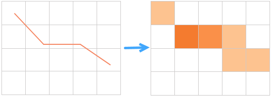
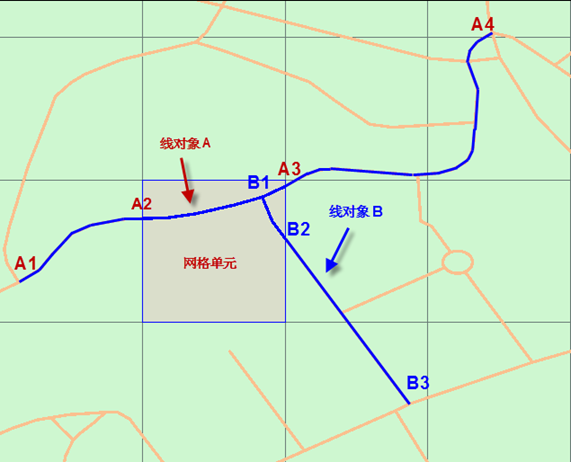
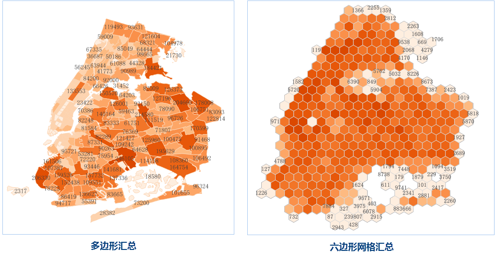

　　区域汇总分析是针对线数据集和面数据集制作聚合图的一种空间分析作业。通过网格面或多边形对地图线或面要素进行划分，然后，以标准属性字段或权重字段对每个网格单元内线或面要素进行统计，将统计结果作为该网格单元的统计值。最后按照网格单元统计值的大小进行排序，通过色带对网格单元进行色彩填充。

　　

　　区域汇总分析的概念与点聚合分析的概念类似，不同的是点聚合分析是对点数据集进行统计计算，而区域汇总分析，是对线数据集和面数据集进行统计计算。

##### 统计方式

　　在区域汇总分析的概念里，网格单元的统计值有两种统计方式，以标准属性字段统计和以权重字段统计，以图一为例进行解释。图一是以四边形网格进行的区域汇总分析，图中高亮显示的网格单元里有两个线对象，线对象A和线对象B。其中线对象A的总长是从A1至A4点，但只有A2至A3部分在网格单元内；线对象B的总长是B1至B3点，但只有B1至B2部分在网格单元内。我们现在对线数据集的“length”字段，进行"sum"统计。

- **以标准属性字段统计**

以标准属性字段统计，即对通过网格单元内的线或面对象的原有属性字段信息进行统计。  

   1. 线对象A的length属性值（即A1至A4点的总长度）为364.11；  
   2. 线对象B的length属性值（即B1至B3点的总长度）为165.01；  
   3. 以“sum”的统计模式进行统计，该网格单元的统计值结果为364.11+165.01=529.12。

- **以权重字段统计**

　　以权重字段统计即对通过网格单元内的线或面对象与网格单元相交部分的对象属性信息进行统计，相交部分的属性信息由标准属性字段的值加权计算得出。

 1. 分析算法将线对象A在A2点和A3点处打断，计算A2A3部分在整个线对象A中所占的比重，通过线对象A的length属性值（即A1至A4点的总长度）364.11，计算出A2A3的属性值为79.70；
 2. 分析算法将线对象B在B2处打断，计算B1B2部分在整个线对象B中所占的比重，通过线对象B的length属性值（即B1至B3点的总长度）165.01，计算出B1B2的属性值为31.72；
 3. 以“sum”的统计模式进行统计，则该网格单元的统计值结果为79.70+31.72=111.42。

　　

##### 应用示例

- 统计某区域各县区域内高速公路的总长度。
<!--- 统计行政区域内的河流、胡泊等水域面积，可以标准属性字段方式进行统计。-->
- 为了合理安排某市每个区域路灯维护人员的数量，可使用范围内汇总计算各各片区的街灯数量，在估算人员安排数量。

##### 功能入口

　　提供了两个功能入口，如下所述：

- 在“在线”选项卡的“分析”组中，选择“区域汇总分析”，即可弹出**区域汇总分析**的参数设置对话框。
- 在**工具箱**，双击“在线分析”中的“区域汇总分析”，或者选中对应功能，将其拖拽到“可视化建模”窗口中，双击即可弹出**参数设置**面板。

##### 分析参数说明

1. **iServer服务地址**：通过下拉选项登录iServer服务地址和帐号，详细说明请参见[数据输入](DataInputType.html)页面。
2. **源数据**：用于设置进行汇总的数据集，仅支持线数据集和面数据集。单击下拉按钮，选择即可，下拉选项中会自动过滤符合分析要求的源数据集，详细说明请参见[数据输入](DataInputType.html)页面。
3. **汇总类型**：必填参数，提供了多边形汇总和网格汇总两种类型。
   - 多边形汇总：根据指定的面数据集中多边形对象范围，来统计每个多边形内指定要素信息，若选择该方法，则需要设置需要汇总到的面数据集，比如行政区划面，设置方式请参加[数据输入](DataInputType.html)页面。
   -  网格面汇总：是指根据指定的网格大小，将汇总范围划分若干个四边形或六边形，再将指定要素信息汇总到各个网格中。选择网格面汇总需要设置以下网格面类型、分析范围、网格大小、网格大小单位。
4. **网格面类型**：必填参数，包括四边形网格和六边形网格。
5. **分析范围**：选填参数，指定范围内的点参与汇总分析，默认为源数据集的全幅范围。范围分析的输入顺序为左下右上，中间以英文的逗号隔开，例如：-74.050,40.650,-73.850,40.850。除了手动输入范围外，还可以通过复制属性中的数据集或对象范围，将其粘贴至此，粘贴后将左下右上等字符删除即可。
5. **网格大小**：必填参数。对于四边形网格为网格的边长；对于六边形网格为六边形顶点到中心点的距离。默认值为10。
6. **网格单位**：必填参数，可选值：米、千米、码、英尺、英里，默认值为米。
7. **以标准属性字段统计**：勾选该复选框，表示对通过网格单元内的线或面对象的原有属性字段信息进行统计。该参数与“以权重字段统计”必须至少选择一项设置。
   - **字段名称**：设置用于以标准属性字段统计的字段名称。
   - **统计模式**：设置用于以标准属性字段统计的统计模式。

8. **以权重字段统计**：勾选该复选框，表示对通过网格单元内的线或面对象与网格单元相交部分的对象属性信息进行统计，相交部分的属性信息由标准属性字段的值加权计算得出。该参数与“以标准属性字段统计”必须至少选择一项设置。
   - **字段名称**：设置用于以权重字段统计的字段名称。
   - **统计模式**：设置用于以权重字段统计的统计模式。
9. **是否统计长度或面积**：如果源数据集是线数据集，则同时统计线的长度作为统计结果的一部分；如果源数据集是面数据集，则同时统计面的面积作为统计结果的一部分。

##### 专题图参数

1. **数字精度**：此字段用于设置分析结果标签专题图中标签数值的精度，如“1”表示精确到小数点的后一位，默认值为1。
2. **分段模式**：设置专题图的分段模式，提供了等距离分段、对数分段、等计数分段、平方根分段、标准差分段几种分段方式。
3. **分段个数**：设置专题图的分段个数。
4. **颜色渐变模式**：设置专题图的颜色渐变模式，提供了绿橙紫渐变色、绿橙红渐变、彩虹色、光谱渐变、地形渐变几种颜色模式。

##### 结果数据

　　设置好以上参数之后，单击执行按钮即可进行区域汇总分析，分析成功之后，分析结果会在地图窗口中打开，同时结果数据的保存路径会在输出窗口中提示，可从该路径获取结果数据。

　　以统计某区域各行政区高速路长度总合为例，分析结果如下图所示：

　　
