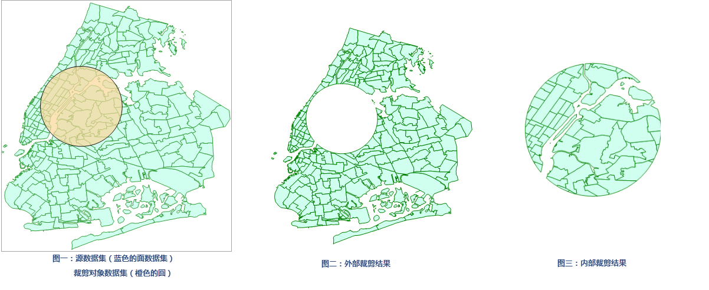

title: 矢量裁剪分析
---

　　矢量裁剪为对矢量数据集进行裁剪，包括内部裁剪和外部裁剪。 
  
　　分布式分析服务中的矢量裁剪，只支持裁剪对象数据集中有一个对象对源数据集做矢量裁剪。如果裁剪数据集中有多个对象，则默认用 SmID 最小的对象对源数据集做矢量裁剪。

##### 功能入口

　　提供了两个功能入口，如下所述：

- 在“在线”选项卡的“分析”组中，选择“矢量裁剪分析”，即可弹出**矢量裁剪分析**的参数设置对话框。
- 在**工具箱**，双击“在线分析”中的“矢量裁剪分析”，或者选中对应功能，将其拖拽到“可视化建模”窗口中，双击即可弹出**参数设置**面板。

##### 分析参数说明

1. **iServer服务地址**：通过下拉选项登录iServer服务地址和帐号，详细说明请参见[数据输入](DataInputType.html)页面。
2. **源数据**：必填参数，指定待裁剪数据集。通过确定“输入方式”选择用于进行裁剪分析的矢量数据集，单击下拉按钮选择即可，下拉选项中会自动过滤符合分析要求的源数据集，详细说明请参见[数据输入](DataInputType.html)页面。
3. **裁剪数据**：必填参数，指定作为裁剪范围的数据集。数据输入方式同“源数据”设置。  
4. **分析参数**：设置裁剪分析模式：
   - 内部裁剪：则被裁剪的矢量数据集在裁剪区范围内的部分被保留到结果数据集中；
   - 外部裁剪：则保留不在裁剪区范围内的那部分数据到结果数据集中。  
5. 设置好以上参数之后，矢量裁剪分析成功之后，分析结果会自动在地图窗口中打开，结果数据的保存路径会在输出窗口提示，可从该路径获取结果数据集。

　　
