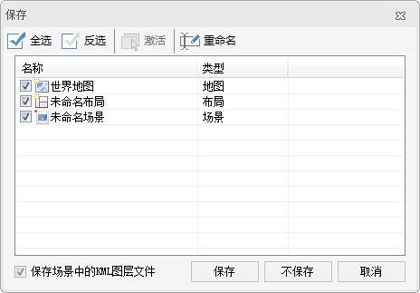

若当前工作空间中打开了一个或多个窗口时，可通过以下操作将应用程序中打开的所有窗口（包括地图窗口、场景窗口、布局窗口和属性表窗口）关闭。

### 操作步骤

  1. 在“ **视图** ”选项卡上的“ **窗口** ”组中，单击“ **全部关闭** ”按钮。
  2. 弹出“保存”对话框，提示用户在关闭的窗口时有哪些没有保存到工作空间中的内容，包括：地图、场景和布局，如下图所示。    
---  
  
“保存”对话框

对话框中的列表为未保存的项目，每个项目前有一个复选框，默认为选中状态，当复选框被选中时，表示将该项内容保存到工作空间中；否则，不进行保存。

**重命名** ：用来重新指定选中项的名称，即可以改变选中地图、布局或场景的名称；

**全选/反选** ：用来全部选中和反选选中列表中未保存的项目。

  3. 指定好要保存到工作空间中的内容后，点击对话框中的“保存”按钮，保存指定的内容到工作空间中并关闭对话框，同时，执行关闭应用程序中所有窗口的操作。

###  注意事项

关闭窗口时，对地图、布局、场景进行保存后，只是将这些要保存的内容保存到其所在的工作空间中，只有进一步保存的工作空间，这些内容才能最终保存下来，当再次打开工作空间时，就可以获取到所保存的工作成果。

