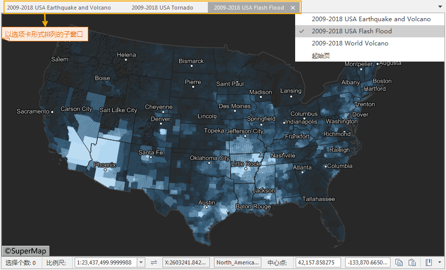
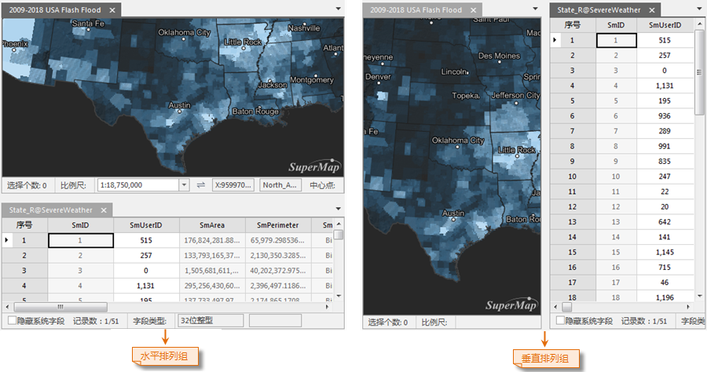

应用程序的窗口模式包括标签模式和扩展模式两种类型。

  * 标签模式：各个子窗口以分组的方式组织排列，并且，每个组中的子窗口以选项卡的方式进行布局排列；
  * 扩展模式：各个子窗口可以脱离应用程序主窗口进行显示，还可以在其他显示器上进行显示和操作。

### 标签模式

应用程序中子窗口的排列模式默认为标签模式，应用程序中的子窗口可以以分组的方式组织排列，每组中的子窗口以选项卡的方式进行布局排列，如下图所示，默认状态下，应用程序中打开的所有子窗口会组织到一个分组中以选项卡形式排列，每个子窗口对应分组中的一个选项卡，点击某个选项卡即可显示相应的子窗口。

  

  
用户除了通过点击相应的子窗口选项卡来切换当前显示的子窗口外，还可以通过点击子窗口分组的 **下拉** 按钮，弹出下拉菜单，该菜单中列出了该分组中的所有
子窗口的名称，用户可以通过选择相应的子窗口来使该窗口在该分组中处于当前显示的状态。

子窗口分组上的 **关闭** 按钮，用来关闭该分组内当前显示的子窗口，另外，鼠标中键点击某个子窗口的选项卡，也可以关闭该子窗口。

在某个子窗口选项卡上右键点击鼠标，弹出右键菜单，使用该右键菜单可以实现对子窗口的排列和管理。

  * 新建水平分组：在某个选项卡上右键单击鼠标，选择弹出菜单中的“新建水平分组”项，可以与其他窗口水平排列显示的子窗口分组，然后该选项卡对应的子窗口将转移至这个新的分组中显示。
  * 新建垂直分组：在某个选项卡上右键单击鼠标，选择弹出菜单中的“新建垂直分组”项，可以与其他窗口垂直排列显示的子窗口分组，然后该选项卡对应的子窗口将转移至这个新的分组中显示。

  * 关闭当前窗口：在某个选项卡上右键单击鼠标，选择弹出菜单中的“关闭当前窗口”项，该选项卡对应的子窗口将被关闭。
  * 关闭其他窗口：在某个选项卡上右键单击鼠标，选择弹出菜单中的“关闭其他窗口”项，则关闭该子窗口分组中除了该选项卡对应的子窗口外的所有子窗口。
  * 关闭所有窗口：在某个选项卡上右键单击鼠标，选择弹出菜单中的“关闭所有窗口”项，则关闭该子窗口分组中的所有子窗口，当子窗口分组中的所有子窗口都被关闭了，即不存在 子窗口后，该子窗口分组自动消失。
  * 水平/垂直排列组：当应用程序中存在多个子窗口分组，则对所有的分组进行水平或垂直排列，如下图所示：

  

  
当应用程序中存在多个子窗口分组时，用户可以将某个子窗口分组中的窗口拖放到其他某个子窗口分组中。

  1. 鼠标左键点击某个子窗口分组中的某个子窗口窗口选项卡，并 按住鼠标左键不放，拖动该窗口到目标子窗口分组中；
  2. 在该分组的标题栏处释放鼠标左键，该子窗口便由原来的分组中移动到目标分组中，对应目标分组中的一个选项卡。

### 扩展模式

此模式支持利用一台计算机同时显示多个窗口，不同的显示器或者屏幕显示不同的内容。对 PC
的显示采用扩展模式以后，通过使用扩展模式同时显示多个窗口，可以增加显示的信息量。例如，我们在主程序窗口中，利用其中一个扩展屏进行了修改，则应用以后可以直接显示在该扩展屏上。

在 **“视图”** 选项卡上的 **“窗口”** 组中，单击 **“扩展模式”**
按钮可对当前窗口中进行扩展显示。分屏模式的窗口模式下，各个子窗口为各个独立的窗口，可以对他们分别进行操作。操作方式与叠加模式下类似。

下图所示为在一个显示器情况下，对两个地图窗口进行分屏显示的效果。

  

扩展窗口标题栏右侧的三个按钮分别为： 最小化窗口按钮， 最大化窗口按钮，
关闭窗口按钮，可以利用这三个按钮对窗口进行最大化、最小化以及关闭窗口等操作。在一个显示器上进行分屏显示时，如果将主程序最大化，其他的分屏窗口会自动隐藏到主窗口的后面。

按住 F11 键，可以进入全屏模式。将当前的地图窗口、布局窗口或者场景窗口全屏显示，按 Esc 键可以退出全屏模式。

###  相关主题

[切换窗口模式](WindowsModel_Basic)

[全屏](FullScreen)

[设置叠加窗口的排列方式](WindowsArrange)

