应用程序中的窗口主要包括应用程序的主窗口、浮动窗口以及地图窗口、场景窗口、布局窗口、浏览属性数据的属性表窗口，还有在功能操作过程中出现的对话框等，其中，
地图窗口、场景窗口、布局窗口、属性表窗口称为应用程序的子窗口。

### 地图窗口

地图窗口是用来可视化显示地理空间数据的场所，同时也是进行空间数据编辑的场所，地图窗口主要用来显示二维数据，所有的具有空间信息的二维数据集都可以添加到地图窗口中进行
可视化显示和可视化编辑（属性数据是在属性窗口中显示和编辑的），可以同时添加多个数据集到地图窗口中显示，地图窗口中显示的所有内容为一个地图。另外，在地图窗口中还可以进行二维空间分析。

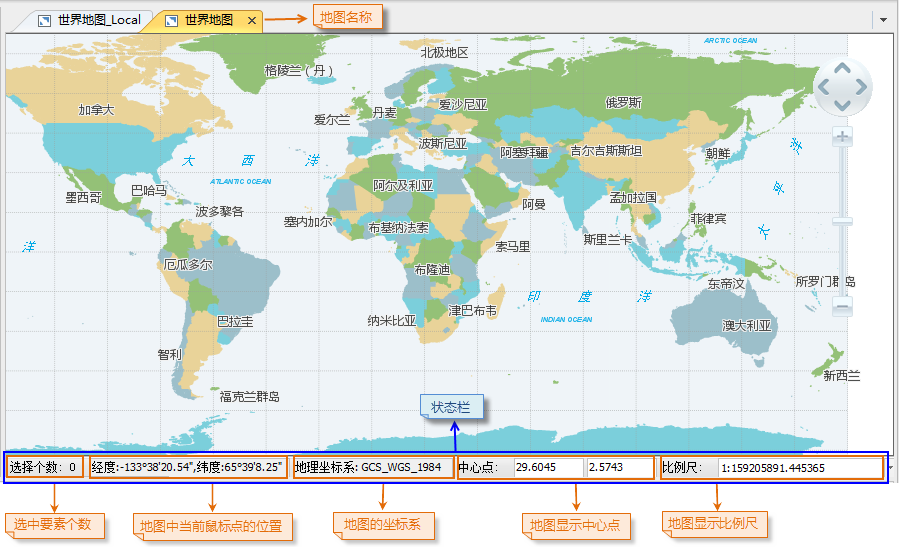  

  
如上图所示，地图窗口顶部显示的名称为地图窗口中所显示的地图的名称；地图窗口的底部为状态栏，状态栏中显示的信息包括：地图窗口中当前鼠标点的坐标值（坐标的单位同地图的坐标单位），
地图窗口中的地图所使用的投影坐标系，地图显示中心点以及地图的显示比例尺。

  * 地图窗口状态栏中的地图显示中心点的数值可以修改，只需在中心点右侧的文本框中输入新的数值，按 Enter （回车）键即可应用修改后的设置。

地图显示中心点是指通过设置该中心点，地图将以该点为中心显示在当前地图窗口中，也就是说通过平移地图，将地图上的该点移动到当前地图窗口的中心点处。

地图显示中心点设置是通过状态栏中“中心点”右侧的两个可编辑文本框进行，当用户在当前地图窗口中平移浏览地图时，这两个文本框中的数据会随之变化，显示
的是当前地图可视范围的中心点，即当前地图窗口的中心点所对应的地图上的坐标点；用户也可以根据需要在文本框中输入自定义数值，那么当前地图窗口中的地图将会
以给定的点为中心点进行显示。

  * 地图窗口状态栏中的地图显示比例尺组合框中显示的数值为当前地图窗口中地图的显示比例尺，点击组合框的下拉箭头弹出下拉列表，列表中例举了常用的标准显示比例尺，用户可以选择任意 比例尺来修改当前地图窗口中地图的显示比例尺；用户也可以在组合框中输入新的比例尺，按回车键(Enter)即可应用修改后的设置。

### 布局窗口

布局窗口是进行地图排版打印的窗口，布局窗口中显示的所有内容构成一个布局，布局是地图、图例、地图比例尺、指北针、文本等各种不同地图内容的混合排版与布置。

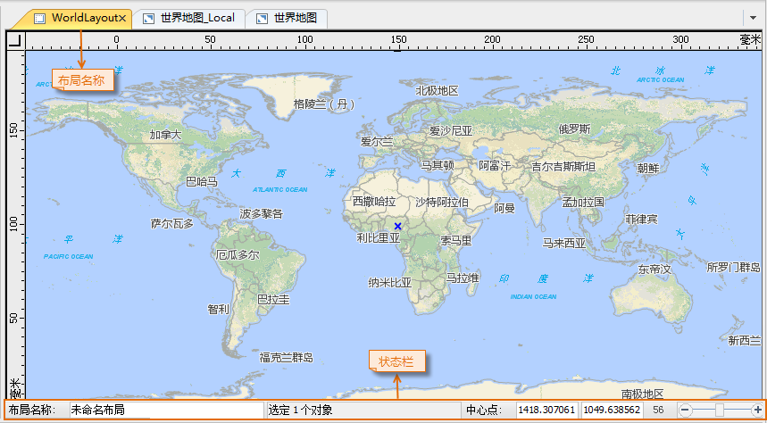  

  
### 场景窗口

场景窗口提供了一个三维球体，用于模拟地球，三维球体表面叠加了全球遥感影像，作为球体的背景，同时还显示了经纬网。另外，除了三维球体，场景窗口中还有模拟地球
所处的周围环境的要素，如星空、大气层和雾环境等。场景窗口可以同时显示二维空间数据和三维空间数据，实现了二三维一体化的数据管理与显示。
场景窗口中显示的所有内容为一个场景。

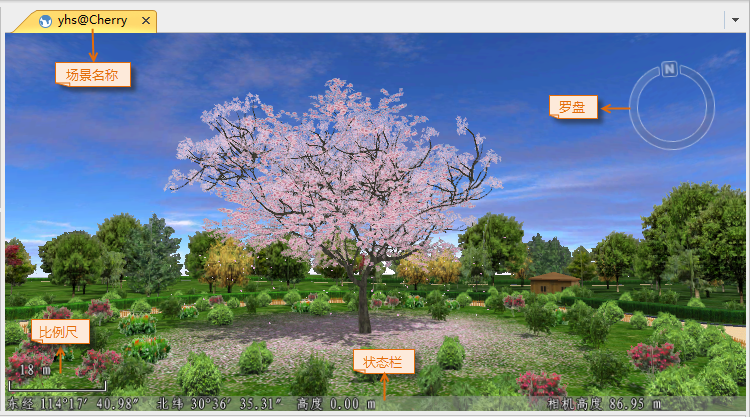  

  
  * 如上图所示，场景窗口顶部显示的名称为场景窗口中所显示的场景的名称。
  * 场景窗口的底部为场景窗口的状态条，用来显示场景窗口中当前鼠标点的坐标值（经纬度坐标）、当前鼠标点的高程值以及相机高度。
  * 场景窗口的右侧区域为场景窗口的导航罗盘，导航罗盘主要用来对场景进行浏览，如放大、缩小场景，对场景中的模拟地球进行旋转、拉平竖起等操作。

### 属性表窗口

属性表窗口是用来浏览和编辑数据集的属性表数据，如下图所示。

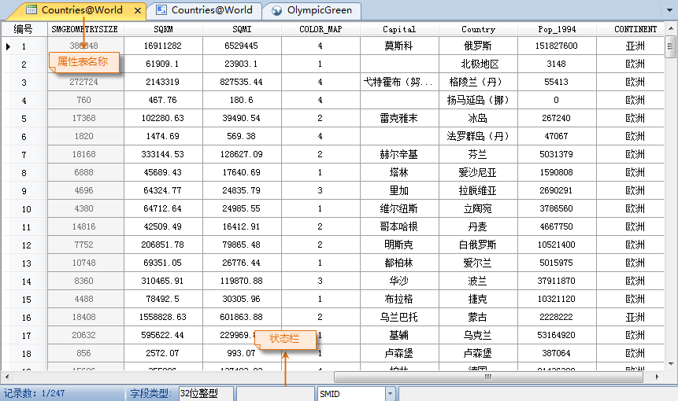  
 
  
  * 如上图所示，属性表窗口顶部显示的名称为属性表窗口中所显示的属性表的名称。
  * 属性表窗口的底部为属性表窗口的状态栏，当在属性表中进行相关操作时，用来显示属性表中被操作的字段信息、以及对属性表中的数据进行统计分析的结果数据。

### 子窗口的排列形式

应用程序的子窗口，如地图窗口、布局窗口、属性表窗口、场景窗口，其在应用程序中的排列模式有两种：标签模式和叠加模式，其中，标签模式为应用程序中的子窗口以分组的方式组织排列，并且，每个组中的子窗口以选项卡的方式进行布局排列；叠加模式为应用程序的子窗口为各个独立的窗口，没有进行分组组织。下面详细介绍这两种窗口模式。

标签模式

应用程序中子窗口的排列模式默认为标签模式，应用程序中的子窗口可以以分组的方式组织排列，每组中的子窗口以选项卡的方式进行布局排列，如下图所示，默认状态下，应用程序中打开的所有子窗口会组织到一个分组中以选项卡
形式排列，每个子窗口对应分组中的一个选项卡，点击某个选项卡即可显示相应的子窗口。

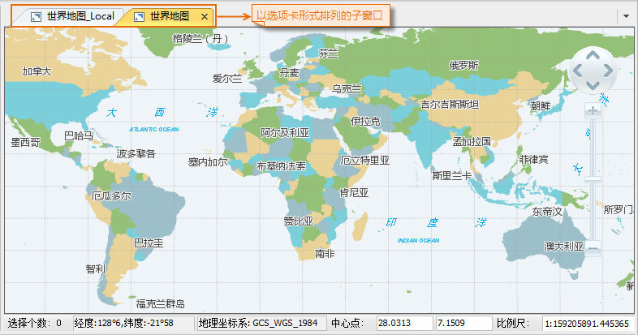  

  
用户除了通过点击相应的子窗口选项卡来切换当前显示的子窗口外，还可以通过点击子窗口分组的 
按钮，弹出下拉菜单，该菜单中列出了该分组中的所有 子窗口的名称，用户可以通过选择相应的子窗口来使该窗口在该分组中处于当前显示的状态。

子窗口分组上的 
按钮，用来关闭该分组内当前显示的子窗口，另外，鼠标中键点击某个子窗口的选项卡，也可以关闭该子窗口。

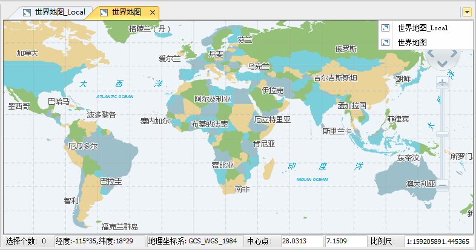  

  
在某个子窗口选项卡上右键点击鼠标，弹出右键菜单，使用该右键菜单可以实现对子窗口的排列和管理。

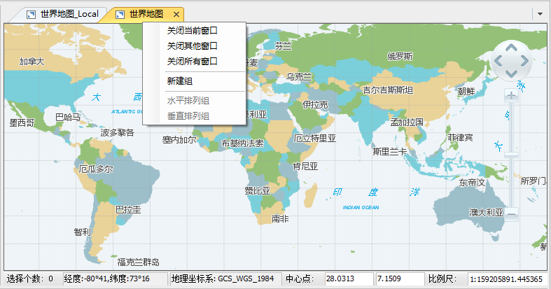  
 
  
  * 新建组：在某个选项卡上右键单击鼠标，选择弹出菜单中的“新建组”项，可以新建一个新的子窗口分组，然后该选项卡对应的子窗口将转移至这个新的分组中显示，如下图所示：

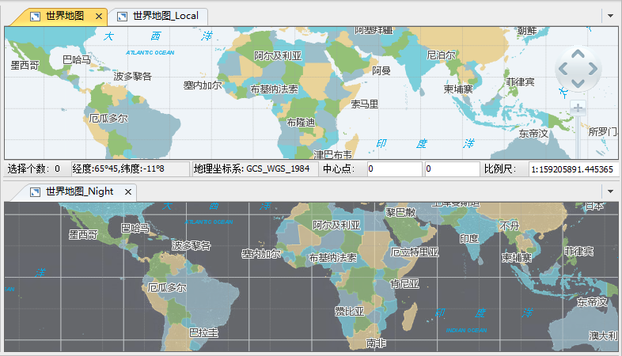  

  
  * 关闭当前窗口：在某个选项卡上右键单击鼠标，选择弹出菜单中的“关闭当前窗口”项，该选项卡对应的子窗口将被关闭。
  * 关闭其他窗口：在某个选项卡上右键单击鼠标，选择弹出菜单中的“关闭其他窗口”项，则关闭该子窗口分组中除了该选项卡对应的子窗口外的所有子窗口。
  * 关闭所有窗口：在某个选项卡上右键单击鼠标，选择弹出菜单中的“关闭所有窗口”项，则关闭该子窗口分组中的所有子窗口，当子窗口分组中的所有子窗口都被关闭了，即不存在子窗口后，该子窗口分组自动消失。
  * 水平/垂直排列组：当应用程序中存在多个子窗口分组，则对所有的分组进行水平或垂直排列，如下图所示：

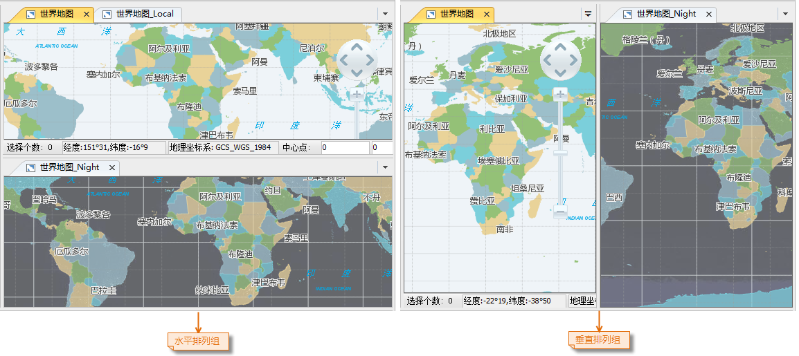  

  
当应用程序中存在多个子窗口分组时，用户可以将某个子窗口分组中的窗口拖放到其他某个子窗口分组中，具体操作为：鼠标左键点击某个子窗口分组中的某个子窗口窗口选项卡，并按住鼠标左键不放，拖动该窗口到目标子窗口分组中，在该分组的标题栏处释放鼠标左键，该子窗口便由原来的分组移动到目标分组中，对应目标分组中的一个选项卡。

叠加模式

叠加模式的窗口排列模式下，各个子窗口为各个独立的窗口，并没有分组进行管理。

叠加模式下的子窗口，窗口标题栏右侧的三个按钮分别为： 最小化窗口按钮，
最大化窗口按钮， 关闭窗口按钮。

点击最大化窗口按钮时，窗口会进行最大化显示，同时窗口标题栏右侧的三个按钮会出现在如下图所示的区域，
还原显示窗口按钮，点击该按钮，窗口将回到最大化之前的显示状态。

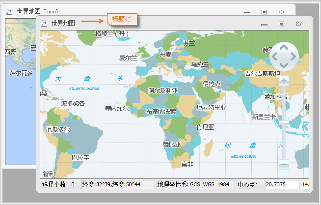  

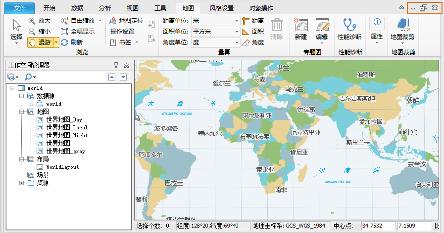  

  
功能区>“ **视图** ”选项卡>“ **窗口** ”组中的“水平平铺”、“垂直平铺”、“层叠窗口”按钮用来对叠加模式下的多个子窗口进行排列。

  

  

  

扩展模式

此模式支持利用一台计算机同时显示多个窗口，不同的显示器或者屏幕显示不同的内容。对 PC
的显示采用扩展模式以后，通过使用扩展模式同时显示多个窗口，可以增加显示的信息量。例如，我们在主程序窗口中，利用其中一个扩展屏进行了修改，则应用以后可以直接显示在该扩展屏上。

在 **“视图”** 选项卡上的 **“窗口”** 组中，单击 **“扩展模式”**
按钮可对当前窗口中进行扩展显示。分屏模式的窗口模式下，各个子窗口为各个独立的窗口，可以对他们分别进行操作。操作方式与叠加模式下类似。

下图所示为在一个显示器情况下，对两个地图窗口进行分屏显示的效果。

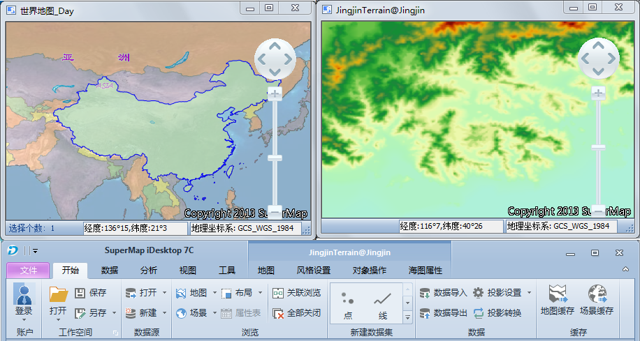  

  
扩展窗口标题栏右侧的三个按钮分别为： 最小化窗口按钮，
最大化窗口按钮，
关闭窗口按钮，可以利用这三个按钮对窗口进行最大化、最小化以及关闭窗口等操作。在一个显示器上进行分屏显示时，如果将主程序最大化，其他的分屏窗口会自动隐藏到主窗口的后面。

按住 F11 键，可以进入全屏模式。将当前的地图窗口、布局窗口或者场景窗口全屏显示，按 Esc 键可以退出全屏模式。

