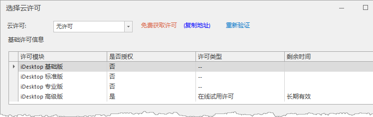

产品支持以公有云许可的方式配置许可，用户可在不同终端上使用许可。下文详细介绍了在 Windows 平台上配置云许可的步骤。

### 使用说明

1. 在文件菜单的“ **许可** ”项中，许可设置可选择配置许可的方式，分别为：配置本地许可和使用公有云许可。单击“使用公有云许可”，弹出“许可授权”对话框，如下图所示：
  
---  
2. 在弹出的账号登录面板中填写已注册的 SuperMap Online 账号、密码，即可登录。登录后弹出“选择云许可”对话框，单击云许可文本框右侧下拉按钮，选择不同的云许可类型，在基础许可信息和扩展许可信息列表区会显示被授权的云许可模块。
* **基础许可信息** ：基础许可信息列表区显示当前账户云许可授权的 是基础版、标准版、专业版和高级版。
* **扩展许可信息** ：扩展许可信息列表区可查看单独购买的云许可模块。
3. **获取许可** ：若用户帐号内无可用云许可，则在“云许可”选择框内显示为“无许可”，可通过点击文本框右侧的“免费获取许可”文字，使用手机号注册 SuperMap Online 账户，即可免费获得试用 SuperMap GIS 平台产品的授权。单击“重新验证”，对许可信息进行重新验证。
  

4. **切换许可** : 当用户需要切换云许可模块时，在“文件”菜单的“许可”项，单击许可设置中“切换公有云许可”，在弹出的“选择云许可”对话框中切换云许可模块。

