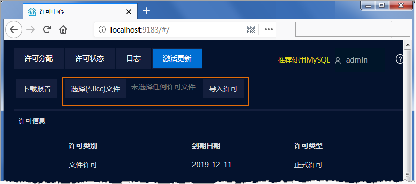
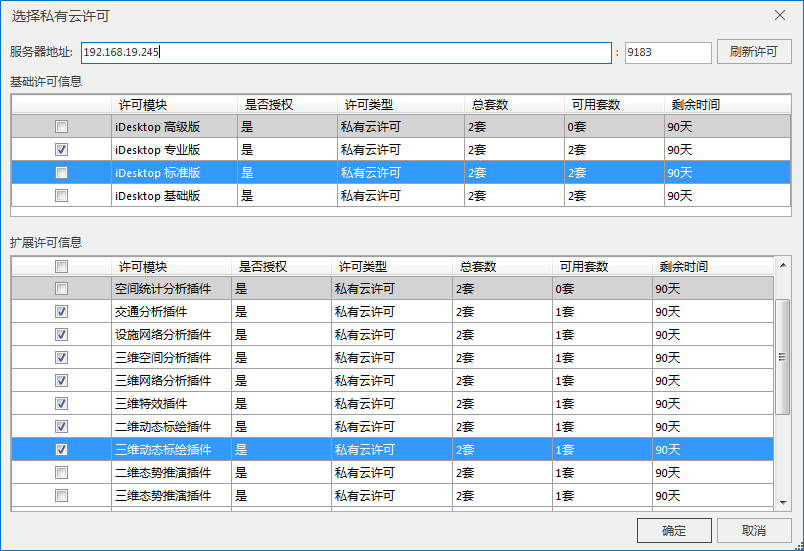

产品支持在局域网布设私有云许可服务器，不同机器通过服务地址即可获取指定的许可模块，便于内网局域网机器许可的分发与获取。下文详细介绍了在 Windows
平台上配置私有云许可的步骤。

### 使用说明

1. **配置私有云许可服务器** ：在局域网范围内配置私有云许可服务器，通过许可配置文件激活许可模块。配置服务器的具体操作请您参看私有云服务启动包中的使用说明。
  

2. **桌面端配置私有云许可，入口有两处** ：
* 启动桌面应用程序，弹出“ **许可授权** ”对话框，单击“ **配置私有云许可** ”，弹出“ **选择私有云许可** ”对话框。
* 若已使用其他许可方式启动桌面，可在 **文件** 菜单的“ **许可** ”项中，单击“ **使用私有云许可** ”，在弹出“ **选择私有云许可** ”对话框切换私有云许可。
3. **服务器地址** ：输入局域网中的私有云许可服务器地址，默认端口号为9183。点击“刷新许可”按钮，连接许可服务器。
4. 连接成功后，在基础许可信息和扩展许可信息列表区会显示被授权的私有云许可模块。
  

* **基础许可信息** ：基础许可信息列表区显示当前私有云服务授权的许可  基础版、标准版、专业版版和高级版。
* **扩展许可信息** ：扩展许可信息列表区可查看单独购买的私有云许可模块。
* **许可类型** ：分为私有云试用许可和私有云正式许可，使用私有云试用许可您的地图将带有 SuperMap 水印。
* **总套数** ：当前私有云服务器中配置的总的许可套数。
* **可用套数** ：当前私有云服务器可分配的许可数，即为可用套数，若多台机器同时接入私有云服务器，许可分配已达总套数，可用套数即为0，该许可模块无可用许可。
* **剩余时间** ：许可的剩余使用时间。
5. **配置本机私有云许可模块** ：勾选许可模块前的复选框配置本机的使用的许可模块。

**注意** ：若您不需要使用私有云许可模块，您可关闭桌面，关闭桌面后即私有云许可服务器回收当前许可，其他用户可通过服务地址再接入。

