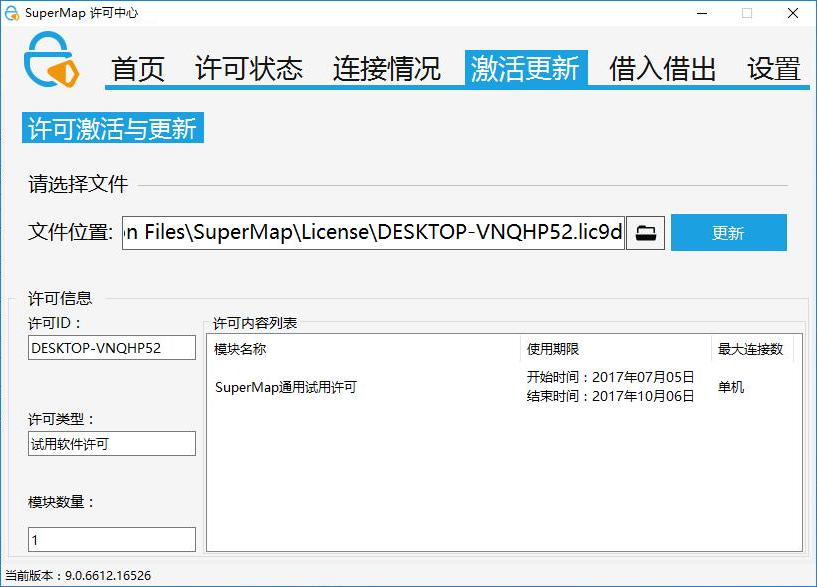

产品正式许可需在Windows平台下进行配置才可生效，下文详细介绍了在Windows平台上配置许可的步骤。

## 部署 SuperMap 许可中心

SuperMap 许可中心（SuperMap License
Center）用来管理系列产品所有与许可相关的工作，包括：配置许可信息、许可信息的内外管理、以及查看目标机器上详细的许可状态和使用情况。

1.SuperMap 许可中心以 Zip 包的形式提供，您可以通过以下任意一种方式获取 Zip 包并进行部署：

    * ### 下载 Zip 包并部署 

访问地址：[ SuperMap
技术资源中心](http://support.supermap.com.cn)，下载“SuperMapLicenseCenter.zip”包。将 Zip
包解压，运行产品包目录\Tools 路径下的 Setup.bat 文件，以完成 SuperMap 许可中心的部署。

    * ### 在线安装

访问地址：[在线安装（http://product.supermap.com.cn/）](http://product.supermap.com.cn)，下载
SuperMap License Center（Windows 32 位）在线安装工具（LicenseCenter.exe），双击运行
LicenseCenter.exe 安装最新版本的 SuperMap 许可中心。在线安装方式会自动安装许可驱动以完成许可中心的部署，您不需要执行
trial.bat 文件。

2.完成 SuperMap 许可中心的部署之后，即可通过运行产品包目录下的 SuperMap.LicenseCenter.exe
文件启动许可中心。首次打开许可中心，默认安装一个90天的试用软许可。

3.运行产品包目录下的 Updater.exe 文件可以进行 SuperMap 许可中心工具的更新操作，获得最新版本的 SuperMap 许可中心。

## 配置许可信息

### 配置软许可

SuperMap 许可中心提供以软件激活方式配置软许可。用户通过 SuperMap
许可中心获取本机信息，并将信息提交给超图公司来获取正式许可，在将正式许可更新到本机，从而完成许可的配置。软件激活方式的具体步骤如下：

  1. **生成本机信息**

进入 SuperMap 许可中心首页，点击“生成本机信息”按钮，在指定的路径下生成本机信息文件(*.c2v)。

  
---  
  2. **将本机信息提交给超图公司**

将上面步骤生成的本机信息文件（*.c2v）提交给超图公司，超图公司将根据您的申请生成*.v2c 正式许可文件并返回给您，您通过该文件配置正式许可。

  3. **许可生效**

在 SuperMap 许可中心，打开"激活更新"页，如下图所示，将您获得的*.v2c 正式许可文件或 *.lic10i
试用许可文件，指定到"文件位置"处，然后单击"更新"按钮，即可将许可激活生效。

  
---  

### 配置硬件许可

在 Windows 操作系统下，单机锁和网络锁的客户端，都不需要安装驱动程序即可运行 SuperMap GIS
10i系列产品；网络锁的许可服务器端需要安装许可驱动。

如果当前网络环境中同一网段内已经配置了可用的许可服务器，则会自动获取和配置许可，不需要手工配置；如果网络环境其他网段存在可用的许可服务器，请按照以下步骤进行许可配置：

  1. 打开 SuperMap 许可中心，进入 SuperMap 许可中心的“设置”页面。
  2. 在“远程连接许可”处输入许可服务器 IP 或服务器名称，点击“应用”按钮使之生效。
  3. 许可默认连接端口为1947，如果该端口已被占用，可以在“许可连接端口”处设置其他未被占用的端口，点击“应用”按钮使之生效。

## 管理许可信息

通过 SuperMap 许可中心，您可以完成查看许可状态、查看许可使用情况、更新许可等许可管理操作。

### 查看许可状态

SuperMap 许可中心的"许可状态"页面，显示了目标机器上所具有的 SuperMap GIS 10i
系列产品的许可信息，信息的组织方式按照产品进行分类，每一类下面的每条记录对应该产品的一个许可模块。

  
---  
  
  * **名称** ：许可模块名称。
  * **类型** ：显示许可类型是试用许可还是正式许可。
  * **可用时间** ：显示该许可模块剩余的可用天数。
  * **使用情况** ：显示该许可模块的当前状态。
  * **可迁出数** ：显示该许可模块可以迁出的数量。

### 查看许可连接情况

SuperMap 许可中心的"连接情况"页面显示了目标机器上所有 SuperMap GIS 10i
系列产品许可模块在目标机器上当前被使用的详细信息，其中每条记录对应一个许可模块。

其中，记录的每个字段表达的内容如下所示：

  * **ID** ：许可模块对应的 ID 值。
  * **模块** ：许可模块的名称
  * **地址** ：许可模块的许可位置，如果是来源于本地，则显示 Local；否则显示对应机器的 IP 地址。
  * **用户** ：许可模块的许可所在的计算机的用户名和计算机名。 
  * **进程** ：显示当前许可模块被使用的进程。
  * **时间** ：当前许可模块被连接的时间。

### 更新许可

SuperMap 许可中心的“许可更新”页用来进行更新许可的工作，您在以下情况需要进行许可的更新：

  * 当您获得了软件激活的正式许可文件（*.v2c）时，您需要通过更新许可的方式配置您本机的许可，使其生效。 
  * 当您从其他具有正式许可的机器上获得了其迁出给您的许可（*.h2r文件）时，您需要通过更新许可的方式将许可配置到您本机，使其生效。 
  * 当您需要归还其他机器迁出给您的许可时，您需要通过更新许可的途径进行归还。 

具体更新操作：

打开 SuperMap 许可中心的“许可更新”页，将上述三种情况的目标文件（*.v2c/*.h2r/*.r2h）指定到“文件位置”处，然后单击更新按钮即可。

### 注意事项

  1. 硬件锁插入计算机后，锁上的信号指示灯点亮说明硬件锁有效。在Windows操作系统下，硬件锁插入后会被识别为 USB 设备，可直接运行。 
  2. 对于两种硬件锁，在同一台计算机，会优先使用单机锁。
  3. 如果在虚拟机上使用硬件锁，需要通过虚拟机软件的相关设置将硬件锁设备连接到虚拟机上。
  4. 建议计算机为 Windows XP或者Windows Server 2003的用户，在配置许可之前先执行安装包中：Tools→SuperMapLicenseCenter→Tools文件夹中的 trial.bat 文件。
