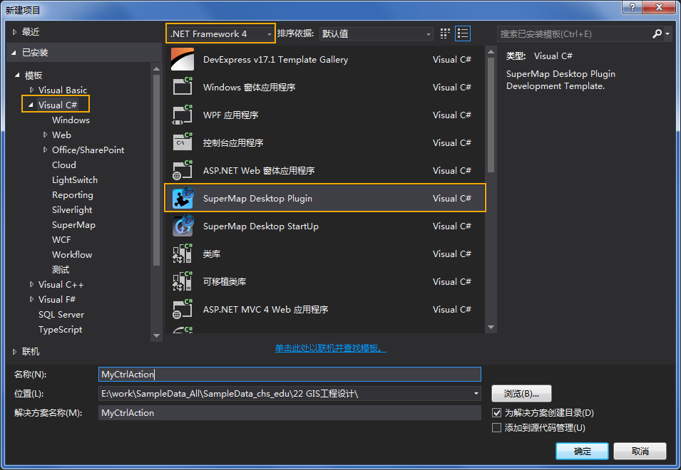
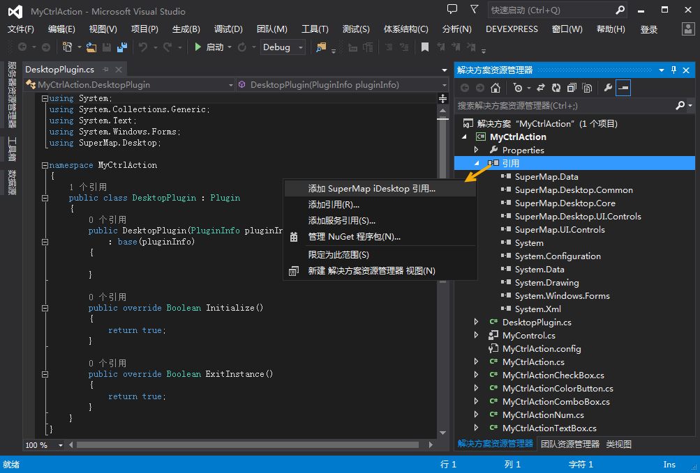
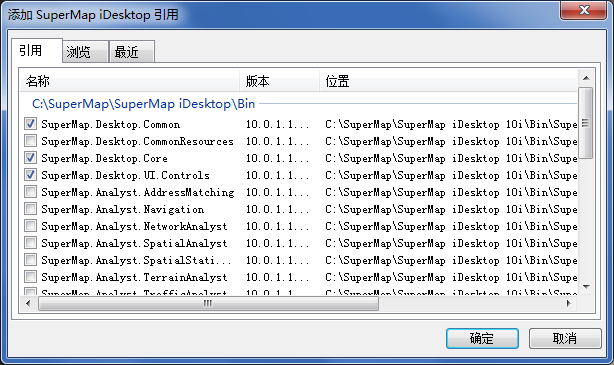

本文以 Visual Studio 2013 为例，介绍 iDesktop 开发流程。

1. 启动 Visual Studio 2013 新建工程。

执行“文件”-> “新建项目”弹出下图窗口，在 **模板** 处选择 **Visual C#** -> **SuperMap Desktop
Plugin** ，设置 .NET Framework 4，项目 **名称**
设置为“MyCtrlAction”，并选择一个工程存放路径，然后单击“确定”按钮新建工程。

在本例中，我们使用“SuperMap Desktop Plugin”模板新建工程，若您尚未进行模板注册，请参考“安装指南”教程进行模板注册。

  

2. MyCtrlAction 工程
* 是支持插件式扩展开发的应用平台， 通过“SuperMap Desktop Plugin”新建工程，会自动生成九个文件“MyCtrlAction.cs”、“DesktopPlugin.cs”、“MyCtrlAction.config”、“MyControl.cs”、“MyCtrlActionCheckBox.cs”、“MyCtrlActionColorButton.cs”、“MyCtrlActionComboBox.cs”、“MyCtrlActionNum.cs”、“MyCtrlActionTextBox.cs”。 
  * 其中“DesktopPlugin.cs”文件是对插件的定义，用来处理插件的初始化工作。
  * “MyCtrlAction.cs”是对操作功能的定义，用来响应控件事件触发时所要执行的内容。
  * “MyCtrlAction.config”是插件配置文件，用来管理插件启动以及相关界面配置。
  * “MyControl.cs”是浮动窗口的功能定义，用来响应功能时间触发时所要执行的内容。
  * “MyCtrlActionCheckBox.cs”是复选框操作功能的定义，用来响应复选框选择状态发生改变时所要执行的内容。
  * “MyCtrlActionColorButton.cs”是颜色按钮功能定义，用来响应触发颜色按钮事所要执行的内容。
  * “MyCtrlActionComboBox.cs”是组合框功能的定义，用来响应组合框选项改变时所要执行的内容。
  * “MyCtrlActionNum.cs”是数值控件功能的定义，用来获取用户输入的数值，并根据数值响应所要执行的内容。
  * “MyCtrlActionTextBox.cs”是文本框功能定义，用来获取用户输入的文本，并根据文本响应所要执行的内容。
* 如下图中第一部分所示，通过“SuperMap Desktop Plugin”新建工程，会自动添加二次开发所常用的引用，例如“SuperMap.Desktop.Core”、“SuperMap.Desktop.UI.Controls”、SuperMap.Desktop.Common.dll 等。
* 若需要添加 SuperMap 相关的其他引用，右键单击下图第一部分中的“引用”，选择“添加 SuperMap Desktop 引用”命令。该功能是  为方便用户快速定位到 SuperMap 引用特别设计的。
  

在弹出的“ **添加 SuperMap iDesktop 引用…** ”窗口中可以自动添加 SuperMap iDesktop
常用的引用。默认情况下会自动查找安装程序所在位置的 Bin 目录下面的动态库文件。

  * **引用** 选项卡：用来添加要引用的程序集。所有引用来源于安装位置\Bin 目录下的程序集。对于任何一个程序集，都会自动显示其名称，版本信息以及所在的位置。鼠标滑过时，还会自动显示该引用的详细描述信息。在"引用"选项卡中，选择要引用的程序集，单击"确定"按钮后，可将选中的程序集添加至项目中使用。
  * **浏览** 选项卡：用来增加引用，单击"打开"按钮，可以浏览要使用的引用文件，选择完成后，单击"确定"按钮，即可将选择的程序集添加至项目中，方便进行引用。
  * **最近** 选项卡：用来显示最近使用过的程序集。选择某个或者多个程序集，可以再次引用。
  

* 也可以通过 Visual Studio 自身的引用功能添加项目所需的文件。
