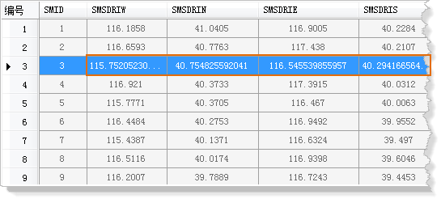
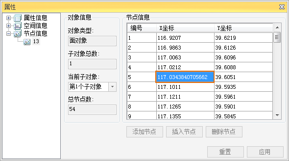
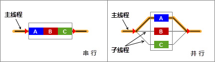
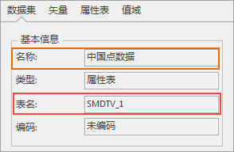
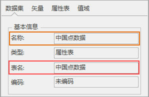
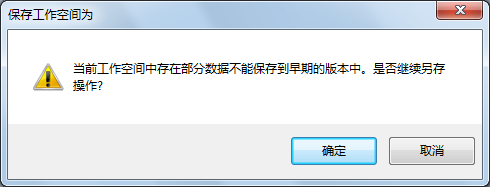

“ **选项** ”的“ **环境** ”选项卡提供了更改应用程序的环境设置的功能。“环境”设置包含了以下四个方面：基本设置、风格设置、场景设置、运行设置。

### 基本设置

基本设置中，用户可以设置桌面标题的显示内容以及是否显示工具提示信息。

  * **桌面标题** ：若用户想自定义桌面标题，在文本框中输入要显示的文字即可。如果不想显示任何内容，删除原有内容键入空格即可。
  * **可见小数位数** ：可见小数位数用来控制小数的显示精度，可通过右侧的下拉列表选择显示位数。 

设置可见小数位数后，在初始状态下，任意小数均按设置的位数值显示。这里采用四舍五入法对小数末位取舍，当取舍后的小数末位为0时，该位数不显示。例如，对小数13.14599按保留4位小数取舍后，显示13.146。可见小数位数的精度设置范围为0-15位，默认精度设置为6位，用户可根据需要自己设置小数位数。

对于只读数据，当数值处于选中状态时，将显示完整数值；对于可编辑的数据，当数值处于可编辑状态时，将显示完整数值。

以属性表数据为例，属性表内的属性字段为只读数据。如下图所示，在初始状态下，所有小数均按照选项中设置的位数显示（修改为显示4位小数）。当鼠标选中一条或多条记录时，选中的小数就会显示完整数值，否则将按照设置的精度显示。此外，属性表的数据统计分析结果和矢量数据集中对象的属性窗口内的部分属性信息均为只读数据，显示方法与效果与上述相同。

  

  
以矢量数据集中对象的属性窗口为例，在编辑状态下，节点信息为可编辑数据。如下图所示，在初始状态下，所有小数均按照选项中设置的位数显示，当鼠标选中某一字段，并双击使其处于可编辑状态时，选中的小数就会显示完整数值。

此外，矢量数据集中对象的属性窗口内的空间信息和部分可编辑属性信息、“三维飞行站点管理”中的相机参数设置、“地图裁剪”中的裁剪区域设置等功能内的数据均为可编辑数据，当数值处于编辑状态时，小数将显示完整数值，否则将按照设置的精度显示。

  

* **并行计算线程数** ：并行计算（Parallel Computing）是将一个任务分解成若干个小任务并协同执行以完成求解的过程，是增强复杂问题解决能力和提升性能的有效途径。多核计算机的出现，改变了并行计算只服务于巨型机和计算机集群的局面。如今，多核微处理器的发展更是使得非常普及的个人 PC 也具备了并行计算能力。 

并行计算可以通过多种途径实现，包括多进程、多线程以及其他多种方式。针对多核计算机，本文主要讨论多线程并行计算（或称多核并行计算）。并行计算技术可将一项任务分解为多个线程，这些线程可由多颗
CPU 内核并行运行，从而能够充分和更加高效地利用多核计算资源，从而降低单个问题的求解时间，节省成本，也能够满足更大规模或更高精度要求的问题求解需求。

下图对比了串行与并行。当一个任务被划分为 A、B、C 三个子任务时，串行需要依次执行三个子任务，而多线程并行则可以通过三个线程同时执行三个子任务。

  

  
对于如何设置合理的线程数目，可以参考以下建议：

  * 指定的多个线程将在计算机处理器所有核之间分配，当线程数目等于处理器总核数时，所有核都参与计算，可以充分利用计算机的计算资源。 
  * 线程数目多于计算机核数时，线程调度与负载均衡问题可能导致占用更多时间，即使分析计算的时间进一步降低，也可能导致整体性能提升不明显。因此不建议这样做。
  * **分析内存模式：** 针对部分分析功能，提供可选的分析模式，包括标准模式和大内存模式。大内存模式与标准模式相比，在提升性能方面具有优势。它通过将分析需要的数据一次性读入内存，从而避免分析过程中频繁与数据引擎交互，进而提升分析的速度。“大内存模式”建议在使用64位系统的时候设置，如果数据量较大，而内存不够大，容易出现内存不足的现象。

目前，支持以大内存模式进行分析的功能包括：

    * 构建网络数据集：包括通过线数据集构建网络和通过点、线数据集构建网络两种方式。 

**注意:**
大内存模式只支持对一个线数据集，或者一个线数据集和一个点数据集构建网络，对于覆盖两个及以上线（或点）数据集的网络，可先对一个线数据集（及一个点数据集）使用大内存模式来构网，然后向该网络追加其他数据

  * 拓扑处理：包括点、线、面数据集的拓扑错误处理和拓扑关系处理。
  * 拓扑预处理：包括设置拓扑预处理容限、进行拓扑预处理两部分内容
  * 拓扑构面：是将线数据集或网络数据集中的每一个封闭区域提取出来，生成一个面数据集的过程。
  * **启用GPU并行计算** ：设置是否开启GPU并行计算模式。 

SuperMap
针对部分分析功能，提供CUDA并行计算模式，只要执行计算任务的主机配有NVIDIA的显卡，且计算能力在2.0以上，就会利用GPU的并行计算能力来执行任务。其性能相对普通CPU并行有较大提升。目前，支持CUDA并行计算模式的分析功能包括：坡度、坡向计算，三维晕渲图（渲染模式）、正射三维影像。

目前提供两种方式设置是否开启CUDA并行计算模式:

  * 通过此属性设置。
  * 通过修改配置文件 SuperMap.xml 中的<IsCUDAComputingEnabled></IsCUDAComputingEnabled>节点的值（默认为 false），该配置文件位于“产品安装目录\Bin”目录下。

使用以上两种方式时请注意：

  * 应用程序启动时，优先读取配置文件中设置的值。在执行分析之前，通过此方法指定值后，将同步修改配置文件。 
  * 配置文件中指定的值只在应用程序启动时读取一次，如果修改，需重新启动应用程序才能生效。 
  * **表名与数据集名称保持一致** ：数据集中数据是以表的形式存储的，所以表名即为数据集对应数据表的名称；数据集表名是数据库按照内部存储规则系统给定，而数据集名称可由用户自定义，所以通常情况下数据集表名与数据集名称不一致。

    * 不选中该项，用户在新建或导入数据集后，应用程序将按照数据存储规则系统给定表名或保持源数据表中的名称不变，如下图1所示。不同数据库对表名长度有限制的，例如 Oracle 数据库表名限制为不超过30个字节（即30个英文字母或者15个汉字）。当数据集表名超过字符限制时，程序会对表名进行截断处理，只保留最大限制数之前的字符。
    * 若用户选中该项设置数据集表名与名称统一，则在新建或导入数据集后，应用程序将数据集的表名处理成和数据集的名称一致。数据集名称和表名统一，方便用户管理和查找数据。同时会避免因为导入数据集的表名太长，而被程序截断的情况，如下图2所示。

**注意** ：程序默认不勾选该选项，是因为若数据写入数据库的编码与程序运行编码不一致，可能会导致乱码，从而影响对数据表的编辑操作。例如：Oracle
数据库在写数据时使用编码 UTF-8 ，而当程序创建数据集写入编码与其不相同时，服务端就会乱码，从而影响对数据表的操作。  

 |   
---|---  
图1：未设置数据集名与表名保持一致 | 图2：设置数据集名与表名保持一致  
  * **使用系统默认提示框** ：系统中是弹出的对话框（例如保存对话框、进程条等），是以桌面系统Office 2016的风格显示，还是与Windows的系统风格保持一致。
  * **显示千分位分隔符** ：设置属性表、比例尺等是否以千分位形式显示数值。
  * **桌面标题中显示当前工作空间名称** ：用户可设置当前桌面标题中是否显示当前工作空间的名称，默认是未显示。

### 风格设置

风格设置中，用户可以设置桌面的字体风格，包括更改显示比例、功能区风格、活动窗体风格等设置。

  * **更改显示比例** ：设置桌面字体显示比例，通过滑动滑块，选择合适的字体比例，滑块有三个刻度：100%、125%、150%。根据选择的缩放比例和默认字体大小，算出一个新的字体大小。默认显示比例为100%。 
  * **功能区风格** ：设置桌面功能区字体的类型、大小以及是否对字体加粗。 
  * **活动窗体风格** ：设置桌面活动窗体字体的类型、大小以及是否对字体加粗。 

以上三种设置，都是即时应用当前设置的风格。

### 场景设置

设置场景操作的相关参数，包括场景反走样、Float纹理、PC设备几个参数。

  * **场景反走样** ：勾选“场景反走样”前的复选框后，会对新打开的场景显示进行优化，使场景自身和加载到场景中的图层和模型的显示更加平滑。设置范围为 [0,16]，数字越大，显示效果越平滑。该设置需要重新打开场景才能生效。 

场景反走样功能对场景窗口、加载在场景中的非纹理对象（即点、线、面等几何对象）、模型和管线起到较好的平滑作用。此外，在加载矢量图层时，需设置成非贴地状态，否则将被视为纹理对象，不对其进行反走样操作。

  * **支持Float纹理** ：如果是独立显卡，建议勾选“支持Float纹理”，否则会影响场景的显示性能；若是集成显卡，出现场景中的地球不显示的问题可以取消Float的勾选
  * **PC设备** ：用于设置场景是否应用于PC端。

### 运行设置

运行设置涉及两个方面的内容，地图临时缓存的路径的设置，是否自动检查工作空间版本，是否生成运行日志以及输出信息级别的设置。

  * **文件缓存路径** :用来设置地图临时缓存文件的存放目录。单击“文件缓存路径”右侧的“浏览”按钮 ，选择保存临时缓存文件的位置即可。
  * **生成运行日志** ：选中运行生成日志，表示应用程序操作过程中，会生成一个日志文件。用户可通过浏览按钮  ,指定日志文件的保存路径。
  * **生成Dump日志** ：选中生成Dump日志，表示应用程序操作过程中，若出现崩溃的情况，会生成一个日志文件，并存放在根目录的“Dumps”文件夹中。用户可通过单击“管理目录”按钮，查看Dumps文件夹中的log文件，若单击“清空目录”按钮，可将Dumps文件夹中的所有文件都删除。
  * **自动检查工作空间版本** ：选中自动检查工作空间，表示应用程序在打开工作空间时，会自动检查该工作空间的版本。对于保存较低版本的工作空间时，应用程序会提示用户选择要保存的版本形式（如下图所示）。若以旧版本保存，当前应用程序中的操作，可能不会完全保存下来。若以新版本保存，则不会存在上述问题。因此取消自动检查工作空间版本信息，可能会造成不同版本工作空间不兼容，丢失部分数据。请用户慎用。    
 
  * **输出信息** ：输出信息级别有两个选项，分别是输出信息和输出异常。选择“输出信息”，输出窗口中仅会输出一些操作信息，不会将异常信息输出；选择“输出异常”，输出窗口会输出所有的操作信息以及异常信息。

### 相关链接

 [常用](General)

 [保存](AutoSavel)

