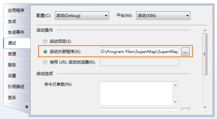

  

产品安装和配置

兼容性相关

数据管理（打开、新建、保存）

数据处理

地图（图层、符号库）

场景

二次开发

其他

## 产品安装和配置  top

**问：** | **在 Windows Vista 或 Windows 7 操作系统下配置许可时，有什么要求？**  
---|---  
**答：** |  在 Windows Vista 或 Windows 7
操作系统下配置许可，需要右键“以管理员身份运行”许可配置应用程序或者把用户控制（UAC）关闭，否则许可配置和检查将不可用。  
**问：** | **为什么在 Microsoft Visual Studio 中进行二次开发时，没有看到 SuperMap 提供的插件模板呢？**  
**答：** |
此种情况可能为未进行模板注册造成的，用户可以通过运行安装目录\Tools\目录下的模板注册程序（RegisterTemplate.exe），重新进行模板注册，并且注册时必须关闭
Microsoft Visual Studio 程序，注册成功后，当再次打开 Microsoft Visual Studio 时就可以看到插件模板了。  
插件模板是在安装  时自动进行注册的，并且  提供了该模板注册程序。  
**问：** | **在卡巴斯基杀毒软件开启（运行）时，为什么 桌面产品不能正确安装？**  
**答：** |
这是由于卡巴斯基出于安全考虑，在安装程序首次运行时，会阻止其安装。解决的方法就是先将安装程序添加到信任区域，然后再运行安装程序，即可成功安装应用程序。  
将  桌面产品添加到信任区域的操作方法如下：  
1 进入卡巴斯基主界面，点击右上角的“设置”；  
2 在设置界面里上，先点击左侧的“威胁和排除”，再点击右面的“排除对象”项下的“设置”按钮；  
3 在打开的信任区域界面上点击“信任程序”标签，再点击“添加”按钮，通过“浏览”按钮找到 SuperMap 安装程序文件，将其添加；  
4 在“排除的应用程序”界面上，将“排除对象”的四个选项都勾选上，点击“确定”；  
5 在“信任区域”页面上，点击“确定”，便可将 SuperMap 安装程序添加到卡巴斯基的信任区域。  
  
**问：** | **出现安装包不能卸载，也不能安装新安装包时，该怎么解决？**  
**答：** |  这种情况是由于卸载/安装应用程序时操作不当，导致注册表异常。可以通过以下方法解决：  
1 在单击操作系统的开始按钮，输入“regedit”命令运行注册表编辑器。  
2 在 HKEY_CLASSES_ROOT 文件夹下，找到 Installer 子文件夹。  
3 选中 Installer 文件夹，单击右键，在弹出的右键菜单中选择“查找”命令，查找“”。  
4 定位到搜索项后，在右侧区域删除“ProductName”的值，重新执行卸载或者安装操作即可。  
  
**问：** | **为什么桌面在安装的过程中提示许可配置成功，但是启动桌面时，却提示许可不可用？**  
**答：** |  由于许可中心需以管理员身份运行才能正确配置，若遇到许可配置失败的情况，用户可尝试以管理员身份运行许可安装工具进行重新配置：  
在“安装路径\SuperMap\”\Tools”文件夹下，单击“SuperMap.Desktop.LicenseInstaller.exe”右键，选择“以管理员身份运行”，即可自动配置许可。  
配置完成后，可双击“安装路径\SuperMap\”\Tools\SuperMapLicenseCenter”下的“SuperMap.LicenseCenter.exe”，打开许可中心，查看许可配置是否成功。  
建议用户在安装软件时，单击setup.exe右键，选择“以管理员身份运行”，安装完成后，会自动配置许可。  
  
**问：** | **在卡巴斯基杀毒软件开启时，为什么 桌面产品默认安装后不能显示图标，帮助文档也不能使用？**  
**答：** |  这是由于有些版本的卡巴斯基杀毒软件，在安装程序的过程中，阻止安装路径下的 Resources 和 WebHelp
文件夹的解压。解决方法是在安装路径下手动解压这些文件夹即可。这两个文件夹的路径为： “安装盘:\Program Files\SuperMap\\”目录下的
Resources 压缩文件和“安装盘:\Program Files\SuperMap\\Help\”目录下的 WebHelp 压缩文件。  
**问：** | ** 所需的动态库及依赖库有哪些？**  
**答：** |

  * .NET 组件依赖 .NET Framework 4.0 及其以上版本。 
  * VC++2008 的一些运行库，安装系统提供的 vcredist90_x86.exe（位于安装目录 Support 文件夹内）即可完成所需动态库的安装，建议安装 9.0.30729 版本及以上；
  * .NET 组件支持1.5及以上版本的 OpenGL；
  * .NET 组件三维功能主要依赖的库文件有 opengl32.dll 和 glu32.dll。

  
**问：** | **Bin 目录下的 xml 文件可以删除吗？**  
**答：** |  不可以删除，因为 Bin 目录下的 xml 文件是 UGC 的资源和配置文件，包括
SuperMap.xml，EPSFont.xml，PrjConfig.xml 等文件，这些文件一旦删除，会导致软件无法启动。  
**问：** | **选择硬件加密时，需要注意什么问题？**  
**答：** |

  * 如果在虚拟机上使用硬件锁，需要通过虚拟机软件的相关设置将硬件锁设备连接到虚拟机上；
  * 硬件锁安装后需要启动一个系统服务，服务名称为：hasplms。

  
**问：** | **对操作系统的"显示 属性"的"颜色质量"有什么要求？**  
**答：** |  要求是32位或24位颜色。 注意 Windows 2000 Server 自带的远程登录方式下，系统是256色的，可以用
PCAnywhere 等软件来进行远程登录，能把颜色质量设置为32位。  
**问：** | **Supermap.xml 配置文件中的相对路径，具体是指什么？**  
**答：** |  Supermap.xml 配置文件中的相对路径，是相对于可执行文件所在目录的相对路径。  
**问：** | **在官网下载的 SuperMap iDesktop 7C 绿色包，解压后程序无法启动？**  
**答：** |  此时单击压缩包右键，查看压缩包属性，在属性面板中解除压缩包锁定，并重新解压，即可正常启动应用程序。  
**问：** |
**在同一机器上覆盖安装不同的桌面版本，版本卸载后，会有很多残留文件，再次覆盖安装就会不成功，也会出现两个版本混乱的问题，有什么解决办法？**  
**答：** |  卸载后，手动删除所有残留文件，保持默认安装文件夹的干净；或者在安装时，选择一个全新的目标文件夹进行安装，避免安装的版本引用到残留文件。  
**问：** | **XP上安装 版本后，启动不了，提示需要字体库。**  
**答：** |  解决办法：将“微软雅黑”等XP系统没有的字体库，安装到XP系统中即可。  
**问：** | **Windows系统中只有Framework 4.5时，桌面启动崩溃。**  
**答：** |  桌面产品是基于Framework 4.0开发的，建议重新安装Framework 4.0。  
**问：** | **桌面突然启动不了，会有哪些可能的原因？以及其对应的解决办法是什么？**  
**答：** |  桌面启动不了的原因总结：  
1\. 计算机上可能存在多个许可文件，导致桌面启动不了。解决方案：查看C:\Program Files\Common
Files\SuperMap\License文件夹下的许可文件数目，建议只留一个可用的许可。  
2\.
部分操作系统上与用户体验计划相关的Userinfo.xml生成失败，会导致桌面版本启动不了。解决方案：从可以正常启动的机器上拷贝一个Userinfo.xml。Userinfo.xml的存放目录：操作系统的隐藏目录C:\Users\当前用户名称\AppData\Roaming中。  
  
## 数据管理（打开、新建、保存）  top

**问：** | **当打开文件型数据源时，为什么会提示是否以只读方式打开？**  
---|---  
**答：** |
若文件型数据源的文件属性为只读，在打开时，会提示用户是否以只读方式打开，如果选择以只读方式打开，则可以打开该数据源，但不可以对该数据源进行编辑操作；如果不选择以只读方式打开，则不能打开该数据源。  
**问：** | **为什么成功打开了数据源后数据源中的数据集都不见了？**  
**答：** |
这种情况可能出现在打开数据库型数据源时，如果用户取消了“自动连接”复选框的勾选状态，则成功打开该数据库型数据源后，该数据源下的数据集不会自动打开，因此，会出现数据源下的数据集不见了的情况。  
**问：** | **为什么应用程序中“开始”选项卡中“打开”下拉按钮的“Oracle”、“Oracle Plus”以及“新建”下拉按钮的“Oracle
Plus”项不可用？**  
**答：** |  如果没有安装 Oracle 数据库，有关 Oracle 数据库的操作将不可用，如打开 Oracle 工作空间、Oracle Plus
数据源以及新建 Oracle Plus 数据源。  
**问：** | **为什么应用程序中使用 sys、system 这两个用户名称创建 Oracle 和 Oracle Spatial
数据库型数据源时，会创建失败，并且输出窗口会提示：系统用户不允许创建数据源？**  
**答：** |  由于sys、system 这两个系统用户的表空间较小，为防止空间被占满，在新建 Oracle 和 Oracle Spatial
数据库型数据源时，不支持使用这两个系统用户创建数据源。  
**问：** | **为什么成功为属性表添加了新的字段后，在属性表中却看不到？**  
**答：** |
如果添加字段时，属性表是打开的，当为属性表添加了新的字段后，添加的结果不能实时反映到打开的属性表中，只有关闭属性表再次打开后，才可以看到添加的结果。  
**问：** | **属性表选项卡中的编辑组里的“添加行”按钮可以为属性表添加记录，为什么已经打开了数据集的属性表，“添加行”按钮仍不可用？**  
**答：** |  这里只支持对非只读的纯属性数据集的属性表追加行，对于其他数据集的属性表，“添加行”按钮不可用。  
**问：** | **UDB 与 SDB Plus 同是文件型数据源，有什么区别吗，UDB 这个引擎解决了什么问题？**  
**答：** |  UDB 是新的文件型数据源引擎，相比 SDB Plus 数据源引擎具有如下优势：  
1\. 具有海量的数据吞吐能力；  
2\. 跨平台的数据共享能力；  
3.高效读写能力；  
4\. 采用多项技术确保安全，如：双层加密模式；CAID 模式存储操作；  
5\. 跨线程操作，但不支持多线程同时访问。  
**问：** | **在对 UDB 数据的中文属性信息进行浏览和查询的时候，为什么有时候会出现信息丢失的情况？**  
**答：** |  由于有些 UDB 数据源是基于 SuperMap Objects .NET SP2 之前的版本创建的，而组件 SP2
版本对中文字段的存储编码做了一些完善， 优化了 UDB 数据源对中文支持。因此，由于组件版本的升级，有些基于组件 SP2 之前版本创建的 UDB
数据源，在对中文属性信息进行浏览和查询时，会出现信息丢失的情况。  
解决方法： 在  中新建 UDB 数据源，将有问题的 UDB 数据源中的所有数据集复制到新建的数据源中，即能修复之前数据源对中文查询结果有信息丢失的情况。  
**问：** | **为什么新建一个数据集后，无法在数据集中绘制对象？**  
**答：** |  注意观察数据集的投影位置，地理坐标系下的数据集可绘制对象的范围必须在（-180，-90）至（180，90），在这个范围外将无法绘制对象。  
**问：** | **为什么直接打开工作空间、数据源或者缓存数据会失败？**  
**答：** |
该问题是由于在某些操作系统下，相应窗体上部分控件被隐藏，无法输入相关参数所致。解决方法是：首先找到注册表HKEY_CURRENT_USER\Software\Microsoft\Windows\CurrentVersion\Explorer\ComDlg32，删除
OpenSavePidMRU 子项，重新打开即可。  
**问：** | **为什么打不开 Oralce 数据库型数据源？**  
**答：** |  当应用程序所在的路径里包含右括号“）”时，会无法连接到 Oracle 数据库，因而无法打开 Oracle 型数据源。为了正确打开
Oracle 型数据源，请保证应用程序路径中不包含右括号“）”。  
**问：** | **在 SuperMap Deskpro .NET 6R或者SuperMap iDesktop
7C（7.0.0）版本创建的Oracle数据源，在7.1.2以上版本打开后，再次回到原来的版本，就打不开了，产品兼容性有问题，这该怎么解决？**  
**答：** |  有两种解决的方案，需要在数据库中直接对表进行操作，但需要注意投影要重新设置，改之前注意备份投影信息。

方案一：

update smdatasourceinfo set smprojectinfo = empty_blob() where
dbms_lob.getlength(smprojectinfo)>199；

update smregister set smprojectinfo = empty_blob() where
dbms_lob.getlength(smprojectinfo)>199;

update smimgregister set smprojectinfo = empty_blob() where
dbms_lob.getlength(smprojectinfo)>199;

commit;

但由于曾有用户报反应方案一报错 “ORA-00997：非法使用LONG类型错误”，故提供方案二。

方案二：

alter table smdatasourceinfo drop (smprojectinfo);

alter table smdatasourceinfo add (smprojectinfo blob);

alter table smregister drop (smprojectinfo);

alter table smregister add (smprojectinfo blob);

alter table smimgregister drop (smprojectinfo);

alter table smimgregister add (smprojectinfo blob);

最后，请注意设置投影。  
  
**问：** |
**在进行网络数据集复制时，先只复制子数据集到一个新的UDB数据源中，再复制父数据集到此数据源中，父数据集复制成功，且打开正常。但是当关闭该UDB数据源后再次打开时，却发现复制的父数据集中没有了子数据集并且打开父数据集抛异常。**  
**答：** |
因为UDB只能用_Node关联，先复制子数据集到UDB时子数据集名会被占用，所以此时再复制父数据集时会失败。可以在新UDB数据源中对子数据集进行重新命名后，再复制父数据集。  
  
## 数据处理  top

**问：** |
**在图层可编辑状态下，全选图层中的所有对象，只有部分对象属于被选中的状态，但在非可编辑状态下，全选所有对象都是可以选中的，这是为什么？**  
---|---  
**答：** |

只能选中部分对象的原因是：组件层在实现时，编辑状态下选中的Geometry对象会被存在内存中，选择数量太大会导致内存不足，所以对默认选中对象设定了10000条的数量限制，超过限制条数的对象将不呈选中状态。

如果一定需要将可编辑状态下的所有对象都显示，可以在SuperMap.xml中修改MaxEditGeometrySize的数值，但是如果内存不够大，建议不要设置太大的数值。

如果数据集的数据量不大，例如小于10000条，可编辑情况下还是不能选中所有对象，可能是数据集的空间索引坏掉了，对数据集重新创建空间索引再进行选择操作。  
  
## 地图（图层、符号库）  top

**问：** | **为什么已经保存了地图，但是，当再次打开工作空间时，地图又不见了？**  
---|---  
**答：** |  保存地图只是将地图保存到工作空间中，只有保存了工作空间，地图才能最终保存下来，当再次打开工作空间时，就可以看到保存的地图了。  
**问：** | **为什么地图中的线条和文字看上去有锯齿，不够清晰，如何解决这个问题？**  
**答：** |  使用线型反走样和文本反走样的功能可以平滑地图中的线条和文本的笔画，从而消除锯齿效果。  
**问：** | **为什么“固定符号角度”和“固定文本角度”的功能不可用？**  
**答：** |  只有当地图属性中的“旋转角度”设置为非零值时，即地图的旋转角度为非零时，“固定符号角度”和“固定文本角度”的复选框才可用。  
**问：** | **为什么加载了同一地区的数据后，两个数据没有叠加显示，而是分布在不同的地方？**  
**答：** |  这种情况是因为两个数据的投影不统一，可以使用动态投影的方式解决这个问题。  
**问：** | **为什么设置填充风格后，面图层中的填充风格没有变化？**  
**答：** |  如果填充风格使用了渐变填充，即非“无渐变”，则所设置的面符号无效，只有设置渐变填充模式为“无渐变”，所使用的填充风格才可以看到效果。  
**问：** | **为文本图层中选中的文本对象设置了背景和轮廓，为什么轮廓看不到了？**  
**答：** |  因为文本对象的背景和轮廓不能同时生效，只有将文本对象的背景透明了，轮廓的设置才可见。  
**问：** | **为什么配置好的专题图，重新打开后，颜色方案默认选中的不是之前设置的颜色方案？**  
**答：** |  颜色方案是用于生成专题图子项颜色的一个辅助属性，没有被存储。  
**问：** | **为什么对面对象进行组合后，两两叠加区域会出现空白，是缺失了吗？且面对象之间存在包含关系时，为什么结果与岛洞多边形操作结果一致？**  
**答：** |
白色区域为结果的一部分，并非缺失，该显示方式是为了方便用户看清组合前子对象的轮廓范围。同时，当进行组合的面对象之间存在包含关系时，程序会按岛洞多边形处理，结果也与岛洞多边形结果一致。  
  
## 场景  top

**问：** | **为什么有的数据集不能添加到场景中？**  
---|---  
**答：** |  添加到场景中的数据的坐标范围在（-180，180）和（-90，90）之间，数据才能添加到场景中。  
**问：** | **为什么添加到场景中的地图，可以选择点、线、面对象，而不能选择其中的文本对象？**  
**答：** |  将二维地图添加到场景后，可以选中点、线、面、文本对象，只是文本对象没有被高亮显示。  
**问：** | **为什么新建的场景没有框架数据？**  
**答：** |  新建场景是否添加框架数据，这是可以控制的，通过开始菜单中的“桌面选项”按钮打开“Deskpro .NET
选项”窗口，点击左侧的“常用”项，右侧区域中存在一个“新建场景自动加载框架数据”复选框，如果勾选该复选框，则新建场景时会自动加载框架数据；否则，不加载框架数据。  
**问：** | **要拉伸添加到场景中的面数据时，为什么拉伸高度等功能不可用？**  
**答：** |  只有设置了高度模式为非贴地模式时，扩展属性组中的功能才可用，因此，才能对矢量数据集进行拉伸。  
**问：** | **场景在渲染时出现问题，为什么？**  
**答：** |  请查看计算机的显卡是否支持 OpenGL 的渲染方式，如果不支持则会出现场景渲染问题。  
**问：** | **在场景中添加了屏幕贴图对象，并且保存的场景，为什么屏幕贴图对象没有保存成功？**  
**答：** |  屏幕贴图对象时添加到场景中的屏幕图层中，屏幕图层主要用于存放临时对象用于显示，而不支持保存在场景中。  
**问：** | **为什么不能生成模型缓存？**  
**答：** |
模型缓存的生成需要依赖于属性表的某些字段，如：模型的存放路径、模型的位置坐标信息等，尤其注意模型路径的字段值，如果该字段值为当前路径，则需要在后续路径前加上“./”或者空字符，不能用“/”，另外，加载模型缓存图层时，需要注意之前用来生成该模型缓存的模型路径没有变化。  
**问：** | **为什么所制作的三维线型，在场景中的应用效果与在三维线型符号编辑器中的预览效果有差别？**  
**答：** |
在三维线型符号编辑器中，在预览区的上方可以设置预览时的三维线型的宽度，之所以三维线型在场景中的应用效果与预览效果不同，就是因为在场景中应用三维线型时所设置的线宽与预览时设置的线宽值不相等。  
  
## 兼容性相关  top

**问：** | **在对 UDB 数据的中文属性信息进行浏览和查询的时候，出现信息丢失的情况？**  
---|---  
**答：** |

由于 SP2 以前版本创建的数据源对中文支持不好，所以用户使用数据有较多中文字符(字段名、表名、字段值)时会产生一些问题。SP2
针对这种情况，对中文字段值从存储从编码上作了些完善，也就是说，增强了 UDB 数据对中文字符的支持。

所以请用户注意：

1、避免在 6R、6R SP1 这两个版本中，编辑通过 SP2 及后续版本创建的数据源，这样会引起数据读取上的丢失。

2、建议用户在 SP2 版本中新建 UDB 数据源，再将数据进行复制，从而能修复之前对中文查询结果有丢失的情况。  
  
## 二次开发  top

**问：** | **为什么通过 Microsoft Visual Studio 开发并编译的插件在桌面程序中不能被加载？**  
---|---  
**答：** |  插件被加载要具备如下条件： Microsoft Visual Studio
中开发并编译的插件原则上是在编译时自动部署到相应的位置，如插件所在的程序集（*.dll）自动默认拷贝到安装目录\Bin\Plugins、目录下所建立的与工程名同名的文件夹中，插件配置文件（*.config）自动默认拷贝到安装目录\Workenvironment\Defalt\目录下，插件未能加载可能是由于上述的条件不具备；  
或者检查插件配置文件中所指定的程序集和 CtrlAction 类的路径是否正确。  
  
**问：** | **覆盖安装覆盖了配置文件怎么办？**  
**答：** |
一定要将用户自己开发的插件的配置文件做好备份，一般将用户自己开发的插件的配置文件单独存放，即建立一个新的工作环境来放置用户所需的插件以及用户自己开发的插件的配置文件。  
**问：** | **为什么在 Visual Studio 2008 中，打开示范代码工程后，按 F5 进行调试，为什么会弹出错误警告？**  
**答：** |
我们在示范代码工程属性“调试”选项卡中，设置了启动外部程序的路径为“..\\..\Bin\.exe”，这个路径是相对于示范代码工程文件（*.sln）的相对路径。若先启动
Visual Studio 2008，再打开示范代码工程文件（*.sln），此情况下，系统当前路径为 Devenv.exe
所在的路径，在相对路径“..\\..\Bin\”下，无法找到并运行“.exe”程序。  
解决方法：  
1 直接双击打开 *.sln 文件，即可保证“..\\..\Bin\.exe”相对路径的正确性；  
2 在示范代码工程属性“调试”选项卡中，修改启动外部程序的路径为“.exe”的绝对路径。  
  
**问：** | **通过 SuperMap.Tools.RegisterTemplate.exe 手动注册二次开发环境成功后，在 Microsoft
Visual Studio 中进行二次开发时，工具箱中没有可用的桌面控件，且“引用”节点的右键菜单中也没有“添加SuperMap
iDesktop引用...”选项。**  
**答：** |

该问题的原因是下载的绿色程序压缩包未在其属性处解除锁定，解决方案为：在下载的压缩包右键菜单中选择“属性”，单击“属性”对话框中的“解除锁定”按钮，将压缩包重新解压后，再双击
Tools 文件夹中的 SuperMap.Tools.RegisterTemplate.exe 文件，重新注册二次开发环境即可。  
  
**问：** | **在利用桌面开发插件时，如何解决 Microsoft .NET Framework 版本不兼容的问题？**  
**答：** |  解决方法：  
1、将如下内容复制到记事本中：

Copy

    
    
    
    <?xml version="1.0" encoding="utf-8" ?>
    <configuration>
      <startup useLegacyV2RuntimeActivationPolicy="true">
        <supportedRuntime version="V4.0" sku=".NETFramework,Version=v4.0"/>
      </startup>
    </configuration>
    
    

其中，sku=".NETFramework,Version=v4.0"代表了支持的 .NET Framework 版本。用户可自行修改 .NET
Framework 的版本。  
2、保存该文件，文件名称为 .exe.config。注意文件后缀名称为 config。  
3、将该文件复制到指定路径下：安装盘:\Program Files\SuperMap\\Bin 根目录下，即可基于该版本的 .NET Framework
进行开发。  
  
**问：** | **Recordset 对象何时需要释放？**  
**答：** |  在一个函数里局部使用的 Recordset 对象，在不用的时候一定要调用一下其 Dispose 方法。  
**问：** | **地图要显示数据之前是否必须先与工作空间建立连接？**  
**答：** |  是，当用户利用 MapControl 控件显示数据前，必须通过 Map.Workspace = workspace 与
Workspace 对象进行关联。  
**问：** | **程序退出之前需要把工作空间和地图关闭吗？**  
**答：** |  需要关闭，关闭的顺序是先关闭 Map 对象或 MapControl 对象，后关闭 Workspace 对象。  
**问：** | **地图坐标系与屏幕坐标系的区别？**  
**答：** |
地图坐标系的坐标原点为左下角，X值在往右的方向增加，Y值在往上的方向增加；屏幕坐标系的坐标原点在左上角，X值在往右的方向增加，Y值在往下的方向增加。  
**问：** | **标签专题图与统计专题图同时显示时的避让问题？**  
**答：** |  默认情况下 Map 的 IsTextOrientationFixed 属性值为 true，文字避让会导致某些文字不显示，所以当在一个
Map 中既有标签专题图又有统计专题图时，或者有多个标签专题图，统计专题图，文本图层时，地图的显示效果会根据图层添加的顺序不同而不同。如果将 Map 的
IsTextOverlapAvoided 属性值设置为 false，则可以显示重叠文本。  
**问：** | **在 MapControl 没有显示的情况下能调用 DoMouseDown 操作吗？**  
**答：** |  在 MapControl 没有显示的情况下，最好不要调用任何 Do 操作，例如调用 DoMouseDown 操作，否则会出现崩溃。  
**问：** | **为什么 Oracle、SQL 和 DB2 引擎数据源制作单值专题图时，不能将单值字段表达式设置为条件表达式？**  
**答：** |  Oracle、SQL 和 DB2
引擎类型的数据源在制作单值专题图的时候，其字段表达式不支持条件表达式。如果传入的字段表达式是条件表达式，例如："SmID>100"，那么制作单值专题图会失败，返回
NULL；所以字段表达式应该为字段名或者字段运算式，例如 （SmID） 或者 （SmID + 1） 等。  
**问：** | **为什么通过 Deskpro .NET 和 Objects .NET 查看同一个图层的符号大小或线宽数值不同，Deskpro .NET
是 Objects .NET 的十倍？**  
**答：** |  两个产品使用的逻辑坐标单位不同，Objects .NET 使用毫米为单位，Deskpro .NET 以0.1毫米为单位。  
**问：** | **设置 MapControl.Action 属性为 Create**常量时，为什么有时会失败？**  
**答：** |  出现失败时，请查看地图是否有可编辑图层，当没有可编辑图层时会导致设置失败。如果绘制临时对象，请在设置 Action 之前，设置
MapControl 的 TrackMode 属性。  
**问：** | **地图出图或地图显示的效果与调用 ViewEntire() 方法的效果并不一样？**  
**答：** |  请检查是否在调用 ViewEntire() 方法后又重新调整了地图的 ImageSize
或是地图控件的大小。如果调整大小后仍需全幅显示，则需再次调用 ViewEntire() 方法。  
**问：** | **设置选择集的填充前景色无效，总是显示对象本身的颜色，只有边线根据设置颜色高亮显示？**  
**答：** |  请查看选择集的风格设置的填充符号 ID 是否为无填充样式，如果是表示不填充。此时把 ID 设置为其他填充样式，即该符号为实体填充。  
**问：** | **为什么在 Recordset.AddNew，Update 前对需要设置的 Geometry 进行 Dispose(), 执行
Update 时发现访问非法内容？**  
**答：** |  在 Update 后进行 Dispose 就可以了，因为在 Update 时还会使用到传入的 Geometry 对象。代码改成这样即可：

Copy

    
    
    
    recordset.AddNew(region);
    recordset.Update();
    region.Dispose();
    
      
  
**问：** | **为什么在三维场景中球面出现大片白色区域？**  
**答：** |  如果三维场景中出现球面伴有大片白色区域，说明与当前机器配置有关，请检查是否开启硬件加速为完全状态。
开启硬件加速步骤：选择桌面空白处，右键弹出"属性"对话框，选择"设置"选项卡，点击"高级"按钮，在新弹出对话框中选择"疑难解答"选项卡，启用硬件加速为完全。  
**问：** | **有时候用户在使用某些方法时抛出异常，这是怎么回事？**  
**答：** |
为了产品能够运行稳定,在某些方法中会抛出异常,这通常是由于用户运行环境的问题造成的。假如遇到这种情况，用户可以首先通过捕获异常，并查看异常类型加以确定解决。  
**问：** | **在 Visual Studio 中新建的插件，出现引用不能添加的情况应该怎么解决？**  
**答：** |  引用添加不成功，是因为 Bin 文件夹的路径设置不正确导致的。一般情况下，默认使用安装包中 Bin
所在的路径中的引用文件。如果用户想引用其他位置的 Bin 目录下的文件，则需要正确设置 Bin 文件的路径。有两种设置的途径：

  * 一种是通过 SuperMap 快速引用功能，在“添加  引用”对话框中，通过“浏览”功能重新定位要引用的文件所在的 Bin 路径。具体操作可参见[ **产品入门->二次开发->第一步：创建一个新的工程**](../GettingStarted/Develop_step1.htm)中的介绍。
  * 另外一种是通过在 Visual Studio 项目工程中修改插件属性。打开插件工程属性窗口，在“ **调试** ”项中修改启动外部程序的路径，如下图所示： 

  
**问：** | **安装了64位的桌面产品，在VS2013中新建项目时，选择了SuperMap Desktop
StartUp模板，直接点击“启动”失败。这是什么原因导致的，该如何解决？**  
**答：** |  使用64位的桌面进行扩展开发， 需要：1、
手动把生成目标平台改成x64。因为桌面提供的模板的目标平台是x86的，所以即使安装的是64位的桌面，默认的平台也是x86，需要用户手动修改。2、项目属性中，"生成"选项中将“输出路径”修改为安装后的桌面Bin目录。
另外，如果“调试”-->“启用调试器”中的"启用Visual Studio承载进程"处于勾选状态，还需要去掉此勾选状态。再次点击“启动”，
就可以正常启动桌面软件。  
  
## 其他  top

**问：** | **如何查看应用程序的版本信息？**  
---|---  
**答：** |  通过开始菜单中的“桌面选项”按钮打开“选项”窗口，点击左侧的“关于”项，右侧区域将显示版本信息。  
**问：** | **启动桌面的时候提示需要安装.NET Framework 4.0，怎么办？**  
**答：** |  找到产品安装根目录
文件夹下的Support子文件夹下安装包自带的dotNetFx40_Full_x86_x64.exe，双击安装即可。  
**问：** | **在官网下载的 绿色包，解压后程序无法启动？ **  
**答：** |  右键单击绿色版本压缩包，查看文件属性，在属性面板中解除压缩包锁定，并重新解压，即可正常启动应用程序。  
**问：** | **双击桌面快捷方式 .exe启动  的时候,发现启动界面闪了一下后就没反应了或者提示许可不可用，怎么办？ **  
**答：** |  原因在于没有配置许可，或者没有可用的许可。找到产品安装根目录， 如D:\Program Files\SuperMap\
\Tools\SuperMapLicenseCenter文件夹下的SuperMap.LicenseCenter.exe双击安装即可。一般安装完成后，产品会自带90天的试用许可，如果用户以前用过SuperMap产品，在安装配置完成后许可中心提示许可过期或无可用许可，此时需要更新许可，具体方法如下：
1、 获取正式许可，请直接联系超图软件进行购买； 2、
获取试用许可，请登录SuperMap技术资源中心[http://support.supermap.com.cn/ProductCenter/DownloadCenter/ProductPlatform.aspx
](http://support.supermap.com.cn/ProductCenter/DownloadCenter/ProductPlatform.aspx)申请7C试用许可。  
**问：** | **在用户定制窗口中，对功能区上的某控件指定 F1 帮助页面定位的网页地址后，为什么按 F1 键不能进行定位？**  
**答：** |  必须同时指定该控件的 CtrlAction 或者代码段后，所设置的 F1 定位网页才生效。  
**问：** | **打开联机帮助文档时，为什么页面会是空白的？**  
**答：** |  若打开文档页面空白，说明联机帮助已被锁定，单击文档右键，选中“属性”选项，在文件属性处解除锁定即可。  
**问：** | **为什么帮助文档中的动画不能播放？**  
**答：** |  帮助文档中的动画为 SWF 格式的文件，用户必须安装 Flash 播放器，帮助文档中的动画才可以在帮助文档中播放。  
**问：** | **为什么“投影设置”按钮的下拉按钮弹不出下拉菜单？**  
**答：** |
投影设置下拉按钮的下拉菜单将显示投影管理窗口中收藏夹中收藏的投影文件，如果投影管理窗口中的收藏夹中没有收藏投影文件，则“投影设置”下拉按钮的下拉按钮部分不可用，因此不能弹出下拉菜单。  
**问：** | **在联机帮助文档中搜索中文时，为什么有时会搜索不到？**  
**答：** |  联机帮助文档不支持中文字搜索和模糊搜索。  
**问：** | **为什么桌面应用程序界面上所显示的字体看上去不够光滑？**  
**答：** |  界面字体不光滑的原因可能是因为没有将系统字体光滑方式设置为 ClearType，需要将系统字体的光滑方式设置为 ClearType
即可解决这个问题。  
**问：** | **为什么将属性表中某一列的属性信息（例如，中文地名）直接粘贴到 word 文档中，会出现乱码？**  
**答：** |  这个问题的产生与 word 中粘贴选项功能的默认设置有关。直接采用 Ctrl + V
的方式进行粘贴，系统辨认为图形文档并以图形文档的形式粘贴，此时则会产生乱码。  
有以下三种解决方法： 1 先将信息粘贴至记事本中，将属性信息转为无格式的文本信息，再粘贴到word 文档中。 2 在 word
开始菜单中，修改【word选项】>【高级】标签中【剪切、复制和粘贴】区域中将“从其他程序粘贴F:”右侧的粘贴方式由“保留源格式(默认)”改为：“仅保留文本”，保存设置后，再将属性信息粘贴至
word 文档中。 3 先将属性信息粘贴至 word 文档中，点击粘贴区域右下侧的粘贴按钮 
，点击下拉菜单按钮在弹出的下拉菜单中选择“仅保留文本”项，然后文本就会正常显示了。  
**问：** | **使用 Oracle 数据库应注意什么问题？**  
**答：** |  要使用 Oracle 数据库，必须安装 Oracle 客户端；当连接比较多的时候，需要修改 Oracle 服务器的最大
Connection 数和最大 Cursor 的个数。  
**问：** | **使用 PostgreSQL 数据库应注意什么问题？**  
**答：** |  要使用 PostgreSQL 数据库，必须安装 PostgreSQL 客户端；安装完客户端后需要设置 PostgreSQL
的环境变量；若服务器安装有防火墙，需要将其配置的监听程序的端口开放（标准端口为5432）。  
**问：** | **使用 DB2 数据库应注意什么问题？**  
**答：** |  要使用 DB2 数据库，必须安装 DB2 客户端；在对 DB2 数据库进行操作之前需要先对其进行编目才能连接到数据库。  
**问：** | **电脑访问 SQL Server 这种 ODBC 数据源速度慢，怎么办？**  
**答：** |
通过"控制面板-->管理工具-->数据源（0DBC）"的跟踪选项卡，参看跟踪状态。如果跟踪状态是开启，将其停止后可改善访问速度；如果已经是停止状态，请检查其他原因。  
  

