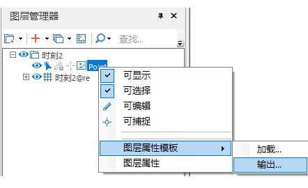
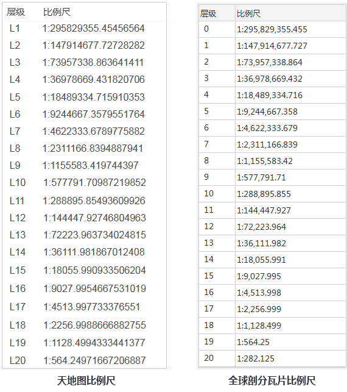

---
id: FAQ_Map
title: 地图
---  

**问：为什么已经保存了地图，但是，当再次打开工作空间时，地图又不见了？**   
**答：**   保存地图只是将地图保存到工作空间中，只有保存了工作空间，地图才能最终保存下来，当再次打开工作空间时，就可以看到保存的地图了。  

**问：为什么地图中的线条和文字看上去有锯齿，不够清晰，如何解决这个问题？**  
**答：**   使用线型反走样和文本反走样的功能可以平滑地图中的线条和文本的笔画，从而消除锯齿效果。  

**问：为什么“固定符号角度”和“固定文本角度”的功能不可用？**  
**答：**   只有当地图属性中的“旋转角度”设置为非零值时，即地图的旋转角度为非零时，“固定符号角度”和“固定文本角度”的复选框才可用。    

**问：为什么加载了同一地区的数据后，两个数据没有叠加显示，而是分布在不同的地方？**  
**答：**   这种情况是因为两个数据的投影不统一，可以使用动态投影的方式解决这个问题。   

**问：为什么设置填充风格后，面图层中的填充风格没有变化？**  
**答：**   如果填充风格使用了渐变填充，即非“无渐变”，则所设置的面符号无效，只有设置渐变填充模式为“无渐变”，所使用的填充风格才可以看到效果。   

**问：为文本图层中选中的文本对象设置了背景和轮廓，为什么轮廓看不到了？**  
**答：**   因为文本对象的背景和轮廓不能同时生效，只有将文本对象的背景透明了，轮廓的设置才可见。  

**问：为什么配置好的专题图，重新打开后，颜色方案默认选中的不是之前设置的颜色方案？**  
**答：**   颜色方案是用于生成专题图子项颜色的一个辅助属性，没有被存储。    

**问：为什么对面对象进行组合后，两两叠加区域会出现空白，是缺失了吗？且面对象之间存在包含关系时，为什么结果与岛洞多边形操作结果一致？**  
**答：** 白色区域为结果的一部分，并非缺失，该显示方式是为了方便用户看清组合前子对象的轮廓范围。同时，当进行组合的面对象之间存在包含关系时，程序会按岛洞多边形处理，结果也与岛洞多边形结果一致。    

**问：使用桌面打开天地图WMTS服务，偏差特别大，偏差有几度，和业务数据无法叠加，怎么解决？**  
**答：** 
这是由于不同天地图服务提供者切图时采用不同dpi导致，软件无法适配所有，可以通过修改索引文件的一个参数实现。在【桌面安装目录】\\\Bin\\\Cache\\\WebCache\\\WMTS\\\目录中，
找到相应服务图层对应的文件夹，继续深入其子文件夹找到sci文件，修改的值为3.779527559055118（96/25.4）或2.952755905511811（72/25.4），再次打开天地图服务即可正常。   

**问：在生成地图缓存，或者将地图输出为图片时，发现生成的结果地图中，有错位的情况，这应该如何解决？**  
**答：**   一般出现这种情况的原因是：地图设置了固定比例尺。去掉地图的固定比例尺，重新生成就可以了。   
 
**问：为什么在填充背景为黑色的地图窗口中，设置面图层的线型风格为空（其他参数默认）时，会发现面图层填充区域内有细小的黑点？**  
**答：**   出现黑点是由于渲染引擎渲染时像素拟合出现的问题，我们给出的解决方案是：将产品包 bin 目录下 SuperMap.xml 文件中 DrawGeometryDeduplicateTolerance 对应值设置为0.05及以下值，重启软件再查看地图就不会有黑点了。  

**问：生成地图瓦片时，生成结果中地图里的矢量数据部分丢失，如下图所示：**  
   

**答：**   此问题一般发生在点矢量数据生成地图瓦片后，结果瓦片中点符号部分丢失，解决的办法是：
在图层属性中，将该点数据图层“显示完整标签”设置关闭即可。 在SuperMap iDesktop中是通过导出该点图层的图层属性模板：  
  
然后修改图层属性模板中的“”属性值为“FALSE”，保存模板：  
  
最后将该图层属性模板重新有应用到该点数据集上即可，而原来的点图层可以移除地图。  

**问：使用SuperMap iServer 将工作空间中的地图发布为 REST 地图服务后，浏览该地图服务，发现矢量数据部分丢失，如下图所示：**  
  
**答：**   此问题，与上面的问题属于一类问题，其解决办法同上。    

**问：行列数较多的影像/栅格数据集，未创建影像金字塔，将其打开至地图，地图比例尺较小的情况下，地图中不显示影像/栅格数据集，怎么办？**  
**答：**   为影像/栅格数据集数据集创建金字塔，再添加至地图，缩放至小比例尺，数据集依然可以正常显示。  

**问：天地图比例尺层级跟桌面地图瓦片全球剖分的比例尺层级是否一致呢？**  
**答：**   桌面全球剖分瓦片的比例尺与天地图比例尺一致，区别为：天地图比例尺层级从L1开始，桌面全球剖分的瓦片层级从L0开始，对应关系如下图：

  
  

