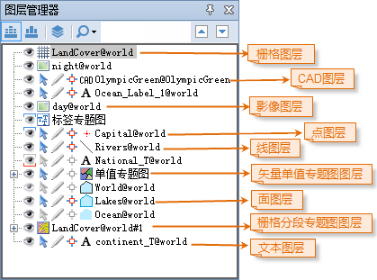

应用程序中的图层管理器用来管理显示在地图窗口中的地图以及显示在场景窗口中的场景中的图层，并且图层管理器中当前只能管理一个窗口中的图层，
即图层管理器中只显示应用程序中当前活动的地图窗口或者场景窗口中的图层内容。

图层管理器中显示了各个图层的图层的标题，以及其他控制图层状态的工具，在图层管理器中，可以通过在显示图层标题的结点上进行各种操作，进而操作其对应的图层。应用程序中的地图图层和场景中的图层都有图层管理器来管理，当当前窗口为地图窗口时，图层管理器中显示的是当前地图窗口中的地图的图层；如果当前窗口为场景窗口，图层管理器中显示
的是当前场景窗口中的场景中的图层，并且图层管理器对应地图图层和场景图层的管理方式有细微差异，主要区别在于，图层管理器对于场景图层的管理会根据图层所对应的数据进行分类管理，主要将场景图层分为三大类：屏幕图层、普通图层和地形图层，因此，场景中的图层将按其所属的图层类别分别位于图层管理器中相应图层类别的结点下，成为该图层类别结点下的子结点。

如下图所示，为图层管理器的两种状态：与地图窗口关联和与三维窗口关联，即分别为当前窗口为地图窗口时的状态和当前窗口为三维窗口时的状态。

 |   

  
在图层管理器的各图层前，可设置图层是否可显示、可选择、可编辑、可捕捉等。若图层设置了最大最小可见比例尺，则可显示图标上下会出现线框标志，蓝线表示在可见比例尺范围内，红线表示超出了可见比例尺范围。当图层当前比例尺在最大最小可见比例尺之间时，图标显示为；当图层当前比例尺大于最大可见比例尺时，图标显示为；当图层当前比例尺小于最小可见比例尺时，图标显示为。若图层值设置了最大或最小可见比例尺，则图标只显示下边或上边线框。

下面详细介绍每种状态下，图层管理器管理图层的结构、方式及各个图层的具体信息。

 [图层管理器（与地图窗口关联）](Layer2DManager.htm)

 [图层管理器（与场景窗口关联）](Layer3DManager.htm)

