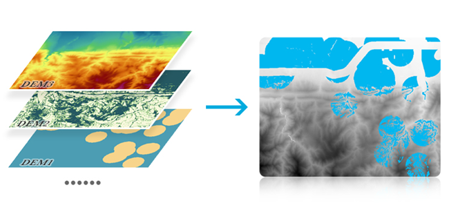
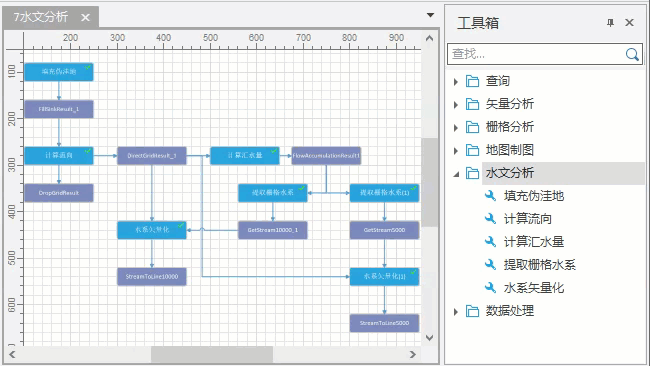
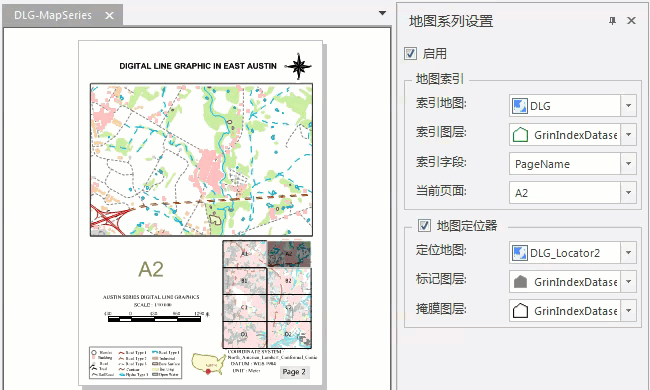
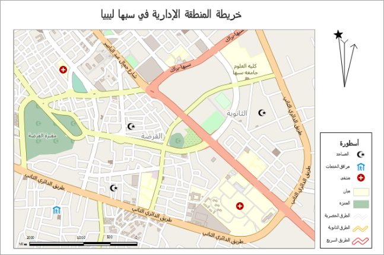

SuperMap iDesktop 10i
桌面产品在上一版本基础上，新增大数据在线分析模块、可视化建模模块功能，支持对大体量数据进行高效、稳定的在线分析；支持通过可视化建模工具定制数据处理流程，实现了一键化、无人值守的连续操作；并新增和优化了数据管理、数据处理、地图制图、空间分析、布局、三维等模块的相关功能，使产品功能更加丰富完善。同时，应用程序的稳定性和易用性得到了进一步的提升。

**SuperMap iDesktop 10i 包含以下新增功能和优化之处：**

**数据管理**

  * 支持阿里 POLARDBGanos 数据库引擎、华为 GaussDB 200 数据库引擎。  
  * 支持将工作空间管理窗口中的内容导出为 Excel 文件，便于用户快速统计当前工作空间数据信息。
  * 支持直接打开原生  SpatiaLite （*.sqlite）文件和 GeoPackage（*.gpkg）文件。
  * 支持将数据集直接另存至新的文件型数据源中，在导出的同时新建数据源，简化了常规的操作步骤，使功能更易用。
  * 支持将地图窗口中选中的几何对象导出为GeoJson、wkt串、SimpleJson等文件。
  * 支持导入满足csv 格式规范的txt（*.txt） 文本格式文件。
  * 新增三个适用于约旦的投影坐标系：Jordan_JTM、Israel 1993 / Israeli TM Grid、Palestine 1923 / Israeli CS Grid。
  * 新增两个中国显示在地图中间部位的全球范围投影坐标系：Robinson for China、Van der Grinten I for China。
  * Web 数据源中新增支持打开基础地形图和深色地形图。
  * Postgis引擎支持 GIST 索引，是一种平衡的、树状结构的索引方法，可加快空间数据的检索。 
  * MongoDB 引擎新增支持 2dsphere 空间索引，支持所有 MongoDB 地理空间查询。 
  * PostGIS 数据源中的数据集添加外部连接表后，在进行SQL查询、显示过滤等构建表达式操作时，程序将自动为表名添加引号，以解决数据库内部表名区分大小写问题。 

**数据处理**

  * 优化数据配准功能： 
    * 支持导入点数据集为配准点和参考点，导出配准点和参考点为点数据集。
    * 配准后的数据坐标系与参考数据的一致。
  * 优化面转点数据集功能，支持在复合面转点时选择内点为子对象内点或复合对象内点。
  * 支持将单个文本对象按照文字内容彻底分解为多个文本对象，便于用户编辑单个文字的内容和风格。 
  * 优化设置栅格图层属性时的拾取栅格值操作，支持在拾取栅格值的同时进行捕捉，提高了拾取精度。
  * 优化属性更新，支持自动匹配同类型同名称字段，使操作更快捷。
  * 优化数据集投影转换等功能中的坐标系设置交互操作方式，以工具条的形式集成坐标系设置相关功能，使功能更丰富、交互更简洁。
  * 优化投影转换功能，支持平面坐标系数据集进行坐标转换，提供四参数转换方法。 
  * 支持在新建数据集时设置坐标系，简化了常规的操作步骤，使操作更高效。
  * 新增栅格数据集加权求和功能，可将多个栅格数据按指定的权重，叠加生成新的栅格适用于综合不同影响因素、需设定不同权重的叠加分析。
  
     

  * 新增对象范围面功能，通过提取线、面几何对象的最小外接矩形，生成新的面数据集。
  * 优化点数据转线数据功能，支持设置排序字段，可用于将带有时间字段的轨迹点数据，按照时间顺序生成轨迹线，以模拟出点数据运行的轨迹。 
  * 优化拓扑检查功能，支持对设置过滤表达式的图层进行拓扑检查，提升了功能的易用性。
  * 新增栅格拼接功能，支持添加多个栅格数据或者多幅影像进行快速的批量拼接，极大的提升了用户的数据处理效率。

**地图制图**

  * 支持 Ctrl+Z 撤销对当前地图图层风格和属性的修改，便于保留上次的操作结果；同时，支持 Ctrl+Y 恢复历史操作。
  * 优化地图网格功能，支持生成面数据集类型的网格。
  * 支持将时态数据的播放过程输出为 *.gif 文件，便于用户在其他场景使用。
  * 新增点匹配线方向功能，计算点到线的垂线方向和距离，配合自定义专题图，使具有指向性的点符号始终匹配线的方向。
  
      

  * 图层管理器中新增定位数据集功能，帮助用户快速定位当前图层关联的数据集在数据源中的位置。
  * 支持发布MongoDB 中的矢量瓦片为 iServer 服务。
  * 生成地图瓦片时，支持设置瓦片分辨率，使用户能够自定义瓦片的输出精度。
  * 优化图幅接边功能，支持保留参与接边融合对象的属性值，可选择保留非空属性、源字段属性或目标字段属性。 
  * 优化标签专题图中自动避让功能，新增支持八方向标签避让和环绕文本避让，以适用更多场景下的标签显示。 
  * 制作默认统一风格标签专题图时，沿线标注绘制类型新增支持从右至左阅读的文字绘制方式，满足阿拉伯语言的阅读习惯。 
  * 新增风格迁移功能： 
    * 支持通过选择图片样式，程序自动分析图片的配色，并将图片风格迁移至当前地图中，智能的渲染地图。
    * 在指定图片样式前，支持设置提取颜色时图片的压缩模式和颜色数，以提高图片的处理性能。
    * 提供暗色系、彩色系、水墨画等多套风格图片，地图可根据选择的图片风格进行渲染。
    * 支持调整亮度、对比度、饱和度对渲染后的文本、线、面图层进行色彩调整。

**空间分析**

  * 优化空间查询功能，支持对查询对象设置查询距离，扩大对象的查询范围。 
  * 优化 SQL 查询功能，支持设置多个关联字段。
  * 新增影像分析功能，提供 NDVI 函数提取植被和 NDWI 函数提取水体。
  * 栅格细化新增效率更高的二值栅格细化，提升了数据处理性能。
  * 含有多个栅格图层的地图中进行表面量算、可视域分析时，可根据鼠标拾取位置自动确定分析图层，提升了功能的易用性。 
  * 优化叠加分析功能，支持输入多个数据集进行合并或者求交分析，从而进行批量操作，提升数据处理效率。
  * 支持对开启动态投影的地图进行空间查询，可将查询对象投影到被查询图层上进行查询，结果数据集的坐标系与被查询图层一致。
  * 优化设置连接表功能，支持相同数据集设置多个连接关系，进一步约束查询结果。 
  * 新增雷达站点分析功能，提供分析遮蔽角、功效域、可视域，为雷达基站选址和设计提供一定的参考数据。 
    * 支持雷达遮蔽角分析，可快速、准确地计算出气象雷达各方向的最大遮蔽角，并输出雷达遮蔽角图。
    * 支持雷达功效域分析，根据雷达作用距离、俯仰角以及地形数据等，分析雷达的探测范围。可用于分析重要区域是否在雷达探测范围内，为雷达站的点位和天线高度提供设计依据。
    * 支持雷达可视域分析，以指定的雷达基站作为观察点，根据地形数据以及基站海拔、雷达架高等参数，分析雷达功效半径范围内的可视域。 
     
**交通分析**
  
* 新增室内导航功能，支持室内导航数据的制作、加载和分析，使室内导航数据制作更便捷，导航体验更直观。 
  * 支持根据道路线数据、楼梯点数据、兴趣点数据等构建室内网络，为室内导航生成路径网络数据集、范围面数据集以及楼层关系属性表数据。   
  * 支持根据各楼层的网络数据集及楼层关系属性表构建楼梯关系，并对楼层之间的楼梯关系进行管理，从而生成三维室内导航模型数据。   
  * 支持加载导航模型数据进行室内导航分析，可根据指定的起点和终点进行行驶导引，直观查看导航路径。 

**大数据在线分析**

  * 新增大数据在线分析功能，基于 Spark 计算平台，支持对 HDFS 和 iServer Catalog 中的地理数据，进行强大的空间分析处理。 
  * 支持矢量裁剪分析功能，可对矢量数据集进行裁剪，包括内部裁剪和外部裁剪两种方式。
  * 支持叠加分析功能，可对输入的两个数据集进行裁剪、擦除、合并、相交、同一、对称差和更新等一系列叠加分析运算，以提取用户所需的空间几何信息。
  * 支持缓冲区分析功能，根据指定距离，对点、线、面几何对象建立一定宽度区域的分析方法。
  * 支持轨迹重构功能，可根据不同时间下物体所处的不同位置，来描述该物体的运动轨迹。
  * 支持 OD 线 (Origin-Destination Line) 构造分析功能，根据起始和终止位置，构造 OD 连线，用于表示两点之间的某种关系，如航班线路、人口迁移等。
  
     

  * 支持简单点密度分析功能，用于计算每个点的指定邻域形状内的每单位面积量值。
  * 支持核密度分析功能，可计算点、线要素测量值在指定邻域范围内的单位密度，直观地反映出离散测量值在连续区域内的分布情况。
  * 支持点聚合分析功能，提供了网格面聚合和多边形聚合两种方式，可通过网格面或多边形对地图点要素进行划分，计算每个面对象内点要素的数量，并作为面对象的统计值，反映点数据的聚集程度。
  * 支持要素连接功能，可对目标数据与连接数据通过空间、时间或属性的关系条件进行要素连接。
  * 支持单对象查询功能，通过几何对象之间的空间位置关系来构建过滤条件的一种查询方式。
  * 支持属性汇总统计功能，对输入的数据集中所选择的属性进行汇总统计。
  * 支持区域汇总功能，可对线数据和面数据集制作聚合图的一种空间分析方法，通过网格面或多边形对地图线或面要素进行划分，根据设定的参数值，计算网格单元的统计值。如可用于汇总某区域内各种道路类型的道路总里程等。
  * 支持拓扑检查功能，根据相应的拓扑规则对点、线和面数据进行检查，返回不符合规则的对象。

**可视化建模**

  * 新增可视化建模功能，通过构建地理数据处理的模型，将一系列的地理数据处理工具，按照一定的逻辑关系进行连接，并自动执行。
  * 新增可视化建模工具箱，集成了矢量分析、栅格分析、水文分析及地图制图等6类工具集作为数据处理和分析的工具。
  * 新增任务管理窗口，可实时查看模型执行的进度与状态，以及历史执行记录的详细信息，包括输入、输出和参数设置等，便于追溯模型执行情况。
  * 可视化建模工具箱中提供的工具，支持单独在后台运行，不会阻塞用户的后续操作。比如在进行坡度分析时，用户可以继续进行浏览数据和地图等其他交互操作。
  * 支持导入和导出模型，便于模型的复用和共享。
  * 可视化建模支持添加变量作为数据节点，使用数据变量可方便地将多个工具与同一数据相关联，而无需在多个工具对话框中指定该数据或值，简化了流程。
  
     

**布局**

  * 支持记录最近使用的布局自定义页边距和纸张大小，便于用户二次使用。
  * 优化布局网格功能，具体优化如下： 
    * 支持在同一幅地图添加多个网格，网格类型支持公里网和经纬网。
    * 支持添加拐角标注，为地图提供明确的参考点。
    * 支持绘制拐角延长线，提升了布局的美观性。
    * 支持设置四周标注为垂直显示并控制每个方向标注的可见性。
    * 支持导入或导出地图网格模板文件(*.xml)，便于用户重复使用和共享。
  * 支持在布局中绘制表格，以表格的方式展示复杂的统计数据： 
    * 支持表格数据编辑控件，可直接修改单元格风格、合并单元格、填充单元格数据等，便于编辑布局中表格的内容和样式。
    * 支持在表格数据编辑控件中导入*.xlsx 等 Microsoft Excel 工作表数据，方便用户将外部数据转换到布局中使用。
    * 支持将布局中的表格对象分解为普通的面、文本等对象，便于进一步调整布局细节。
  * 支持在布局中绘制统计图表，使布局信息表达更丰富、更专业。
  * 实现布局和地图对象互通，提高制图效率： 
    * 支持将布局中的图例，直接复制并粘贴到地图图层中，并保留图例的对象布局与风格。
    * 支持将地图中的点、线、面、文本等对象，直接复制并粘贴到布局中。
  * 新增地图系列功能： 
    * 支持创建格网索引，可创建间隔均匀的水平线和垂直线组成的网格，用于识别和定位地图中的图幅页面。
    * 支持计算相邻字段，可用于计算每个图幅在其八个主方向上的相邻图幅标识，辅助阅图。
    * 支持基于索引图层中的各个索引网格范围，快速切换和更新布局中的地图空间范围和其它辅助属性信息，便于快速生成系列排版布局类似的页面。
    * 支持绘制地图定位器，定位器地图显示的范围比主地图大，使地图浏览者能够在较大区域中快速定位和识别当前地图所在的空间位置。
    * 支持创建动态文本，文本随布局中地图的当前属性变化而变化，会自动显示其每个属性的当前值。当更新属性时，文本也将自动更新。
    * 支持创建八方向文本，结合计算相邻字段功能，可在布局中快速标注当前地图图幅的邻图。
    * 支持打印地图册，即将创建的地图系列页面导出为单个 PDF 文件。
  
    

  * 支持绘制三北指北针，即在一个指北针中同时标识地图的真北方向、地图北方向以及磁北方向。
  * 支持图例从右到左显示，即图例在右文字在左的布局方式，满足阿拉伯语言的阅读习惯。
  * 支持比例尺从右到左显示，满足阿拉伯语言的阅读习惯；同时支持将比例尺拆分为多个布局元素。   

   

**流数据**

  * 支持接入矢量数据流，可实时显示、刷新数据，动态反应数据的空间位置变化情况。
  * 支持基于矢量数据流制作专题图、热力图、网格聚合图、统计图表，通过不同的方式对数据流进行渲染，实时反映数据的变化趋势。
  * 支持接入视频数据，支持播放本地视频以及通过RTSP协议接入的在线视频。

**三维**

  * 优化三维配准功能，支持在当前配准窗口中加载在线地图和缓存图层。
  * 新增地图生成三维缓存功能，支持地图生成三维地图缓存文件（*.sci3d），支持设置图片类型、开始层、结束层等参数。
  * 三维数据
    * 优化模型转换功能， 支持转换成s3mb格式模型。
    * 优化批量生成模型缓存，提供拼接、拼接且重映射等纹理和重映射处理方式。
    * 优化批量生成模型缓存，支持设置模型数据集生成缓存的顶点权重模式。
    * 优化模型数据集生成缓存，支持设置模型数据集生成缓存的顶点权重模式。
    * 新增点外挂生成缓存，支持点外挂模型数据集生成模型缓存。
    * 新增矢量拉伸生成缓存功能，支持将矢量面数据拉伸生成一份OSGB或S3M或S3MB格式缓存文件，支持设置拉伸字段值。
    * 新增批量生成矢量缓存功能，支持将多个矢量数据集（点/线/面）生成一份缓存文件。
    * 新增移除重复点功能，支持批量去除多个数据集中，模型对象的重复点和冗余点，精简模型数据，降低内存占用。
    * 新增批量修改模型材质颜色，提供统一设置和条件设置两种方式，条件设置支持根据过滤条件分别设置满足某一条件的一类模型的材质颜色。
    * TIN提取数据更名为提取三维数据。
    * 新增合并TIN配置文件功能，支持多个配置文件合并为一个配置文件。支持生成发布地形合并服务的配置文件时，设置是否生成相交区域的预缓存。
    * 新增去除无效值功能，生成TIN缓存时支持根据高度范围筛选TIN有效值。
    * 优化生成倾斜摄影配置文件，支持根据关键字查找根节点。
    * 新增ENU转投影坐标系功能，支持将ENU坐标系的倾斜摄影模型转为投影坐标系的倾斜摄影模型。
    * 优化压缩并单体化功能，支持*.s3m转为*.s3mb或*.s3m，新增提供iOS系列设备-快速的压缩类型，节约压缩时间。
    * 优化倾斜摄影修改模型中心点功能，支持批量修改多个模型的中心点信息，支持是否批量设置投影信息。
    * 新增倾斜入库功能，支持倾斜摄影数据进行合并根节点、纹理压缩、模型单体化以及修改模型中心点等操作。
    * 体元栅格生成缓存改名为体元栅格叠加生成缓存，并提供纹理重映射的选项。
    * 优化点云追加模式生成缓存，支持设置点云数据分组。
    * 新增添加BIM数据功能，支持直接导入或打开Revit的RVT文件和CATIA的3DXML文件。  

    

  * 模型数据集新增支持创建模型LOD，实现根据具体需求设置模型数据集的LOD层次和简化率。
  * 场景
    * 优化生成场景缓存功能，提供拼接、拼接且重映射和重映射等纹理处理方式。
    * 新增全局对象选择风格，实现设置加载至场景中的图层中对象选中后的显示风格（统一风格）。
    * 优化生成三维影像缓存功能，支持生成WebP格式的影像缓存。
  * 三维地理设计
    * 优化线性拉伸功能，支持设置多张纹理，提供纹理坐标以及拆分对象等选项。
    * 优化旋转拉伸功能，支持绘制不跨Y轴的线作为截面形状，支持设置旋转角度的切分次数，将旋转角度均分成若干份。
    * 新增流形校正功能，支持校正存在拓扑错误的模型对象，校正后的模型对象满足Halfedge数据结构。
    * 优化批量平移功能，支持设置插入点和选择进行批量平移的图层，以便用户根据需求快速方便地批量平移模型。
    * 优化TIN地形镶嵌功能，支持设置镶嵌面的底部高程值，支持输入正负数值作为底部高程。
    * 优化TIN地形拉伸闭合体功能，支持纹理设置。
    * 优化倾斜摄影镶嵌操作，支持设置镶嵌面的底部高程值，支持输入正负数值作为底部高程。 
    * 优化倾斜摄影纹理替换操作，支持设置参数Alpha值。
  * 图层属性
    * 体元栅格新增支持查看行数、列数以及波段数等属性。
    * 三维切片缓存图层分层设色支持设置临近采样和线性采样两种采样模式。
    * 模型数据集图层分层设色新增支持设置无效值颜色。
    * 新增点云信息页面，用于显示点云缓存的分类信息。
    * 点/线/面矢量数据集和模型数据集图层支持设置是否生成三维切片缓存。
  * 三维分析
    * 优化生成DSM功能，支持设置附加高度，该高度值会附加到生成的DSM中。
    * 优化填挖方分析功能，支持设置填挖方区域的附加高度值，支持输入正负数值作为附加高度。
    * 新增生成DOMDSM功能，支持将当前场景中的缓存数据同时生成DOM和DSM。相较于分别生成DOM和DSM，同时生成影像和高程图能节约更多时间。

**属性操作**

  * 新增汇总字段功能，支持设置多个汇总字段同时进行多类型汇总统计，使统计更加便捷快速，且统计结果为属性表数据，方便用户导出为Excel 等文件形式在其他场景中使用。 
  * 支持为矢量数据集的属性字段设置超链接，开启地图超链接之后，单击地图中的矢量对象可打开对应的超链接属性，可用于浏览 URL 网址页面、打开并查看图片等外部文件等。
  * 优化隐藏行性能，提升大数据量属性表中隐藏行操作后浏览数据的流畅性。
  * 支持分页浏览数据集属性表，便于大数据量（亿级）数据集属性表的快速加载与浏览。 
  * 优化隐藏行性能，提升大数据量属性表中隐藏行操作后浏览数据的流畅性。

**许可管理**

  * 新增私有云许可，支持在局域网布设私有云许可服务器，不同机器通过服务地址即可获取指定的许可模块，便于内网局域网机器许可的分发与获取。

**示例地图**

  * 优化了部分中文地图，使地图更符合制图规范。
  * 新增四个美观专业的颜色方案。  
  * 新增5个示例地图，包括故宫地图、地图系列示例地图DLG、2016年伊利诺伊州选举图、6月1日全国人口流动OD图以及全球海平面温度图。 

**易用性**

  * 优化功能搜索，提升搜索性能。
  * 优化输出窗口中提示信息的提示形式，采用信息弹窗的方式，即不改变用户的操作界面布局，又能使用户实时查看到信息提示。
  * 输出窗口中支持超链接，便于用户快速定位数据源、数据集和应用程序产生的结果文件目录等。
  * 优化 Ribbon 选项卡切换效率，提升用户操作体验。
  * 优化桌面奔溃日志体验，桌面启动时会自动监测日志文件大小，并给出清理提示，防止日志文件过大占用过多的磁盘空间。
  * Ribbon 功能图标支持 SVG 格式的图片，解决了高分屏上图片显示模糊的问题。
