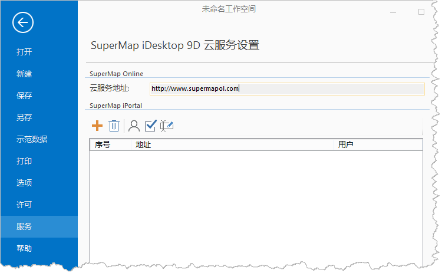

“ **服务** ”选项卡，用来设置桌面产品中在线功能用到的云服务地址，可设置 SuperMap Online 和 iPortal
的地址，即可直接访问到云服务中的数据，并可将本地数据分享上传。

  * SuperMap Online :提供的云服务地址为 http://www.supermapol.com ，地址为只读，不支持修改。
  * SuperMap iPortal :支持添加多个服务地址，并对服务地址进行修改及删除等操作。

  

  
###  相关链接

 [打开](ItemOpen.htm)

 [新建](ItemNew.htm)

 [保存/另存](ItemSave.htm)

 [示范数据](ItemSampleData.htm)

 [打印](ItemPrint.htm)

 [选项](ItemDeskproOption.htm)

 [许可](ItemLicense.htm)

 [帮助](ItemHelp.htm)

 [关于](About.htm)

