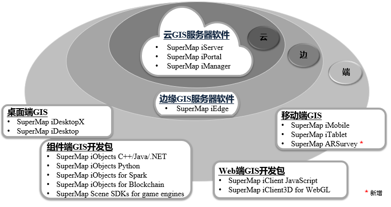

SuperMap GIS 10i(2021) 包含了云GIS 服务器、边缘GIS 服务器、端GIS 以及在线GIS 平台的多种软件产品，全面融入人工智能技术。

  
---  
  
##  云GIS服务器

### SuperMap iServer

基于高性能跨平台 GIS 内核的云 GIS 应用服务器，具有二三维一体化的服务发布、管理与聚合功能，并提供多层次的扩展开发能力。

提供强大的空间大数据存储、空间大数据分析、流数据实时处理、机器学习和空间数据科学等 Web 服务，支持海量的矢量、栅格数据“免切片”发布。

深度融合微服务、容器化等，提供PC 端、Web 端和移动端等多种SDK，可快速构建基于云原生架构的大数据、AI 与三维GIS 应用系统。

### SuperMap iPortal

是集 GIS资源整合、搜索、共享和管理于一体的 GIS 门户平台，具备零代码可视化界面定制、多源异构服务注册、系统监控仪表盘等能力。

提供丰富的Web端应用，可以进行专题图制作、三维可视化、分布式空间分析、大屏展示和模板式应用创建等操作。

作为云端一体化GIS平台的用户中心、资源中心、应用中心，可快速构建GIS云门户站点。

### SuperMap iManager

全面的GIS 运维管理中心，可用于应用服务管理、基础设施管理、大数据管理。提供基于容器技术的Kubernetes 解决方案，可一键创建基于云原生GIS
技术的大数据、AI 与三维GIS 系统。

可监控多个GIS 数据存储、计算与服务节点或其它Web 站点，监控硬件资源占用、地图访问热点、节点健康状态等指标，实现GIS 系统的一体化运维管理。

可管理运维GIS云原生系统，实现细粒度的动态伸缩和灵活部署。

##  边缘GIS服务器

### SuperMap iEdge

边缘GIS 服务器。部署在靠近客户端或数据源一侧，实现就近服务发布与实时分析计算，可降低响应延时和带宽消耗，减轻云GIS
中心压力。提供高效的服务发布能力，支持海量矢量数据快速发布。

可作为 GIS 云和应用终端间的边缘节点，通过服务代理聚合与缓存加速技术,有效提升云 GIS
的终端访问体验，并提供内容分发和边缘分析计算能力，助力搭建更高效智能的“云 边 端” GIS 应用系统。

##  PC端 GIS

### SuperMap iObjects Java

大型全组件式 GIS 开发平台，提供跨平台、二三维一体化和大数据GIS能力，适用于 Java 开发环境。

### SuperMap iObjects C++

大型全组件式 GIS 开发平台，提供跨平台和二三维一体化能力，适用于 C++ 开发环境。

### SuperMap iObjects .NET

大型全组件式 GIS 开发平台，提供二三维一体化能力，适用于 .NET 开发环境。

### SuperMap iObjects Python

开箱即用的GIS 脚本语言包，提供空间数据组织、转换、处理与分析能力，适用于Python 开发环境。

### SuperMap iObjects for Spark

基于分布式技术的大数据GIS 基础组件，提供丰富的大数据分布式管理与分析功能，适用于Spark 架构的计算和开发 环境。

### SuperMap iDesktop

桌面 GIS
应用与开发软件，具备二三维一体化的数据管理与处理、编辑、制图、分析、二三维标绘等功能，支持海图，支持在线地图服务访问及云端资源协同共享，可用于空间数据的生产、加工、分析和行业应用系统快速定制开发。

### SuperMap iDesktopX

跨平台全功能桌面GIS 软件，支持Windows、Linux 等主流操作系统，原生支持全国产化软硬件环境，突破了专业桌 面GIS
软件只能运行于Windows 的困境。

提供空间数据生产及加工、分布式数据管理与分析、地图制图、服务发布、地理处理建模等功能，用于数据生产、加工、处理、分析及制图。

##  Web端 GIS

### SuperMap iClient JavaScript

云GIS网络客户端开发平台，基于现代Web技术栈全新构建，是SuperMap云GIS和在线GIS平台系列产品的统一 JavaScript 客户端。

集成了领先的开源地图开发库、可视化开发库，且核心代码以Apache License 2.0协议完全开源，连接了SuperMap与开源社区。

提供了全新的大数据可视化功能，通过本产品可快速实现浏览器和移动端上美观、流畅的地图呈现与空间分析。

### SuperMap iClient3D for WebGL

基于 WebGL 技术实现的三维客户端开发平台，可用于构建无插件、跨操作系统、跨浏览器的三维 GIS 应用程序。

##  移动端 GIS

### SuperMap iMobile for Android / iOS

全功能移动GIS SDK，支持通用数据格式，提供多种数据可视化效果，支持二维和三维应用开发，支持在线/ 离线应用。

### SuperMap iMobile Lite for Android / iOS

专为在线应用打造的轻量级移动GIS SDK。

### SuperMap iTablet for Android / iOS

全功能移动GIS APP，基于SuperMap iMobile
开发，支持指划制图，模板化数据采集、数据分析、三维数据展示，同时也具备室内外一体化导航、目标识别检测等能力，支持扩展开发，可用于行业应用系统快速定制开发。

##  在线GIS平台

### SuperMap Online

超图在线GIS平台（www.supermapol.com）帮助用户实现GIS数据的安全上云，提供丰富的工具对数据进行在线展示和分析，同时提供多种类型SDK以访问使用GIS数据，快捷开发业务系统。
